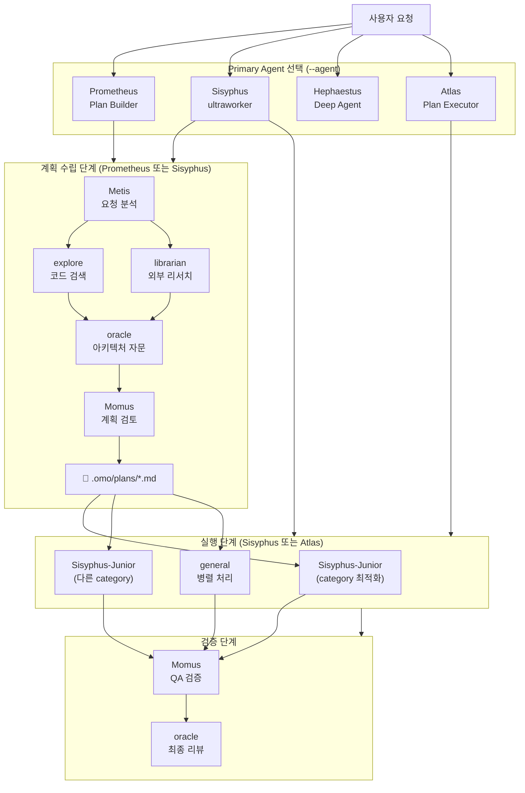

# Agent 개념 정리 (opencode)

---

## 목차

1. [전체 구조](#1-전체-구조)
2. [Primary Agent 상세](#2-primary-agent-상세)
3. [Primary Agent 비교](#3-primary-agent-비교)
4. [Subagent 상세](#4-subagent-상세)
5. [Subagent 비교](#5-subagent-비교)
6. [Primary Agent별 Subagent 위임 패턴](#6-primary-agent별-subagent-위임-패턴)
7. [Category (Sisyphus-Junior 도메인 최적화)](#7-category-sisyphus-junior-도메인-최적화)
8. [전체 워크플로우](#8-전체-워크플로우)

---

## 1. 전체 구조

opencode는 계층적인 Agent 시스템으로 구성된다. 최상위에는 사용자가 `--agent` 플래그로 선택하는 **Primary Agent**가 있고, Primary Agent는 `task()` 도구를 통해 **Subagent**를 호출하여 작업을 위임한다. 또한 시스템이 내부적으로 자동 실행하는 **System Primary**가 존재한다.

```
opencode
│
├── Primary Agent (--agent 플래그로 선택)
│   ├── Sisyphus - ultraworker    ← 올라운드 실행자 (기본값)
│   ├── Hephaestus - Deep Agent   ← 딥 리서처
│   ├── Prometheus - Plan Builder ← 계획 수립자
│   └── Atlas - Plan Executor     ← 계획 실행자
│
├── System Primary (opencode가 자동 실행)
│   ├── compaction   ← 세션 컨텍스트 압축
│   ├── summary      ← 세션 요약 생성
│   └── title        ← 세션 제목 생성
│
└── Subagent (task()로 호출)
    ├── oracle              ← 고난도 추론 자문 (읽기전용)
    ├── librarian           ← 외부 라이브러리/문서 리서치 (읽기전용)
    ├── explore             ← 코드베이스 검색 (읽기전용)
    ├── Metis               ← 사전 기획 분석 (읽기전용)
    ├── Momus               ← 계획 검토/비평 (읽기전용)
    ├── multimodal-looker   ← 이미지/PDF 분석 (읽기전용)
    ├── plan                ← Plan 전용 모드 (읽기전용)
    ├── general             ← 범용 멀티스텝 실행
    ├── build               ← 기본 실행자 (전권)
    └── Sisyphus-Junior     ← Category 기반 작업 실행자 (위임 가능)
```

---

## 2. Primary Agent 상세

`opencode --agent "이름"`으로 선택하여 세션을 시작한다. 각 Primary Agent는 서로 다른 성향과 권한을 가지며, 작업의 성격에 따라 적합한 Agent를 선택해야 한다.

### 2.1 Sisyphus - ultraworker

Sisyphus는 **오케스트레이터**입니다. 작업을 분석하고, 적절한 Agent나 Category에 위임(delegate) 해서 병렬 처리하는 역할을 합니다. `task()` 도구를 통해 모든 하위 Agent를 호출할 수 있습니다. 직접 구현할 수도 있고, 적합한 전문가가 있으면 반드시 위임합니다.

**"Ultraworker"와 Sisyphus의 관계:** 둘은 같은 하나의 Agent를 지칭합니다. 전체 표기는 **"Sisyphus - ultraworker (primary)"** 이며, Sisyphus는 이름(identity), ultraworker는 역할/유형(type descriptor)입니다. 비유하자면 "김철수(이름) - 소프트웨어 엔지니어(직함)"과 같은 관계입니다. **Ultraworker = "분석에 그치지 않고 끝까지 실행해서 결과를 내는 작업자"** 를 의미하며, 이름의 `ultra`는 **지속성(persistence)** 과 **완료(completion)** 에 초점이 맞춰진 워크스타일을 나타냅니다. 분석↔실행을 자유롭게 오가며, 필요한 것은 위임하고, 직접 만들고, 검증까지 하는 전과정(end-to-end) 수행자가 바로 Ultraworker입니다.

| 항목 | 내용 |
|---|---|
| **신화적 의미** | 시시포스 — 끝없이 바위를 굴리는 자, **포기하지 않고 끝까지 실행** |
| **유형 (descriptor)** | **ultraworker** — 분석에 그치지 않고 완료까지 실행 |
| **시작 방법** | `opencode` (기본값), `/start-work`, `/ulw-loop` |
| **슬래시 명령어** | `/ulw-loop` (ultrawork 모드 지속 실행 루프) |
| **핵심 역할** | 올라운드 end-to-end 실행자 |
| **워크스타일** | 분석 → 계획 → 위임 → 직접 구현 → 검증 → 완료, 모든 단계 자유롭게 전환 |
| **의사결정** | 사용자에게 질문 가능 (`question` ✅), 계획 수립 가능 (`plan_enter` ❌) |

**권한 요약:** `*` allow, `task`/`task_*`/`teammate` 위임 ✅, `grep`/`glob` 직접 사용 ❌ (subagent에 위임)

---

### 2.2 Hephaestus - Deep Agent

Hephaestus는 **딥 리서처**입니다. 한 가지 문제를 받으면 표면만 보지 않고 끝까지 파고들어 근본 원인을 분석하는 데 특화되어 있습니다. `apply_patch` 권한이 없어 직접 코드를 수정하기보다는 분석 결과를 전달하는 역할에 집중합니다. 복잡한 버그의 원인 추적, 레거시 코드의 동작 분석, 외부 라이브러리와의 호환성 연구 등에 적합합니다.

| 항목 | 내용 |
|---|---|
| **신화적 의미** | 헤파이스토스 — 대장장이 신, **깊은 곳에서 물건을 빚어냄** |
| **유형 (descriptor)** | **Deep Agent** — 깊이 파고드는 탐구자 |
| **시작 방법** | `opencode --agent "Hephaestus - Deep Agent"` |
| **핵심 역할** | 딥 리서치: 한 가지 문제를 끝까지 분석, 연구 결과 제공 |
| **특징** | `apply_patch` ❌ — 직접 코드 수정보다 **분석/탐구에 특화** |
| **의사결정** | 사용자에게 질문 가능 (`question` ✅) |

**권한 요약:** Sisyphus와 유사하나 **`apply_patch` → deny** 차이. `task_*` 권한 없음.

---

### 2.3 Prometheus - Plan Builder

Prometheus는 **계획 수립자**입니다. 복잡하고 모호한 요청을 받았을 때, 가장 먼저 `metis`를 호출해 요청을 분석하고, `explore`/`librarian`으로 현재 상황을 파악한 뒤, `oracle`의 자문을 거쳐 `momus`의 검토를 받은 후 최종 계획(`.omo/plans/*.md`)을 완성합니다. 완성된 계획은 Sisyphus나 Atlas가 실행합니다.

| 항목 | 내용 |
|---|---|
| **신화적 의미** | 프로메테우스 — 불을 가져온 자, **계획과 지혜를 전파** |
| **유형 (descriptor)** | **Plan Builder** — 계획 수립자 |
| **시작 방법** | `opencode --agent "Prometheus - Plan Builder"` |
| **핵심 역할** | 작업 계획(`.omo/plans/*.md`) 수립, 경로 설계 |
| **슬래시 명령어** | `/hyperplan` (적대적 멀티에이전트 플래닝 — 5명 교차 비평) |
| **특징** | `edit` ✅, `bash` ✅, `webfetch` ✅ — 계획 작성을 위한 도구 전권 |
| **의사결정** | 사용자에게 질문 가능 (`question` ✅) |

**권한 요약:** 권한 구조가 가장 단순. `grep`/`glob` 제한 없음. 계획 수립에 집중된 환경.

---

### 2.4 Atlas - Plan Executor

Atlas는 **계획 실행자**입니다. 이미 완성된 계획을 받아서 각 단계를 순서대로 실행하는 데 특화되어 있습니다. `question` 권한이 없어 사용자에게 되묻지 않고 주어진 일을 수행합니다. 계획이 명확할 때 가장 효율적으로 작동합니다.

| 항목 | 내용 |
|---|---|
| **신화적 의미** | 아틀라스 — 하늘을 떠받치는 자, **주어진 임무를 묵묵히 수행** |
| **유형 (descriptor)** | **Plan Executor** — 계획 실행자 |
| **시작 방법** | `opencode --agent "Atlas - Plan Executor"` |
| **핵심 역할** | 이미 완성된 계획을 받아서 순서대로 실행 |
| **특징** | `call_omo_agent` ❌, `task_*` ✅ |
| **의사결정** | **사용자에게 질문 불가** (`question` ❌) — 주어진 일만 수행 |

**권한 요약:** Sisyphus와 유사하나 **`question` → deny** 차이. 되묻지 않고 계획을 실행.

---

## 3. Primary Agent 비교

### 3.1 역할 스펙트럼

```
[연구/분석] ←------------------→ [실행/구현]
     │                               │
  Hephaestus                     Atlas
     │                               │
     └─── Prometheus ─── Sisyphus ───┘
          (계획 수립)       (전과정)
```

4개의 Primary Agent는 **연구/분석**과 **실행/구현** 사이의 스펙트럼 상에 위치한다. Hephaestus는 가장 분석적인 쪽에, Atlas는 가장 실행적인 쪽에 있다. Prometheus는 계획 수립에 특화되어 있고, Sisyphus는 이 모든 영역을 넘나드는 올라운드형이다.

| 비교 항목 | Sisyphus | Hephaestus | Prometheus | Atlas |
|---|---|---|---|---|
| **성향** | 균형 (분석+실행) | 분석/탐구 | 계획/설계 | 실행/완료 |
| **자율성** | 높음 | 중간 | 높음 | 낮음 |
| **사용자 질문** | 가능 | 가능 | 가능 | **불가능** |
| **계획 수립** | 직접 가능 | 결과 전달 | **전문** | 불가 |
| **코드 수정** | 직접+위임 | 분석 위주 | 계획만 | 직접+위임 |
| **적합한 태스크** | 명확하지 않은 요청, 다단계 작업 | 근본 원인 분석, 리서치 | 복잡한 요청의 사전 설계 | 명확한 계획이 있는 작업 |

### 3.2 권한 차이 (Primary Agent 간)

각 Agent의 권한 차이가 성향과 역할을 결정한다. 주요 차이점은:

- **Hephaestus만** `apply_patch`가 막혀 있어 직접 코드 수정보다 분석에 특화됨
- **Atlas만** `question`이 막혀 있어 사용자에게 되묻지 않고 실행에 집중
- **Hephaestus만** `task_*` 권한이 없어 추가 위임 체인에 제한이 있음

| 기능 | Sisyphus | Hephaestus | Prometheus | Atlas |
|---|---|---|---|---|
| 파일 읽기 | ✅ | ✅ | ✅ | ✅ |
| 파일 쓰기/수정 | ✅ | ✅ | ✅ | ✅ |
| bash 실행 | ✅ | ✅ | ✅ | ✅ |
| `task()` 위임 | ✅ | ✅ | ✅ | ✅ |
| `task_*` 위임 | ✅ | ❌ | ✅ | ✅ |
| `teammate` 호출 | ✅ | ✅ | ✅ | ✅ |
| `apply_patch` | ✅ | **❌** | ✅ | ✅ |
| `call_omo_agent` | ❌ | ❌ | ❌ | ❌ |
| `question` (질문) | ✅ | ✅ | ✅ | **❌** |
| `plan_enter/exit` | ❌ | ❌ | ❌ | ❌ |

---

## 4. Subagent 상세

`task(subagent_type="...")` 로 호출한다. 읽기전용 Subagent는 파일을 절대 수정할 수 없으며, 순수한 조언과 정보만 제공한다.

### 4.1 oracle (읽기전용)

**초고IQ 추론 컨설턴트**입니다. 복잡한 디버깅, 아키텍처 설계, 코드 리뷰 등에 사용합니다. 파일 쓰기/수정이 불가능하여 순수한 조언만 제공합니다. 2회 이상 실패한 버그 수정, 보안/성능 분석, 다중 시스템 트레이드오프에 활용됩니다.

| 항목 | 내용 |
|---|---|
| **설명** | 초고IQ 추론 컨설턴트 |
| **권한** | 읽기전용. `write`/`edit`/`apply_patch` 전부 ❌ |
| **적합한 상황** | • 2회 이상 실패한 버그 수정 • 아키텍처 트레이드오프 평가<br>• 복잡한 디버깅 • 보안/성능 분석 • 다중 시스템 비교 |
| **부적합한 상황** | • 단순 파일 조작 • 첫 시도 수정 • 변수명/포매팅 결정 |
| **비용** | **고비용** — 신중하게 사용 |

---

### 4.2 librarian (읽기전용)

**외부 레퍼런스 리서처**입니다. 익숙하지 않은 라이브러리/패키지를 조사하거나, 오픈소스 구현 예제를 찾거나, 공식 문서를 검색할 때 사용합니다. GitHub 검색, Context7 문서 조회, 웹 검색 도구를 갖고 있습니다.

| 항목 | 내용 |
|---|---|
| **설명** | 외부 레퍼런스 리서처 |
| **권한** | 읽기전용. `write`/`edit`/`apply_patch` 전부 ❌ |
| **보유 도구** | `grep_app_*` (GitHub 검색), `webfetch`, `websearch`, Context7 |
| **적합한 상황** | • 낯선 라이브러리/API 사용법 • 오픈소스 구현 예제 검색<br>• 공식 문서 확인 • "왜 이 라이브러리가 이렇게 동작하지?" |
| **부적합한 상황** | • 우리 코드베이스 내 검색 (→ `explore`) • 단순 웹 검색 |

---

### 4.3 explore (읽기전용)

**코드베이스 검색 전문가**입니다. "이 함수가 어디 있지?", "이 패턴을 쓰는 파일들은?" 같은 질문에 특화되어 있습니다. `grep`, `glob`, `read` 도구만 있어서 정확한 파일 위치/패턴 찾기에 특화되어 있습니다.

| 항목 | 내용 |
|---|---|
| **설명** | 코드베이스 검색 전문가 |
| **권한** | 읽기전용. `grep`/`glob`/`bash`/`read` 만 있음. `write`/`edit` ❌ |
| **적합한 상황** | • "이 함수가 어디 있지?" • "이 패턴을 쓰는 파일들은?"<br>• "이 모듈의 구조가 어떻게 되지?" • 모르는 파일 찾기 |
| **부적합한 상황** | • 외부 리서치 (→ `librarian`) • 파일 수정 필요한 작업 |

---

### 4.4 Metis - Plan Consultant (읽기전용)

**사전 기획 분석 컨설턴트**입니다. 복잡한 요청을 받았을 때 숨은 의도, 모호함, 실패 지점을 사전에 발굴합니다. 실행 전에 Metis에 먼저 물어보면 리스크를 줄일 수 있습니다. 요청을 받자마자 가장 먼저 호출하는 Subagent로, 작업의 범위와 접근 방식을 명확히 하는 데 도움을 줍니다.

| 항목 | 내용 |
|---|---|
| **설명** | 사전 기획 분석 컨설턴트 |
| **권한** | 읽기전용. `write`/`edit`/`apply_patch` 전부 ❌ |
| **적합한 상황** | • 요청이 모호할 때 숨은 의도/실패 지점 발굴<br>• "이 요청을 하기 전에 무엇을 고려해야 하나?"<br>• 복잡한 요청을 받자마자 가장 먼저 호출 |
| **비용** | **고비용** — 중요 결정 전에만 사용 |

---

### 4.5 Momus - Plan Critic (읽기전용)

**계획 검토/비판 전문가**입니다. 작성된 작업 계획(`.omo/plans/*.md`)의 명확성, 검증 가능성, 완전성을 평가합니다. Prometheus가 계획을 수립한 후 최종 검증 단계에서 호출하거나, 구현 완료 후 QA 검증 용도로도 사용됩니다.

| 항목 | 내용 |
|---|---|
| **설명** | 계획 검토/비평 전문가 |
| **권한** | 읽기전용. `write`/`edit`/`apply_patch` 전부 ❌ |
| **적합한 상황** | • 작성된 계획(`.omo/plans/*.md`) 검토<br>• 구현 완료 후 QA 검증<br>• 계획의 명확성/검증가능성/완전성 평가 |

---

### 4.6 multimodal-looker (읽기전용)

**미디어 파일 분석기**입니다. PDF, 이미지, 다이어그램 등 텍스트 외의 콘텐츠를 분석하고 설명합니다. `look_at` 도구를 통해 이미지 속 정보를 추출합니다.

| 항목 | 내용 |
|---|---|
| **설명** | 미디어 파일 분석기 |
| **권한** | `read`만 있음. 다른 모든 도구 ❌ |
| **적합한 상황** | • PDF 내용 파악 • 이미지/다이어그램 분석<br>• 스크린샷에서 정보 추출 |

---

### 4.7 plan (읽기전용)

**Plan 전용 모드**입니다. 모든 수정 도구가 차단되어 있고, `.opencode/plans/*.md` 파일만 편집 가능합니다. 실행 전 계획 수립 단계에서 사용합니다. 복잡한 태스크를 바로 실행하기 전에 계획만 먼저 수립할 때 적합합니다.

| 항목 | 내용 |
|---|---|
| **설명** | Plan 전용 모드 |
| **권한** | 모든 수정 도구 차단. `.opencode/plans/*.md`만 편집 가능 |
| **적합한 상황** | • 복잡한 태스크를 실행 전에 계획만 먼저 수립할 때 |
| **특징** | `general` subagent 호출 불가. `question` ✅ |

---

### 4.8 general

**일반 목적 멀티스텝 실행자**입니다. 여러 단계의 작업을 독립적으로 실행할 때 사용합니다. 병렬 처리에 적합합니다. 다만 `todowrite`, `task`, `question` 권한이 없어 단순 확인 작업이나 독립적인 하위 작업 위임용으로 제한됩니다.

| 항목 | 내용 |
|---|---|
| **설명** | 범용 멀티스텝 실행자 |
| **권한** | 제한적: `todowrite` ❌, `task` ❌, `question` ❌ |
| **적합한 상황** | • 단순 확인 작업 병렬 처리 • 독립적인 하위 작업 위임 |
| **부적합한 상황** | • 복잡한 추론 필요 • 추가 위임이 필요한 작업 (→ `Sisyphus-Junior`) |

---

### 4.9 build

**기본 실행자**입니다. 모든 툴에 접근 가능하고, 가장 많은 권한을 가집니다. Sisyphus-Junior가 처리하기 애매한 작업의 기본 Fallback입니다. `question`과 `plan_enter`도 허용되어 있어 가장 자유로운 실행이 가능합니다.

| 항목 | 내용 |
|---|---|
| **설명** | 기본 실행자 (Fallback) |
| **권한** | `*` allow — **모든 도구 접근 가능** |
| **적합한 상황** | • Sisyphus-Junior로 처리하기 애매한 작업<br>• 명시적인 분류가 필요 없는 단순 실행 |
| **특징** | `question` ✅, `plan_enter` ✅ |

---

### 4.10 Sisyphus-Junior

**Category 기반 작업 실행자**입니다. Sisyphus로부터 작업을 위임받아 실행하는 전담 실행 Agent입니다. `task(category="...", ...)` 로 호출하며, category에 따라 도메인에 최적화된 모델이 선택됩니다. `question` 권한이 없어 사용자에게 질문하지 않고 알아서 처리합니다.

| 항목 | 내용 |
|---|---|
| **설명** | Category 기반 작업 실행자 |
| **권한** | `task`/`call_omo_agent`/`task_*`/`teammate` 위임 가능 — **Sisyphus와 동일한 위임 권한** |
| **호출 방법** | `task(category="...", ...)` 로 호출 |
| **특징** | `question` ❌ — 사용자에게 질문하지 않고 알아서 처리 |
| **적합한 상황** | • 구현 작업 위임 • 카테고리 최적화가 필요한 도메인 작업 |

---

## 5. Subagent 비교

### 5.1 읽기전용 vs 쓰기가능

Subagent는 크게 **읽기전용(분석/조언 전용)** 과 **쓰기가능(직접 실행 가능)** 으로 나뉜다. 읽기전용 Subagent는 파일을 절대 수정할 수 없으므로, 코드 수정이 필요한 작업은 반드시 쓰기가능 Subagent에 위임해야 한다.

```
읽기전용 (파일 수정 불가)                  쓰기가능 (파일 수정 가능)
────────────────────────────             ────────────────────────────
oracle                                    general
librarian                                 build
explore                                   Sisyphus-Junior
Metis
Momus
multimodal-looker
plan
```

### 5.2 용도별 Subagent 추천

| 하고 싶은 것 | 사용할 Subagent |
|---|---|
| "이 파일이 어디 있지?" | `explore` |
| "이 라이브러리 어떻게 쓰지?" | `librarian` |
| "이 버그 왜 나는 거지?" (2회 실패 후) | `oracle` |
| "이 요청 뭐가 문제일까?" (모호할 때) | `metis` |
| "내 계획 괜찮아?" | `momus` |
| "이 이미지/PDF 뭐라고 나와?" | `multimodal-looker` |
| "이거 그냥 만들어줘" (단순 작업) | `Sisyphus-Junior` (quick) |
| "이 프론트엔드 컴포넌트 만들어줘" | `Sisyphus-Junior` (visual-engineering) |
| "이 문서 좀 작성해줘" | `Sisyphus-Junior` (writing) |

### 5.3 비용 계층

Subagent마다 사용하는 모델과 리소스가 달라 비용 차이가 있다. 고비용 Subagent는 꼭 필요할 때만, 저비용 Subagent는 자주 사용하는 것이 효율적이다.

| 비용 | Subagent |
|---|---|
| **고비용** (신중히) | `oracle`, `metis`, `momus` |
| **중간** | `librarian`, `Sisyphus-Junior` (ultrabrain/deep) |
| **저비용** (자주) | `explore`, `general`, `build`, `Sisyphus-Junior` (quick) |

---

## 6. Primary Agent별 Subagent 위임 패턴

### 6.1 Sisyphus - ultraworker (지금의 나)

**원칙:** "DEFAULT BIAS: DELEGATE" — 전문 Subagent가 있으면 반드시 위임. 직접 구현할 수도 있지만, 적합한 Subagent가 있으면 위임을 우선한다.

| 상황 | 위임할 Subagent | 빈도 |
|---|---|---|
| 코드베이스 검색 | `explore` | ✅ 자주 |
| 외부 라이브러리/문서 조사 | `librarian` | ✅ 필요시 |
| 2회 이상 실패한 버그 수정 | `oracle` | ✅ 필요시 |
| 복잡한 아키텍처 결정 자문 | `oracle` | ✅ 필요시 |
| 요청이 모호할 때 사전 분석 | `metis` | ✅ 복잡한 요청시 |
| 계획/결과 검토 (QA) | `momus` | ✅ 완료 후 |
| 구현 작업 위임 | `Sisyphus-Junior` (category) | ✅ 매우 자주 |
| 미디어 파일 분석 | `multimodal-looker` | ✅ 필요시 |
| 단순 확인 작업 병렬 처리 | `general` | ✅ 필요시 |
| Plan 파일 작성 | `plan` | ✅ 필요시 |

---

### 6.2 Hephaestus - Deep Agent

**원칙:** "깊이 파고드는 분석이 목적" — 분석 결과를 전달하고 직접 구현까지는 하지 않음. 탐색과 검증에 집중하며, `explore`와 `librarian`을 가장 자주 사용한다.

| 상황 | 위임할 Subagent | 빈도 |
|---|---|---|
| 문제의 근본 원인 추적 | `explore` | ✅ **자주** |
| 외부 표준/모범사례 검증 | `librarian` | ✅ **자주** |
| 분석 결과 구조화 | `metis` | ✅ 분석 병목시 |
| 분석 결론 검증 (구멍 찾기) | `momus` | ✅ 분석 완료 후 |
| 2회 이상 실패한 분석 자문 | `oracle` | ✅ 분석 병목시 |
| 단순 확인 작업 | `general` | ✅ 필요시 |
| **구현 위임** | `Sisyphus-Junior` | ❌ **안 함** |

---

### 6.3 Prometheus - Plan Builder

**원칙:** "계획 수립이 전부" — Metis로 시작해서 Momus로 끝내는 정해진 순서를 따른다. Metis가 가장 먼저, Momus가 가장 마지막에 호출된다.

| 상황 | 위임할 Subagent | 빈도 |
|---|---|---|
| 요청 분석 & 숨은 의도 발굴 | `metis` | ✅ **가장 먼저 호출 (필수)** |
| 현재 코드베이스 이해 | `explore` | ✅ 초기 분석시 |
| 최신 라이브러리/기술 확인 | `librarian` | ✅ 필요시 |
| 아키텍처 트레이드오프 평가 | `oracle` | ✅ 계획 수립시 |
| 계획안 검토/비평 | `momus` | ✅ **마지막 단계 (필수)** |
| 계획 문서 작성 | `Sisyphus-Junior` (writing) | ✅ 문서 생성용 |

**흐름:** `Metis` → (`Explore`/`Librarian`) → `Oracle` → `Momus` → 계획 완성

---

### 6.4 Atlas - Plan Executor

**원칙:** "주어진 계획을 실행만" — 계획은 이미 완성되어 있으므로 사전 분석(metis/librarian)이 필요 없다. 실행과 검증에 집중한다.

| 상황 | 위임할 Subagent | 빈도 |
|---|---|---|
| 계획의 각 단계 구현 | `Sisyphus-Junior` (category) | ✅ **매우 자주** |
| 계획에 언급된 파일 위치 확인 | `explore` | ✅ 실행 전 확인용 |
| 계획의 모호한 부분 판단 자문 | `oracle` | ✅ 계획 해석 필요시 |
| 실행 결과 검증 | `momus` | ✅ 단계 완료 후 |
| 독립적인 하위 작업 | `general` | ✅ 병렬 처리 |
| **사전 분석** | `metis` / `librarian` | ❌ **안 함** |

---

## 7. Category (Sisyphus-Junior 도메인 최적화)

`task(category="...")` 로 호출하며, 내부적으로 Sisyphus-Junior가 해당 도메인에 최적화된 모델로 실행된다. Category를 올바르게 선택하는 것이 작업의 품질과 효율에 직접적인 영향을 미친다.

| Category | 용도 | 특징 |
|---|---|---|
| `visual-engineering` | 프론트엔드, UI, CSS, 스타일링, 레이아웃, 애니메이션 | 시각 작업 전용 모델 |
| `ultrabrain` | 어려운 로직, 알고리즘, 아키텍처 결정 | 고성능 추론 모델. **명확한 목표만 주고 step-by-step 지시 금지** |
| `deep` | 자율적 딥 리서치 + 구현까지 | **한 번에 하나의 목표**만. 끝까지 해결. |
| `quick` | 단순 파일 수정, 오타 수정, 단순 변경 | 경량 모델. 빠름. |
| `writing` | 문서, 보고서, 기술 문서 작성 | 문서 작성 최적화 |
| `artistry` | 창의적/비정형 문제 해결 | 일반적인 패턴을 벗어난 접근 |
| `unspecified-low` | 분류가 애매한 작업 (저난이도) | 기본 모델 |
| `unspecified-high` | 분류가 애매한 작업 (고난이도) | 기본 모델 |

### Category 선택 규칙

| 작업 도메인 | 반드시 사용할 Category |
|---|---|
| UI, 스타일링, 애니메이션, 레이아웃, 디자인 | `visual-engineering` |
| 어려운 로직, 아키텍처 결정, 알고리즘 | `ultrabrain` |
| 자율적 리서치 + end-to-end 구현 | `deep` |
| 단일 파일 오타 수정, 단순 설정 변경 | `quick` |
| 그 외 | 절대 `quick`이나 `unspecified-*`가 기본이 아님. 도메인에 맞게 선택 |

---

## 8. 전체 워크플로우



### 작업 흐름 예시

| 사용자 요청 유형 | 추천 경로 |
|---|---|
| "이거 만들어줘" (명확) | `Sisyphus` → `explore` → `Sisyphus-Junior` → `momus` |
| "이거 검토해줘" (분석) | `Hephaestus` → `explore` + `librarian` → `oracle` → `metis` |
| "이거 계획부터 세워줘" (복잡) | `Prometheus` → `metis` → `explore` → `oracle` → `momus` → 계획 |
| "계획대로 실행만 해줘" (계획 있음) | `Atlas` → `Sisyphus-Junior` → `momus` |
| "이거 끝까지 해줘" (자율) | `Sisyphus` → `/ulw-loop` (완료될 때까지 지속) |

---

> **참고:** `opencode agent list` 명령어로 현재 환경의 모든 등록된 Agent와 권한을 확인할 수 있다.
