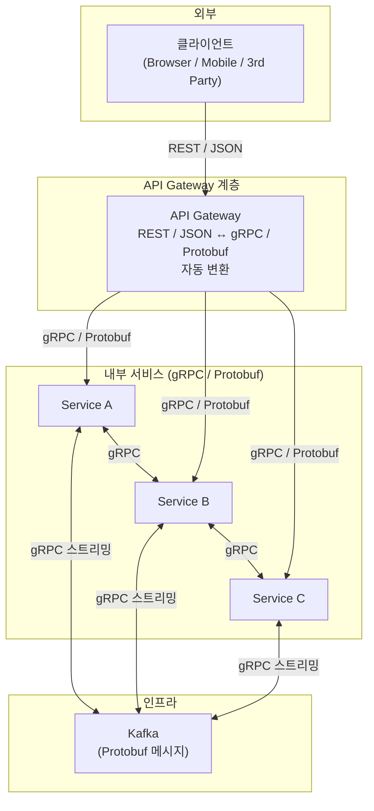
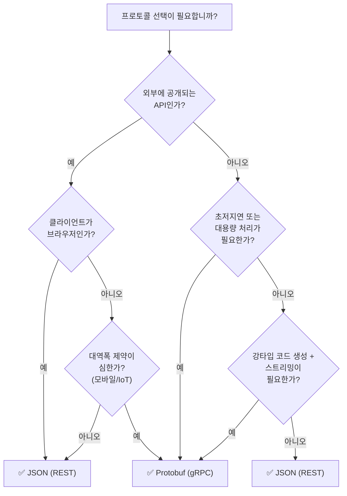

# JSON vs Protobuf 비교 분석

## 1. 기본 개념

| 항목 | JSON | Protobuf |
|---|---|---|
| **개발사** | 개방형 표준 (ECMA-404) | Google (2008, 오픈소스) |
| **형식** | 텍스트 기반 (UTF-8) | 바이너리 기반 |
| **스키마** | 선택적 (없어도 작동) | 필수 (`.proto` 파일 정의) |
| **자기-기술성** | ✅ 데이터만 봐도 구조 파악 가능 | ❌ `.proto` 파일 없이 해석 불가 |
| **사람 가독성** | ✅ 텍스트 편집기로 읽고 수정 가능 | ❌ 바이너리, 디코딩 필요 |

---

## 2. 성능 비교

```
데이터 예시: {"id": 42, "name": "Alice", "email": "alice@example.com"}

JSON (텍스트):       ~52 bytes
Protobuf (바이너리):  ~21 bytes  (약 60% 더 작음)
```

### Protobuf가 작고 빠른 이유

- **필드 번호 + 와이어 타입 인코딩** — Protobuf는 필드 번호(1, 2, 3...)와 와이어 타입만으로 인코딩합니다. JSON처럼 `"id"`, `"name"` 같은 키 이름을 저장하지 않아 불필요한 바이트가 전혀 없습니다.
- **Varint (가변 길이 정수)** — 정수는 Varint 인코딩을 사용해 작은 숫자는 1~2바이트만 차지합니다. 예를 들어 42는 1바이트, 큰 숫자만 그만큼 더 사용합니다.
- 결과적으로 **네트워크 대역폭 40~70% 절감**, **파싱 속도 3~10배 빠름**의 성능 차이가 발생합니다.

| 항목 | JSON | Protobuf |
|---|---|---|
| 직렬화 속도 | 기준 | **2~5x 빠름** |
| 역직렬화 속도 | 기준 | **3~10x 빠름** |
| 메시지 크기 | 기준 | **30~70% 더 작음** |
| 메모리 사용량 | 기준 | 유사하거나 더 적음 |

---

## 3. 스키마 & 타입 시스템

**JSON:**
```json
{
  "id": 42,
  "name": "Alice",
  "tags": ["admin", "user"]
}
```

- 스키마가 없으면 타입을 **추론**해야 함 — `42`가 숫자인지 문자열인지 불분명
- 선택 필드 유무를 런타임에 체크해야 함
- IDE 자동완성/정적 분석 지원 어려움

**Protobuf (.proto):**
```protobuf
message User {
  int32  id            = 1;
  string name          = 2;
  repeated string tags = 3;
}
```

- 필드 번호(1, 2, 3)로 태깅 → 바이너리에서 키를 숫자로 참조
- **required / optional / repeated** 명확
- **enum, oneof, map, any** 등 풍부한 타입
- `.proto` → 코드 생성기로 **강타입 코드 자동 생성** (Java, Go, Python, TS 등)

---

## 4. 버전 호환성

| 특성 | JSON | Protobuf |
|---|---|---|
| **필드 추가** | 새 필드를 모르는 클라이언트가 무시 | 동일 — unknown field 처리 |
| **필드 삭제** | 하위 호환 깨질 수 있음 | **reserved** 키워드로 번호 재사용 방지 |
| **필드 타입 변경** | 위험 (명시적 타입 없음) | 가능하나 제한적 (int32 → int64) |
| **명시적 방어** | 미지원 | `reserved`, `deprecated` 옵션 |

Protobuf는 **필드 번호(field number) 기반**이라 이름을 바꿔도 호환성이 유지됩니다. 반면 JSON은 필드 이름에 의존하기 때문에 이름 변경이 하위 호환을 깨뜨립니다.

---

## 5. 생태계 & 도구

| 항목 | JSON | Protobuf |
|---|---|---|
| **브라우저** | ✅ 네이티브 `JSON.parse()` | ❌ 직접 사용 불가 (WebAssembly/gRPC-Web 필요) |
| **모바일** | ✅ 모든 플랫폼 | ✅ 네이티브 코드 생성 |
| **HTTP API** | ✅ REST의 표준 | ⚠️ 주로 gRPC와 함께 사용 |
| **디버깅** | ✅ curl, 브라우저 DevTools로 즉시 확인 | ❌ `protoc --decode` 등 추가 도구 필요 |
| **라이브러리** | 모든 언어 기본 내장 | `protobuf` 패키지 별도 설치 |
| **스트리밍** | 제한적 (SSE) | ✅ gRPC 스트리밍 네이티브 |

---

## 6. 대표 사용 사례

**JSON이 적합한 경우:**

- **웹 브라우저 ↔ 서버** 통신 (REST API)
- **공개 API** (외부 개발자가 데이터를 바로 보고 디버깅해야 함)
- **설정 파일**, 가벼운 데이터 저장
- **프로토타입/초기 개발** (빠른 반복, 스키마 부담 없음)
- **서버리스/에지** (Lambda, Cloudflare Workers — 최소 의존성)

**Protobuf가 적합한 경우:**

- **마이크로서비스 간 내부 통신** (gRPC)
- **고성능/저지연 시스템** (트레이딩, 게임 서버, 실시간 분석)
- **대용량 데이터 스트리밍** (Kafka 메시지, 로그 수집)
- **모바일 앱 ↔ 서버** (대역폭 제약)
- **IoT/임베디드** (제한된 메모리/네트워크)

---

## 7. 결정 매트릭스

```text
                        JSON 사용 ← → Protobuf 사용

개발 속도 중요           ✅ --------------------------
외부 공개 API            ✅ --------------------------
브라우저 클라이언트      ✅ --------------------------
내부 서비스 통신         --------------- ✅ -----------
초저지연 필요            -------------------- ✅ -----
대역폭/데이터 크기 중요   -------------------- ✅ -----
강타입/코드 생성 필요     ----------------------- ✅ --
스트리밍 필요            ----------------------- ✅ --
디버깅 용이성 중요        ✅ --------------------------
```

---

## 8. 일반적인 현대 아키텍처



---

## 9. 결정 플로우차트



---

## 10. 요약

| | JSON | Protobuf |
|---|---|---|
| **속도** | 느림 | **훨씬 빠름** |
| **크기** | 큼 | **훨씬 작음** |
| **가독성** | ✅ **좋음** | ❌ 나쁨 |
| **타입 안전성** | 낮음 (동적) | **높음 (정적 코드 생성)** |
| **스키마** | **선택** | **필수** |
| **생태계** | 보편적 (웹 표준) | gRPC 생태계 한정 |
| **학습 곡선** | **낮음** | 중간 (`.proto`, 빌드 과정) |

> **결론**: 둘 중 하나를 선택할 필요는 없습니다. **외부는 JSON, 내부는 Protobuf**가 현대 시스템의 정석 패턴입니다.
