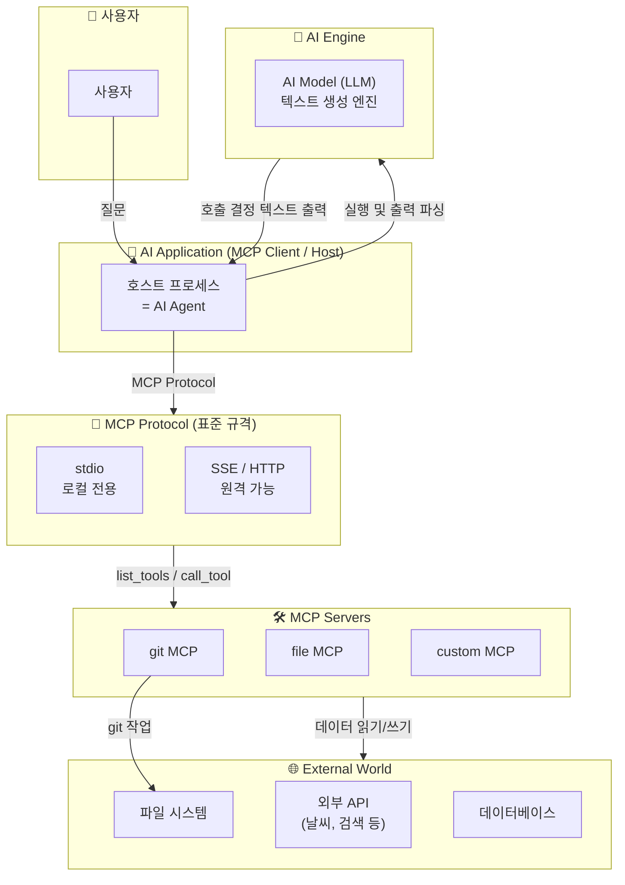
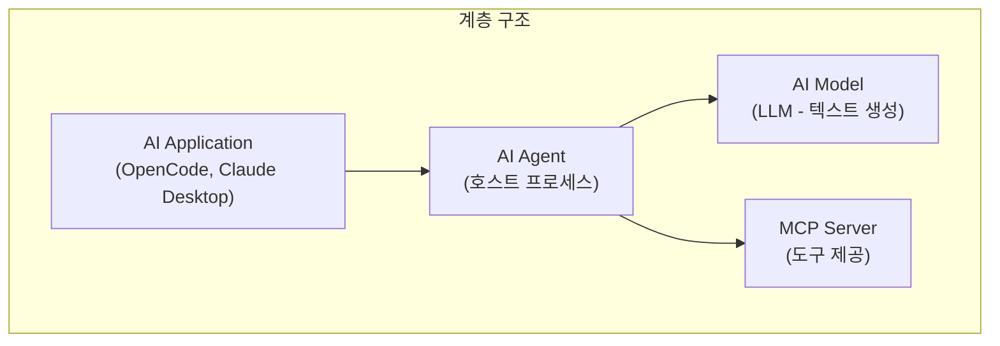
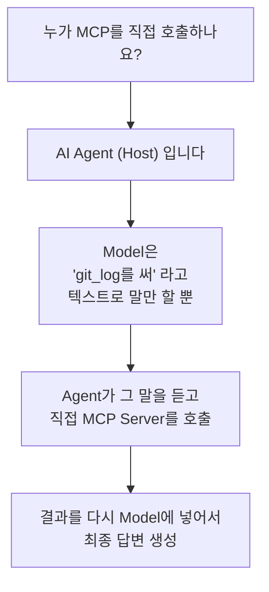
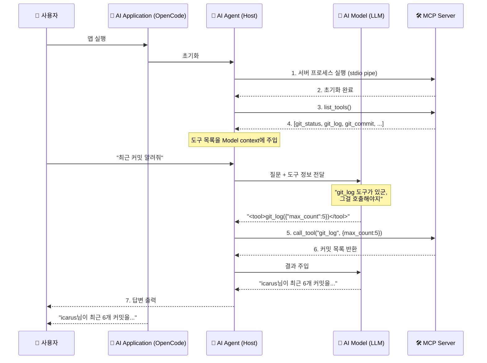
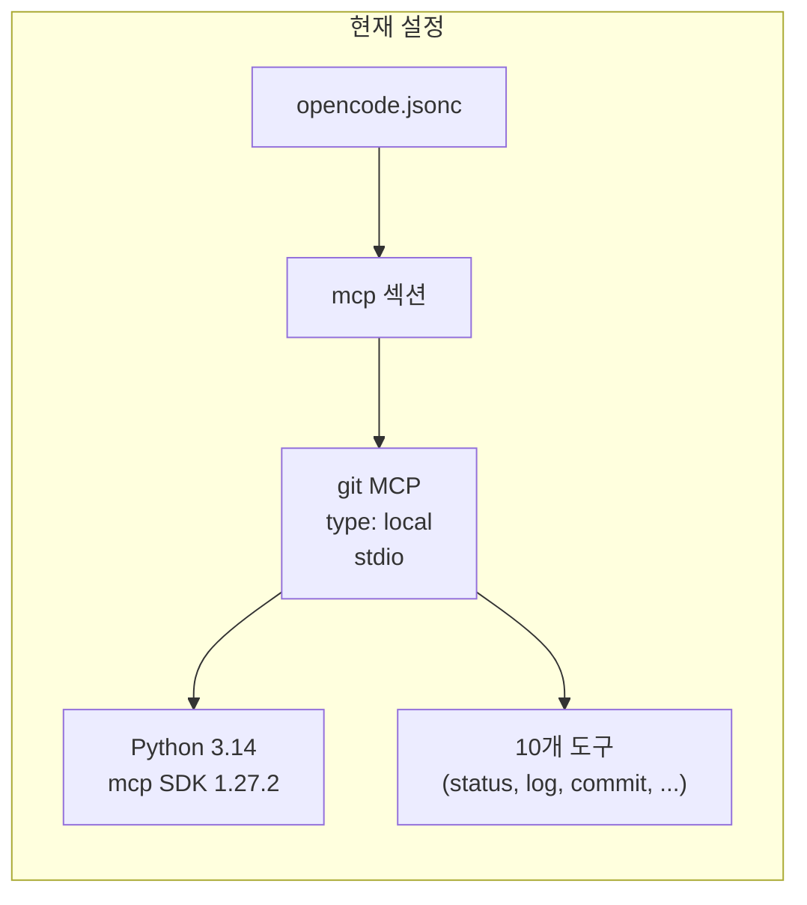

# MCP (Model Context Protocol)

## 1. MCP는 무엇인가?

> **AI Application이 외부 도구와 연결되는 표준 인터페이스**

MCP는 Anthropic이 만든 오픈 프로토콜로, HTTP가 웹 클라이언트와 서버 간 통신의 표준이라면, MCP는 **AI Application과 외부 도구/데이터 간 통신의 표준**입니다.

### 전체 관계도



### 각 주체의 역할



| 주체 | 한국어 | MCP와의 관계 | 하는 일 |
|------|--------|-------------|---------|
| **AI Application** | AI 응용 프로그램 | **MCP Client** — 서버를 실행하고 통신 | 사용자에게 UI 제공, Agent + Model Orchestration |
| **AI Agent (Host)** | AI 에이전트 | **MCP Client** — tool 목록 수집, 호출 실행 | Model 출력을 파싱해서 도구 호출 여부 판단, 결과 재주입 |
| **AI Model (LLM)** | AI 모델 | **MCP를 모름** — 그냥 텍스트만 생성 | "git_log를 불러야지"라고 텍스트로 출력할 뿐 |
| **MCP Server** | MCP 서버 | **MCP Protocol 구현체** — 도구 제공 | tool 목록 노출, call_tool 수신 시 실제 작업 수행 |

### 이것만 기억하세요



> **비유**: Model = 두뇌 (아이디어), Agent = 손 (실행), MCP = 공구, Protocol = 공구 사용 설명서

---

## 2. 왜 필요한가?

MCP가 없으면:

- AI가 파일 읽기, git 작업, 검색 같은 걸 하려면 **매번 직접 코딩**해야 함
- 각 AI 플랫폼(OpenCode, Claude Desktop, Cursor)마다 **다른 방식**으로 도구를 연결해야 함
- 도구 하나 바꾸면 **모든 연동 코드**를 수정해야 함

MCP가 있으면:

> **MCP 서버 하나만 만들면, MCP를 지원하는 모든 AI Application이 자동으로 그 도구를 사용할 수 있음**

---

## 3. 동작 흐름



---

## 4. 핵심 구성 요소

| 요소 | 설명 | git MCP 예시 |
|------|------|-------------|
| **Server** | 도구를 제공하는 프로세스 | `mcp_server_git` 모듈 |
| **Tool** | AI Agent가 호출할 수 있는 함수 | `git_status`, `git_log`, `git_commit` |
| **Resource** | Agent가 읽을 수 있는 데이터 (파일 같은) | (git MCP는 미사용) |
| **Transport** | 통신 방식 | **stdio** (현재) 또는 **SSE** (HTTP) |

---

## 5. Transport 비교

| 항목 | stdio | SSE (HTTP) |
|------|-------|-----------|
| **통신** | 표준입출력(Pipe) | HTTP 요청/응답 |
| **속도** | 빠름 (로컬 IPC) | 네트워크 레이턴시 |
| **보안** | 로컬 전용, 사용자 권한 상속 | 네트워크 노출 가능 |
| **사용처** | 로컬 AI 도구 | 원격 서비스, 팀 공유 |

---

## 6. 현재 시스템



---

## 7. Python MCP 서버 만들기 (예제)

Python SDK(`mcp` 패키지)로 만든 최소 서버 구조:

```python
from mcp.server import Server
from mcp.server.stdio import stdio_server
from mcp.types import Tool, TextContent
from pydantic import BaseModel

server = Server("my-mcp-server")

class MyInput(BaseModel):
    name: str
    count: int = 1

@server.list_tools()
async def list_tools() -> list[Tool]:
    return [
        Tool(
            name="hello",
            description="인사 도구",
            inputSchema=MyInput.model_json_schema(),
        )
    ]

@server.call_tool()
async def call_tool(name: str, arguments: dict) -> list[TextContent]:
    if name == "hello":
        result = f"Hello, {arguments['name']}! x{arguments.get('count', 1)}"
        return [TextContent(type="text", text=result)]

async def main():
    options = server.create_initialization_options()
    async with stdio_server() as (read, write):
        await server.run(read, write, options, raise_exceptions=True)

if __name__ == "__main__":
    import asyncio
    asyncio.run(main())
```

`opencode.jsonc` 등록:

```jsonc
"mcp": {
    "my-server": {
        "type": "local",
        "command": ["python", "/path/to/my_server.py"],
        "enabled": true
    }
}
```
