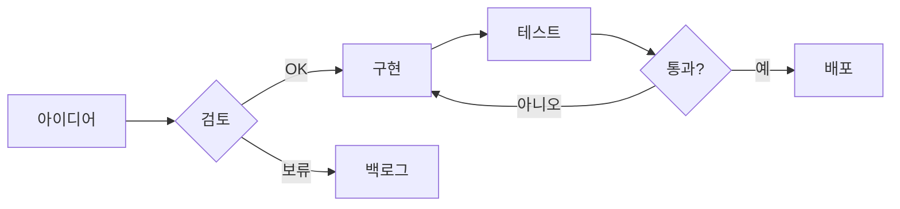
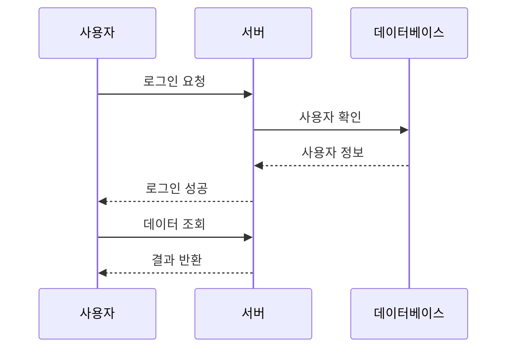
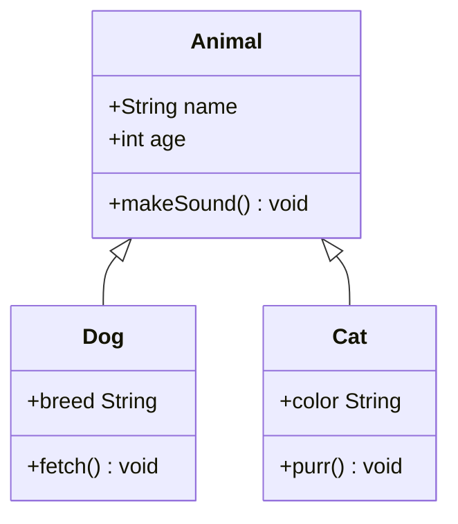
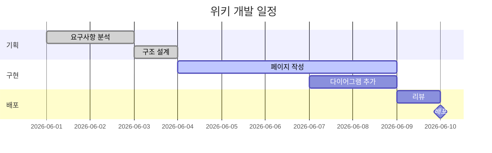
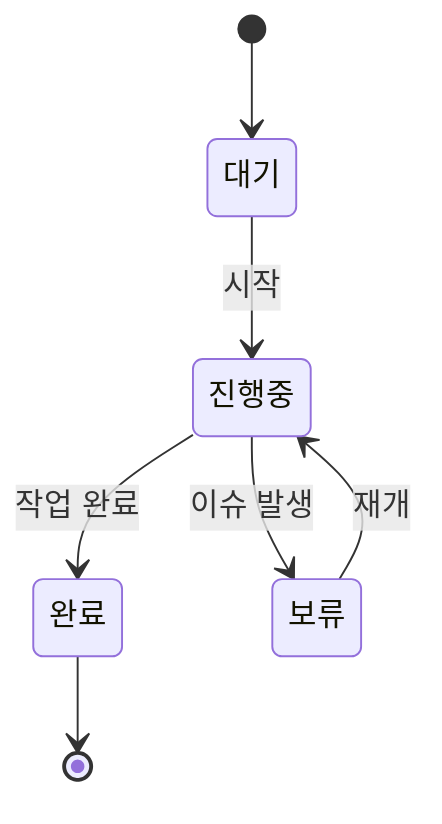
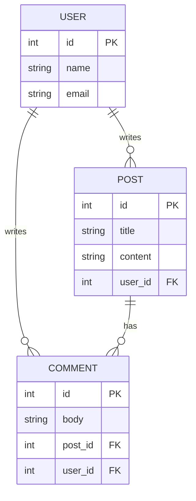

# Mermaid 다이어그램 예제

## 흐름도 (Flowchart)

```mermaid
graph LR
    A[아이디어] --> B{검토}
    B -->|OK| C[구현]
    B -->|보류| D[백로그]
    C --> E[테스트]
    E --> F{통과?}
    F -->|예| G[배포]
    F -->|아니오| C
```

## 시퀀스 다이어그램

```mermaid
sequenceDiagram
    participant U as 사용자
    participant S as 서버
    participant DB as 데이터베이스

    U->>S: 로그인 요청
    S->>DB: 사용자 확인
    DB-->>S: 사용자 정보
    S-->>U: 로그인 성공
    U->>S: 데이터 조회
    S-->>U: 결과 반환
```

## 클래스 다이어그램

```mermaid
classDiagram
    class Animal {
        +String name
        +int age
        +makeSound() void
    }
    class Dog {
        +breed String
        +fetch() void
    }
    class Cat {
        +color String
        +purr() void
    }
    Animal <|-- Dog
    Animal <|-- Cat
```

## 간트 차트

```mermaid
gantt
    title 위키 개발 일정
    dateFormat  YYYY-MM-DD
    section 기획
    요구사항 분석        :done, 2026-06-01, 2d
    구조 설계            :done, 2026-06-03, 1d
    section 구현
    페이지 작성          :active, 2026-06-04, 5d
    다이어그램 추가      :2026-06-07, 2d
    section 배포
    리뷰                :2026-06-09, 1d
    배포                :milestone, 2026-06-10, 0d
```

## 상태 다이어그램

```mermaid
stateDiagram-v2
    [*] --> 대기
    대기 --> 진행중: 시작
    진행중 --> 완료: 작업 완료
    진행중 --> 보류: 이슈 발생
    보류 --> 진행중: 재개
    완료 --> [*]
```

## ER 다이어그램

```mermaid
erDiagram
    USER ||--o{ POST : writes
    USER ||--o{ COMMENT : writes
    POST ||--o{ COMMENT : has
    USER {
        int id PK
        string name
        string email
    }
    POST {
        int id PK
        string title
        string content
        int user_id FK
    }
    COMMENT {
        int id PK
        string body
        int post_id FK
        int user_id FK
    }
```
