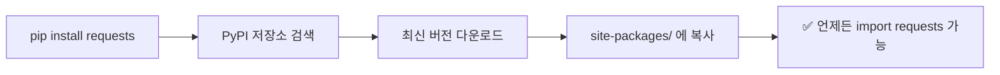
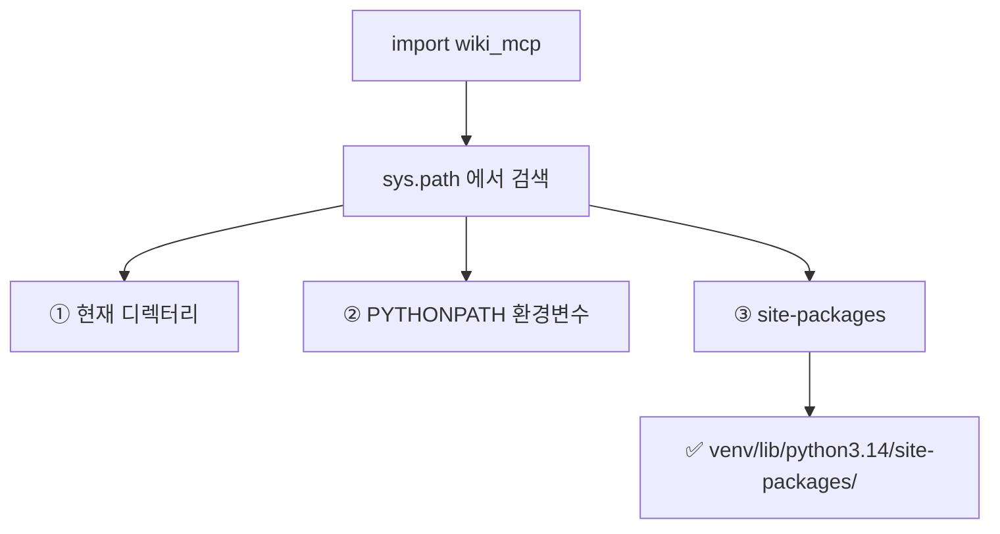

# pip와 Python 패키지 개념 정리

## 1. pip이란?

pip은 Python **패키지 관리자**입니다. PyPI(Python Package Index)라는 중앙 저장소에서 패키지를 다운로드받아 설치합니다.

```
pip install requests       # PyPI에서 requests 패키지 설치
pip install -e ./wiki_mcp  # 로컬 프로젝트를 개발자 모드로 설치
```

---

## 2. pip install — 일반 설치



- PyPI에서 패키지를 **다운로드**해서 `site-packages/`에 **복사**
- 복사본이므로 원본 코드를 수정해도 설치된 패키지에 반영 안 됨
- 수정하려면 새 버전을 pip으로 다시 설치해야 함

---

## 3. pip install -e (editable / 개발자 모드)


- 패키지를 복사하지 않고 **심볼릭 링크**만 등록
- **원본 코드를 수정하면 즉시 반영**됨
- "editable" = 개발 중인 프로젝트에 사용

---

## 4. Python이 패키지를 찾는 원리

### site-packages

Python이 `import requests`나 `python -m wiki_mcp`를 실행할 때 패키지를 찾는 순서:



### site-packages에 등록한다는 의미

| 상태 | 설명 |
|------|------|
| **pip install 한 패키지** | `site-packages/`에 실제 파일이 존재함 |
| **pip install -e 한 패키지** | `site-packages/`에 **.pth** 파일이나 **egg-link**로 경로만 등록됨 |
| **install 안 한 패키지** | 현재 디렉터리에 있거나 PYTHONPATH로 직접 지정해야 찾을 수 있음 |

---

## 5. -m (모듈 실행) 플래그

```bash
python -m wiki_mcp <args>
```

| 항목 | 설명 |
|------|------|
| `python` | Python 인터프리터 실행 |
| `-m` | module의 약자. 뒤에 오는 이름을 모듈/패키지로 찾아서 `__main__.py` 실행 |
| `wiki_mcp` | 찾을 패키지 이름 |

Python 내부적으로는 `import wiki_mcp` 한 다음 `wiki_mcp/__main__.py`를 실행합니다.

---

## 6. 적용 사례: wiki MCP 문제 해결

### pip install -e 전


`wiki_mcp` 패키지가 pip으로 등록되지 않아서, Python이 `python -m wiki_mcp`를 찾을 수 없었습니다. OpenCode가 실행하는 **작업 디렉터리(CWD)** 에 따라 동작할 수도 있고 안 할 수도 있었습니다.

### pip install -e 후


`site-packages/`에 등록되었기 때문에 **어느 디렉터리에서 실행해도** Python이 `wiki_mcp`를 찾을 수 있습니다.

---

## 7. 실제 설치 정보

```bash
$ pip show wiki-mcp

Name: wiki-mcp
Version: 0.1.0
Location: /home/icarus/work/wiki_mcp/.venv/lib/python3.14/site-packages
Editable project location: /home/icarus/work/wiki_mcp   # ← 실제 코드 위치
Requires: mcp
```

`Location`(site-packages)에는 실제 파일이 없고, `Editable project location`의 경로를 바라보는 심볼릭 링크만 있습니다.

---

## 8. 비유로 정리

| 개념 | 비유 |
|------|------|
| **PyPI** | 도서관 중앙 저장소 |
| **pip install requests** | 책을 도서관에서 빌려와서 내 책장(site-packages)에 **복사** |
| **pip install -e ./wiki** | 내가 쓰는 노트를 도서관 목록에 **"XX 책장에 있음"** 이라고 등록 |
| **python -m wiki_mcp** | "wiki_mcp라는 책 어딨지?" 하고 도서관 목록(site-packages)에서 검색 |
| **site-packages** | Python의 도서관 목록. 여기에 등록된 패키지만 찾을 수 있음 |
| **editable install 실패 시** | 책장(프로젝트 폴더)에 책이 있는데 도서관 목록에 없어서 검색 실패 |

---

## 9. 요약

> - **pip install** = PyPI에서 받아서 **복사**
> - **pip install -e** = 로컬 코드를 **등록만** (심볼릭 링크)
> - site-packages에 등록되어야 `python -m` 또는 `import`로 찾을 수 있음
> - wiki MCP는 `pip install -e`로 등록해서 **어디서든 실행 가능**하게 만든 것
