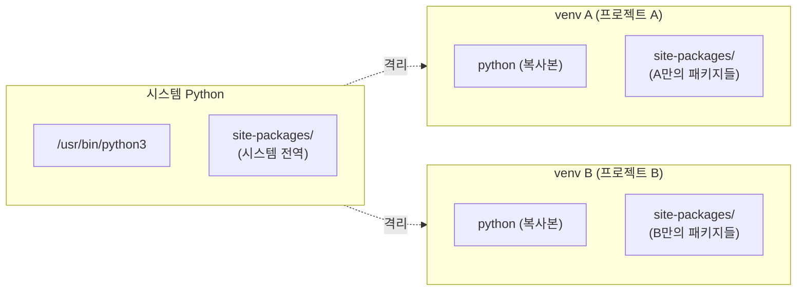
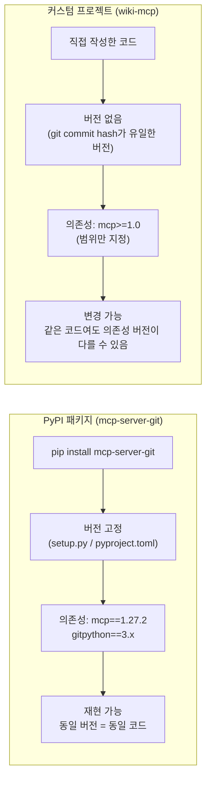
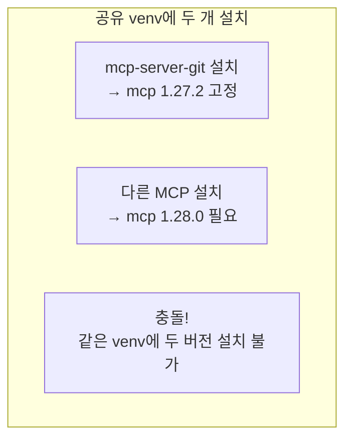
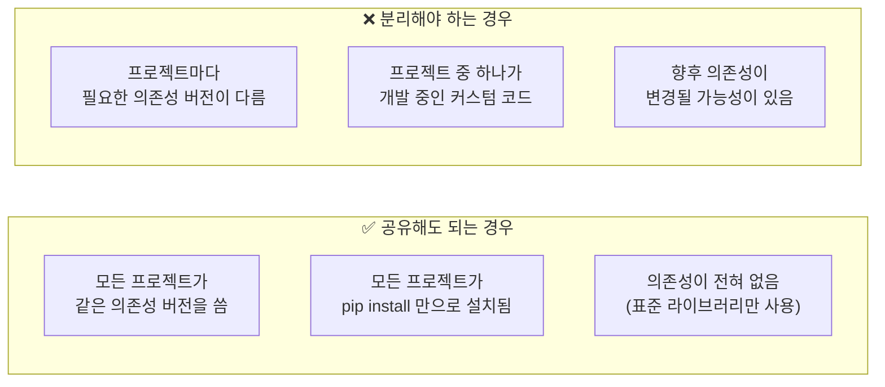
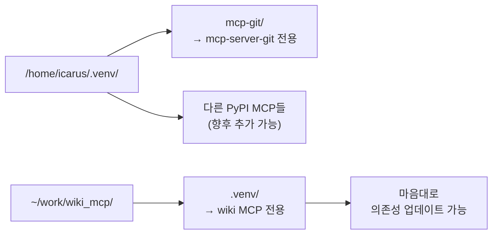

# Python venv — 개념과 공유/분리 전략

## 1. venv (Virtual Environment)란?

> **프로젝트마다 독립된 Python 실행 환경을 만드는 도구**



### 왜 필요한가?

| 문제 | 설명 |
|------|------|
| **의존성 충돌** | 프로젝트 A는 `mcp==1.27.2` 필요, B는 `mcp==1.28.0` 필요 — 같은 시스템에 둘 다 설치 불가 |
| **버전 고립** | 프로젝트 A를 업데이트해도 B에 영향 없음 |
| **재현성** | `requirements.txt`만 있으면 정확히 같은 환경을 어디서든 생성 가능 |

### 동작 원리

```bash
python3 -m venv .venv    # .venv/ 디렉터리 생성
source .venv/bin/activate # PATH를 .venv/bin/ 으로 변경
pip install requests      # → .venv/lib/python3.14/site-packages/ 에 설치
```

`activate`를 하면:
- `PATH`의 맨 앞에 `.venv/bin/`이 추가됨
- `python` → `.venv/bin/python` (시스템 Python이 아님)
- `pip install` → 시스템이 아닌 venv 안에 설치됨

### 비활성화

```bash
deactivate  # PATH 복원
```

---

## 2. venv 공유 vs 분리

## pip 패키지 vs 커스텀 프로젝트 — venv 공유의 차이

### 핵심 차이: 의존성의 주인



### ① 버전 고정 vs 버전 범위

**PyPI 패키지**는 배포 시 의존성 버전이 `pyproject.toml`에 정확히 명시됩니다:

```
# mcp-server-git의 pyproject.toml (예)
dependencies = [
    "mcp>=1.0.0",
    "gitpython>=3.1.0",
]
```

이 패키지를 설치하면 `pip`가 **설치 시점에** 적절한 버전을 결정하고, 그 상태로 고정됩니다. 나중에 다른 패키지가 같은 venv에 설치되어도 이미 결정된 버전은 바뀌지 않습니다.

**하지만** 문제는 여기서 발생합니다:



pip는 같은 패키지의 **두 버전을 동시에 설치할 수 없습니다**.

### ② 커스텀 프로젝트의 특성

커스텀 프로젝트는 **개발 중인 코드**입니다. 다음과 같은 상황이 발생할 수 있습니다:

| 상황 | 문제 |
|------|------|
| `mcp` SDK가 1.28.0으로 업데이트됨 | wiki-mcp에서 새 기능을 쓰고 싶음 |
| 하지만 git MCP가 1.27.2에 의존하고 있음 | `pip install mcp==1.28.0` 하면 git MCP가 깨짐 |
| 해결: wiki-mcp venv를 분리 | git MCP는 1.27.2 유지, wiki-mcp는 1.28.0 사용 가능 |

### ③ 공유해도 되는 경우 vs 안 되는 경우



### ④ 그래서 git MCP는 공유해도 되고 wiki는 안 되는 이유

**git MCP (`mcp-server-git`):**
- PyPI에서 받아온 **완성된 패키지**
- 의존성 목록이 고정되어 있음
- 개발자가 버전을 바꾸지 않는 한 의존성이 변하지 않음
- 같은 venv에 다른 패키지와 함께 있어도 충돌하지 않음

**wiki MCP (커스텀):**
- **직접 개발 중인 코드**
- 개발하면서 `mcp` SDK의 새 기능을 쓰기 위해 버전을 올릴 수 있음
- 다른 패키지와 충돌하면? 해결하려고 시간 쓰는 것보다 venv 분리가 깔끔

### ⑤ 현재 구성의 의미



공유 venv(`/home/icarus/.venv/`)에는 **PyPI에서 설치하는 안정적인 패키지**들만 모으고, 직접 만드는 프로젝트는 **별도 venv**를 두는 것이 가장 관리가 편한 구성입니다.

### 요약

> **PyPI 패키지** = 출판된 책 → 다른 책들과 같은 책장에 꽂아도 문제없음
> **커스텀 프로젝트** = 쓰고 있는 노트 → 다른 사람 노트와 섞으면 찾기 힘들어짐
