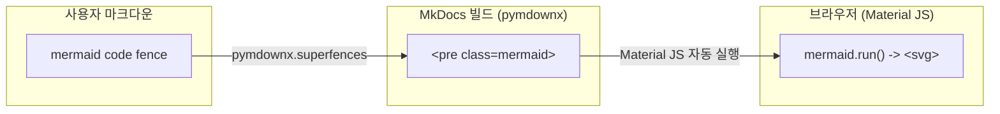

# WiKi Update 내용 요약

> 작성일: 2026-06-14
> 저장소: `icarus-inte01/wiki`
> 대상 페이지: `docs/dev/mermaid-example.md`

---

## 이전 방식 (extra.js 도입 전)

렌더링 구조: **Material for MkDocs 내장 Mermaid 지원**. `pymdownx.superfences`가 코드 블록 → `<pre>` 변환, Material JS가 `mermaid.run()`으로 SVG 생성.



**이전 렌더링 과정 (단계별):**
1. `pymdownx.superfences`가 ` ```mermaid ` 코드 블록을 `<pre class="mermaid"><code>...</code></pre>`로 변환
2. Material for MkDocs가 번들로 포함한 Mermaid JS가 자동으로 `<pre class="mermaid">`를 찾음
3. `mermaid.run()`이 각 코드 블록을 SVG로 렌더링 (light 모드 색상 고정)

**문제점:**
- 툴바(확대/축소/전체화면/패닝) 없음
- 다크모드(`slate`)에서 SVG가 light 모드 색상(검정 선, 흰 배경) 그대로 렌더링 → 아무것도 안 보임
- SVG에 `width="100%"` 강제 삽입 → 좁은 다이어그램이 좌측 정렬됨

---

## extra.js가 하는 일

`extra.js` + `extra.css`가 Material의 Mermaid 처리를 **완전히 대체**.
Material은 `<pre>` 생성까지만 담당, 이후 모든 과정은 extra.js가 제어.

1. **`class: mermaid` → `class: mermaid-diagram`** — Material이 `<pre>`를 건드리지 못하게 차단
2. **`mermaid.render()` API로 직접 렌더링** — DOM 탐색 없이 정확한 타이밍에 SVG 생성
3. **렌더링된 SVG 위/아래에 툴바 HTML을 붙임** — top toolbar (전체화면/복사) + bottom toolbar (pan/zoom/reset)
4. **SVG `width="100%"` 제거** — viewBox 기준 자연 크기 유지, 좁은 다이어그램도 정상 표시
5. **CSS로 다크모드 invert 필터 적용** — `invert(1) hue-rotate(180deg) brightness(1.3) saturate(1.4)`

쉽게 말해, **Material이 하던 일을 extra.js가 완전히 대체** — Material은 `<pre>` 생성까지만, 이후 Mermaid 초기화/SVG 생성/툴바 부착은 전부 `extra.js` + `extra.css`가 처리.

---

## 1. In-place Mermaid 다이어그램 렌더링 + Two-tier 툴바

**목적:** `<pre class="mermaid-diagram">`를 제자리에서 SVG + 툴바로 교체. 기존 fetch+append 방식은 모든 SVG가 문서 하단에 몰리는 문제가 있었음.

**주요 변경:**
- `extra.js`: `fetchMermaidSources()` → DOM `<code>`에서 Mermaid 소스 읽기
- `<pre>` 직후에 `<div class="mermaid mermaid-enhanced">` 삽입, `<pre>`는 `display:none`
- per-container pan state (dataset.zoomLevel, dataset.panX, dataset.panY) — 전역 변수 제거
- 툴바는 hover 시 CSS opacity/pointer-events로 표시

**툴바 구성:**
| 위치 | 버튼 | 설명 |
|------|------|------|
| 상단 (top: -40px, 중앙) | 전체화면, SVG 복사 | `fullscreen`, `copy` |
| 하단 (bottom: -40px, 중앙) | ↑↓←→ + 원래 위치 + − + ＋ | `pan-up/down/left/right`, `reset`, `zoom-out/in` |

**Commit:** `add3102`, `a78f8e0`, `61302b5`
**Files:** `docs/extra.js` (+162/-99), `docs/extra.css` (+42)

---

## 2. Centered Zoom/Pan & Toolbar Positioning

**목적:** SVG transform 기준점을 중앙으로 고정하고, 툴바를 다이어그램 위/아래 중앙에 배치.

**주요 변경:**
- SVG transform을 `dataset` 기반으로 변경 (`applyContainerTransform`)
  ```js
  svg.style.transform = "translate(Xpx, Ypx) scale(Z)";
  svg.style.transformOrigin = "center center";
  ```
- 상단 툴바: `top: -40px; left: 50%; transform: translateX(-50%)` — 다이어그램 위쪽 중앙
- 하단 툴바: `bottom: -40px; left: 50%; transform: translateX(-50%)` — 다이어그램 아래쪽 중앙

**Commit:** `d159d73`
**Files:** `docs/extra.js`, `docs/extra.css`

---

## 3. SVG width="100%" Strip & Narrow SVG Centering

**목적:** Mermaid가 자동 생성하는 `width="100%"`를 제거해 SVG가 viewBox 기준 자연 크기를 유지하게 함. 좁은 SVG는 컨테이너 중앙 정렬.

**문제 상황:** Mermaid 렌더 결과 SVG에 `width="100%"`가 포함되어 있어 좁은 다이어그램(시퀀스 다이어그램 등)이 좌측 정렬되고, zoom-in/reset 시 갑자기 898px(컨테이너 폭)로 확대됨.

**주요 변경:**
- `extra.js` SVG 렌더 시 `<svg>` 태그의 `width=""`, `height=""` 속성만 제거 (하위 요소 영향 없음)
  ```js
  var svgClean = result.svg.replace(/<svg\s[^>]*>/i, function (tag) {
    return tag.replace(/\s(width|height)="[^"]*"/gi, '');
  });
  ```
- `extra.css`: `.mermaid-enhanced { text-align: center; }`
- zoom-in/out/reset에서 `svg.style.maxWidth`/`svg.style.width` 조작 제거 (필요 없음)

**Commit:** `8d345d5`, `ddccfe2`
**Files:** `docs/extra.js`, `docs/extra.css`

---

## 4. Dark Mode Invert Filter

**목적:** `slate` (다크) 테마에서 Mermaid SVG 색상 반전. Mermaid SVG는 light 모드 색상(검정 선/글자, 흰 배경)으로 고정 렌더링되므로 다크 배경에서 아무것도 안 보임.

**주요 변경:**
- `extra.css`: `[data-md-color-scheme="slate"]` 아래 두 CSS 규칙 추가
  ```css
  [data-md-color-scheme="slate"] .mermaid-enhanced > svg {
    filter: invert(1) hue-rotate(180deg);
  }
  [data-md-color-scheme="slate"] .mermaid-overlay-svg svg {
    filter: invert(1) hue-rotate(180deg);
  }
  ```
- overlay는 .mermaid-enhanced 바깥에 있으므로 별도 선택자 필요

**Commit:** `be64156`
**Files:** `docs/extra.css` (+11)

---

## 5. Dark Mode Contrast & Visibility Enhancement

**목적:** invert만으로는 시퀀스 다이어그램의 얇은 선(lifeline, box border)이 너무 흐려서 보이지 않음. 툴바 아이콘도 흰색으로 고정.

**주요 변경:**
- SVG 필터 강화: `brightness(1.3) saturate(1.4)` 추가
  ```css
  filter: invert(1) hue-rotate(180deg) brightness(1.3) saturate(1.4);
  ```
- 툴바 아이콘 순수 흰색: `color: rgba(255,255,255,0.95)` → `color: #fff`
- 다이어그램 컨테이너에 1px border 추가: `border: 1px solid rgba(255,255,255,0.08)`
- 툴바 테두리 다크모드 대응: `border-color: rgba(255,255,255,0.25)`

**Commit:** `618fb73`
**Files:** `docs/extra.css`

---

## 6. Dark Mode Toolbar Background

**목적:** 툴바 배경색이 페이지 본문과 동일한 `rgb(30,33,41)`이라 흰색 아이콘(18×18 SVG, 얇은 경로)이 배경에 묻혀 육안 식별 불가능했음.

**주요 변경:**
- 툴바 배경: `background: rgba(255, 255, 255, 0.10)` — 반투명 흰색으로 툴바 영역 시각적 분리
- `box-shadow: 0 2px 8px rgba(0, 0, 0, 0.3)` — 툴바가 다이어그램 위에 떠 있는 듯한 효과

**Commit:** `be32cf2`
**Files:** `docs/extra.css`

---

## Appendix: Cache Buster History

GitHub Pages는 정적 파일을 10분간 캐싱하므로 CSS/JS 변경 시마다 `?v=N`을 증가시켜 브라우저가 새 버전을 받도록 함.

| Commit | 파일 | 버전 |
|--------|------|------|
| `61302b5` | extra.js | `?v=2` (최초 도입) |
| `566d90f` | extra.js | `?v=3 → ?v=4` |
| `8d345d5` | extra.js | `?v=6 → ?v=7` |
| `ddccfe2` | extra.js | `?v=7 → ?v=8` |
| `2ea52dc` | extra.css | `?v=2` (최초 도입) |
| `be64156` | extra.css | `?v=2 → ?v=3` |
| `618fb73` | extra.css | `?v=4 → ?v=5` |
| `be32cf2` | extra.css | `?v=5 → ?v=6` |

---

## Files Summary

| 파일 | 역할 |
|------|------|
| `docs/extra.js` (371 lines) | Mermaid 렌더링, 툴바 생성, zoom/pan/reset/전체화면/복사 |
| `docs/extra.css` (287 lines) | 툴바 스타일, 다크모드 대응, 컨테이너 레이아웃 |
| `mkdocs.yml` | CSS/JS 캐시버스트, Mermaid 설정 |

**Sizedown:** `docs/extra.js`는 초기 구현 대비 약 60줄 감소 (중복 코드 제거, 단일 이벤트 핸들러, 전역 변수 → dataset)
