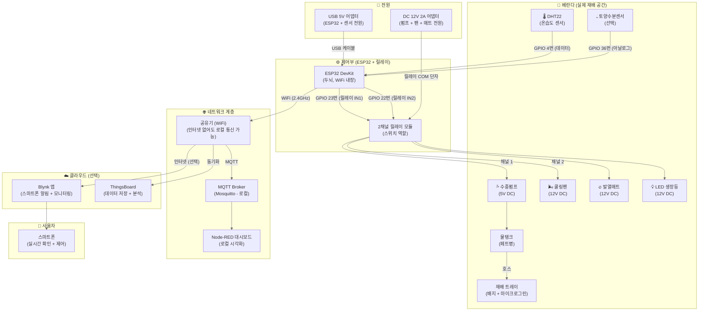

# 아파트 베란다 Private Network + IoT Smart Farm Feasibility Guide

> 초보자가 아파트 베란다에서 시작하는 초소규모 스마트팜 Feasibility Test
> Private Network + IoT 구조를 가장 싸고 빠르게 검증하는 방법

---

## 목차

1. [개요](#1-개요)
2. [추천 작물: 마이크로그린](#2-추천-작물-마이크로그린)
3. [전체 아키텍처](#3-전체-아키텍처)
4. [하드웨어 상세](#4-하드웨어-상세)
5. [네트워크 구성](#5-네트워크-구성)
6. [단계별 시작 가이드](#6-단계별-시작-가이드)
7. [총 예산](#7-총-예산)
8. [자주 묻는 질문](#8-자주-묻는-질문)

---

## 1. 개요

### 이 가이드의 목적

아파트 베란다에서 **Private Network + IoT** 아키텍처를 실제로 구현해보고, 그것이 작물 재배에 실질적인 도움이 되는지 **가장 작은 단위로 검증(Feasibility Test)** 하는 것이 목적입니다.

### Feasibility Test의 기준

| 항목 | 검증 포인트 |
|---|---|
| **Private Network** | 인터넷이 끊겨도 로컬 WiFi + MQTT로 센싱-제어 루프가 정상 도는가 |
| **IoT 연동** | 센서 데이터가 실시간 수집되고 시각화되는가 |
| **재배 효과** | 자동 제어로 인해 작물 생육이 개선되는가 |
| **비용 효율** | 투자 대비 효과가 실제 농업에 적용 가능한 수준인가 |

### 접근 원칙

> 작물을 먼저 정하고, 그 작물의 생육 데이터에 최적화된 IoT 시스템을 만든다.
> 시설부터 짓고 작물은 나중에 정하면 망한다.

---

## 2. 추천 작물: 마이크로그린

### 마이크로그린이란?

**마이크로그린(Microgreens)** 은 새싹(Sprouts)보다 한 단계 더 자란, 본잎이 1~2쌍 나온 어린 채소입니다.

| 단계 | 발아 후 일수 | 크기 | 특징 |
|---|---|---|---|
| 새싹 (Sprouts) | 2~5일 | 2~5cm | 뿌리+줄기+떡잎, 물에서 키움 |
| **마이크로그린** | **7~21일** | **5~10cm** | 본잎 1~2쌍, 흙/배지에서 키움 |
| 베이비 채소 | 21~40일 | 10~15cm | 좀 더 큰 상태 |
| 성체 채소 | 40일+ | 완전체 | 일반 채소 |

### 마이크로그린이 Feasibility Test에 적합한 이유

| 이유 | 설명 |
|---|---|
| **턴어라운드 극도로 빠름** | 7~10일이면 수확. 한 달에 3~4번 사이클 가능 |
| **실패 확률 낮음** | 특히 해바라기 품종은 발아율 95%+ |
| **공간 효율 극대화** | 3~5층 선반 수직재배 시 1평으로 충분 |
| **IoT 테스트 최적** | 생육 주기가 짧아 설비 변경 → 결과 확인이 빠름 |
| **고단가** | 100g당 5,000~15,000원 |
| **판로 용이** | 동네 레스토랑, 카페, 브런치에 샘플 납품 용이 |

### 추천 품종

| 종류 | 맛 | 재배 난이도 | 성장 속도 |
|---|---|---|---|
| **해바라기** | 고소함 | ★☆☆☆☆ 매우 쉬움 | 7~10일 |
| 완두순 | 달콤함 | ★★☆☆☆ 쉬움 | 10~14일 |
| 무순 (Red Radish) | 알싸함 | ★☆☆☆☆ 매우 쉬움 | 7~10일 |
| 바질 | 바질 향 | ★★☆☆☆ 쉬움 | 14~21일 |

> **처음이라면 해바라기 → 두 번째는 무순 → 세 번째는 바질** 순서로 난이도를 높여가세요.

---

## 3. 전체 아키텍처

### 시스템 구성도



### 데이터 흐름 (정상 상태)

```
DHT22 (온도/습도 측정)
  ↓  (2초 간격)
ESP32 (데이터 읽기 + 판단)
  ↓  (MQTT 프로토콜)
WiFi 공유기 (로컬)
  ↓
MQTT Broker (Mosquitto) ──→ Node-RED 대시보드 (로컬 시각화)
  ↓  (인터넷 연결 시만)
Blynk 앱 / ThingsBoard (클라우드)
```

### 데이터 흐름 (인터넷 단절 시 = Private Network 모드)

```
DHT22 → ESP32 → WiFi 공유기 → MQTT Broker → Node-RED
  ↑                                     ↓
  └─────── 자동 제어 루프 (정상 동작) ──────┘
```

인터넷이 끊겨도 **모든 로컬 루프는 정상 동작**합니다. 데이터는 로컬에 쌓이고, 인터넷 복구 시 자동으로 클라우드 동기화됩니다.

---

## 4. 하드웨어 상세

### 4.1 ESP32 DevKit

**ESP32**는 Espressif 사의 초소형 컴퓨터 겸 WiFi 통신 칩입니다. CPU와 WiFi/BLE가 하나의 칩에 내장되어 IoT의 표준 보드로 자리잡았습니다.

| 항목 | 값 | 의미 |
|---|---|---|
| CPU | 240MHz 듀얼코어 | 아두이노(16MHz)보다 15배 빠름 |
| RAM | 520KB + 외장 4MB | 센서 데이터 처리 충분 |
| WiFi | 2.4GHz 802.11 b/g/n | 공유기/스마트폰과 직접 통신 |
| BLE | Bluetooth 4.2 | 스마트폰과 근거리 직접 연결 |
| GPIO 핀 | 30개 | 센서/릴레이/LED 자유롭게 연결 |
| 전압 | 3.3V / 5V USB 전원 | 보조배터리나 충전기로 구동 |
| **가격** | **5,000~8,000원** | |

ESP32의 역할:

1. DHT22에서 온도+습도 값 읽기
2. WiFi로 MQTT Broker에 데이터 전송
3. 설정 범위 벗어나면 릴레이로 펌프/팬 ON/OFF
4. Blynk 앱으로 스마트폰에 푸시

### 4.2 DHT22 온습도 센서

주변 공기의 온도와 습도를 측정하는 3핀 초소형 센서입니다.

| 항목 | DHT11 (구형, 비추) | DHT22 (추천) |
|---|---|---|
| 온도 범위 | 0~50°C | **-40~80°C** (베란다 겨울 대비) |
| 온도 정확도 | ±2°C | **±0.5°C** (5배 정밀) |
| 습도 범위 | 20~80% | **0~100%** |
| 습도 정확도 | ±5% | **±2%** |
| 측정 주기 | 1초 | 2초 |
| **가격** | 1,000원 | **3,000~5,000원** |

> **DHT11을 사지 마세요.** DHT22가 3,000원 더 비싼데 성능 차이가 너무 큽니다. 스마트팜에서 ±2°C 오차는 큰 차이입니다.

| DHT22 핀 | ESP32 연결 |
|---|---|
| 1번 (VCC) | 3.3V |
| 2번 (DATA) | GPIO 4번 |
| 4번 (GND) | GND |

### 4.3 릴레이 모듈 (핵심 부품)

**릴레이**는 ESP32의 약한 전기 신호(3.3V)를 받아서 강한 전기(12V)를 켜고 끄는 스위치입니다.

```
ESP32 핀(3.3V 신호) ───→ 릴레이 모듈 ───→ 펌프/팬/매트(12V 전원)
                          (스위치 역할)    (ESP32와 고전압 완전 분리)
```

ESP32는 **절대** 펌프/선풍기에 직결되지 않습니다. 무조건 릴레이를 사이에 둡니다.

| 채널 | ESP32 GPIO | 제어 대상 |
|---|---|---|
| 채널 1 (IN1) | GPIO 23 | 수중펌프 (급수) |
| 채널 2 (IN2) | GPIO 22 | 쿨링팬 / 발열매트 |

### 4.4 급수 시스템

| 부품 | 역할 | 가격 |
|---|---|---|
| DC 5V 미니 수중펌프 | 물탱크 → 배지로 급수 | 5,000~10,000원 |
| 1채널 릴레이 모듈 | 펌프 ON/OFF 제어 | 2,000~4,000원 |
| 실리콘 호스 (5mm) 1m | 물 길 | 1,000원 |
| 물탱크 (페트병 재활용) | 펌프 잠글 용기 | 0원 |
| (옵션) 토양수분센서 | 배지 건조도 측정 | 1,000~2,000원 |

자동 급수 동작:

```
① 토양수분센서가 배지 습도 측정 (또는定时 1일 1회로 대체 가능)
② ESP32: "건조" 판단 → 릴레이 ON → 펌프 3초 작동
③ ESP32: 릴레이 OFF → 펌프 정지
```

### 4.5 온도 조절 시스템

| 부품 | 역할 | 가격 |
|---|---|---|
| DC 12V 쿨링팬 (120mm) | 여름 베란다 냉각 | 8,000~15,000원 |
| 육묘용 발열매트 25W | 겨울 뿌리 가온 | 15,000~30,000원 |
| 2채널 릴레이 모듈 | 팬/PUMP 각각 제어 | 3,000~5,000원 |

자동 온도 제어 로직:

```python
# 의사 코드
while True:
    temp = DHT22.read_temperature()
    if temp > 30:  # 여름 더움
        relay_fan.on()
    elif temp < 28:
        relay_fan.off()

    if temp < 15:  # 겨울 추움
        relay_heatmat.on()
    elif temp > 20:
        relay_heatmat.off()

    sleep(2초)
```

### 4.6 전원 구성

```
USB 5V 어댑터 ──→ ESP32 (직결, 초저전력)
                      ↓
                릴레이 모듈 신호핀 제어 (3.3V)
                      ↓
DC 12V 2A 어댑터 ──→ 릴레이 COM 단자 ──→ 펌프/팬/매트에 전원 공급
```

ESP32는 USB 5V로 구동되어 감전 위험이 없습니다. 12V 장치는 릴레이를 통해 물리적으로 분리됩니다.

---

## 5. 네트워크 구성

### 5.1 Private Network 구현

이 구조의 핵심은 **인터넷이 없어도 정상 동작**하는 것입니다.

| 계층 | 역할 | 인터넷 필요? |
|---|---|---|
| ESP32 → 공유기 | WiFi 물리 연결 | 아니요 (로컬 IP만 있으면 됨) |
| 공유기 → MQTT Broker | Mosquitto (로컬 설치) | 아니요 (같은 LAN) |
| MQTT → Node-RED | 데이터 시각화 | 아니요 (같은 LAN) |
| MQTT → Blynk | 폰 알림 | **예** (인터넷 필요) |
| MQTT → ThingsBoard | 장기 저장/분석 | **예** |

즉, **공유기만 켜져 있으면** (인터넷 회선은 끊겨도) `ESP32 → MQTT Broker → Node-RED 대시보드` 루프는 정상 동작합니다.

### 5.2 초보자용 네트워크 구성 (추천)

**1단계: Blynk 앱만 사용 (초간단)**

가장 쉽게 시작하는 방법입니다. ESP32가 직접 Blynk 클라우드로 데이터를 보내고, 스마트폰 앱으로 확인합니다. 인터넷이 필요하지만 셋업이 5분이면 끝납니다.

```
ESP32 ──WiFi──→ Blynk Cloud ──→ 스마트폰 Blynk 앱
```

**2단계: 로컬 MQTT 추가 (Private Network 시작)**

WiFi 공유기 내부에 Mosquitto MQTT Broker를 띄우면, 인터넷 없이도 로컬 데이터 수집이 가능해집니다.

```
ESP32 ──WiFi──→ 로컬 MQTT Broker (Mosquitto)
                   ↓
              Node-RED 대시보드 (로컬 접속)
                   ↓
              (인터넷 있을 때만) Blynk 동기화
```

**3단계: 확장**

```
ESP32 → 로컬 MQTT + InfluxDB(시계열 DB) + Grafana(시각화)
       → ThingsBoard (클라우드, 선택)
       → Home Assistant (스마트홈 연동, 선택)
```

### 5.3 추천 오픈소스 소프트웨어

| 소프트웨어 | 역할 | 설치 위치 | 라이선스 |
|---|---|---|---|
| [Mosquitto](https://mosquitto.org/) | MQTT Broker | Raspberry Pi 또는 항시 켜진 PC | 오픈소스 (무료) |
| [Node-RED](https://nodered.org/) | IoT 플로우 + 대시보드 | 동일 | 오픈소스 (무료) |
| [ThingsBoard](https://thingsboard.io/) | IoT 플랫폼 (저장/분석) | 클라우드 or 로컬 | Community Edition 무료 |
| [Blynk](https://blynk.io/) | 스마트폰 앱 | ESP32 + 폰 앱 | 무료 티어 (10 device) |
| [Home Assistant](https://www.home-assistant.io/) | 스마트홈 통합 | Raspberry Pi | 오픈소스 (무료) |

---

## 6. 단계별 시작 가이드

### Week 1: 재배만 (IoT 없음) — 2만원

```
목표: 마이크로그린이 뭔지 경험
```

| 할 일 | 상세 |
|---|---|
| 구매 | 새싹재배용기 세트 (5,900원) + 해바라기 씨앗 1kg (8,000~12,000원) |
| 설치 | 베란다 창가에 트레이 놓고 씨앗 뿌리기 |
| 관리 | 하루 1회 분무. 7일 후 수확 |
| 학습 | "마이크로그린은 이렇게 자라는구나" 경험 |

### Week 2: IoT 센서 붙이기 — +3만원

```
목표: ESP32로 온습도 데이터 수집 시작
```

| 할 일 | 상세 |
|---|---|
| 구매 | ESP32 DevKit (5,000원) + DHT22 (3,000원) + 점퍼 케이블 (2,000원) |
| 설치 | ESP32와 DHT22 연결, 아두이노 IDE에 코드 업로드 |
| 확인 | 시리얼 모니터로 온도/습도가 찍히는지 확인 |
| WiFi | ESP32를 집 공유기에 연결, Blynk 앱에 데이터 전송 테스트 |
| 학습 | "인터넷이 있을 때 센서 데이터가 폰으로 오는구나" |

### Week 3: Private Network 구축 — +0원 (SW만)

```
목표: 인터넷 없이도 데이터 수집/제어가 동작하는 환경 구축
```

| 할 일 | 상세 |
|---|---|
| 설치 | 노트북 or Raspberry Pi에 Mosquitto MQTT Broker 설치 |
| 설치 | Node-RED 설치, 로컬 대시보드 구성 |
| 전환 | ESP32가 Blynk 대신 로컬 MQTT로 데이터 보내도록 코드 수정 |
| 테스트 | **공유기 인터넷 케이블을 뽑는다** → 데이터가 여전히 Node-RED 대시보드에 쌓이는지 확인 |
| 학습 | "인터넷 없이도 로컬에서는 모든 게 정상 동작하는구나" |

### Week 4: 자동 제어 완성 — +5만원 (릴레이 + 펌프 + 팬)

```
목표: 센서 → 판단 → 제어의 완전 자동 루프 완성
```

| 할 일 | 상세 |
|---|---|
| 구매 | 2채널 릴레이 모듈 (3,000원) + DC 5V 수중펌프 (5,000원) + 12V 쿨링팬 (8,000원) + 12V 2A 어댑터 (5,000원) + 호스 (1,000원) |
| 설치 | 릴레이 → 펌프/팬 배선. 물탱크 구성 |
| 코딩 | "온도 30도 이상 → 팬 ON", "배지 건조 → 펌프 3초 ON" 코드 작성 |
| 테스트 | 24시간 자동 모드로 돌려보기. 로그 확인. |
| 수확 | 한 cycle(7~10일) 완전 자동 운영 후 수확 → 기록과 비교 |
| 학습 | "이 시스템이 실제로 농업에 도움이 되는가" 판단 |

### Week 5+: 확장 판단

```
Feasibility Test 결과를 바탕으로 다음 결정:
```

| 결과 | 판단 |
|---|---|
| 재배 성공 + IoT 안정적 | 소규모 상업화 or 규모 확장 고려 |
| 재배 성공 but IoT 불필요 | IoT는 빼고 재배만. Private Network 개념은 접어둠 |
| 재배 실패 | 작물 or 환경 조건 재검토 |

---

## 7. 총 예산

### 필수 품목 (최소 구성)

| 구분 | 품목 | 최소 가격 |
|---|---|---|
| **🌱 재배** | 트레이 + 배지 + 해바라기 씨앗 | 10,000원 |
| **🧠 제어** | ESP32 DevKit | 5,000원 |
| **🌡 센서** | DHT22 온습도 센서 | 3,000원 |
| **🔌 전원** | USB 5V 어댑터 + 케이블 | 3,000원 |
| **🛠 연결** | 점퍼 케이블 | 2,000원 |
| **합계** | | **약 23,000원** |

이 구성으로 **Week 2**까지 진행 가능. 온도/습도 데이터를 폰으로 확인.

### 권장 품목 (자동 제어 포함)

| 구분 | 품목 | 권장 가격 |
|---|---|---|
| 🌱 재배 | LED 식물생장등 | 20,000원 |
| 💧 급수 | DC 5V 수중펌프 | 6,000원 |
| 💧 급수 | 실리콘 호스 1m | 1,000원 |
| 🔧 제어 | 2채널 릴레이 모듈 | 3,500원 |
| 🌬 냉각 | DC 12V 쿨링팬 120mm | 10,000원 |
| 🔥 가온 | 발열매트 25W | 18,000원 |
| 🔌 전원 | DC 12V 2A 어댑터 | 6,000원 |
| **추가 합계** | | **약 64,500원** |

> **총 87,500원**이면 온도/습도/급수/냉방/난방 완전 자동 제어 시스템 완성.

### 월 운영비

| 항목 | 예상 비용 |
|---|---|
| 씨앗 (해바라기 1kg) | 12,000원 (수백 회 재배) |
| 배지 (코코피트) | 5,000원 (2~3개월) |
| 전기세 (LED + 펌프 + 팬) | 월 3,000~5,000원 |
| **합계** | **월 약 5,000~10,000원** |

---

## 8. 자주 묻는 질문

### Q: 베란다에서 겨울에도 가능한가요?

가능합니다. DHT22가 온도를 감지해서 발열매트를 제어합니다. 해바라기 마이크로그린은 최저 10~12°C만 유지되면 자랍니다. 아파트 베란다는 완전 외부보다 온도가 높아서 겨울에도 발열매트 하나면 충분합니다.

### Q: 여름에 베란다가 너무 더운데요?

베란다는 외부보다 5~10°C 더 올라갈 수 있습니다. 이때 쿨링팬이 필요합니다. ESP32가 30°C 이상에서 자동으로 팬을 켜도록 설정하면 문제없습니다.

### Q: ESP32를 못 배우겠는데 어떻게 하죠?

두 가지 대안이 있습니다:

1. **기성 수경재배기 (10~20만원)** + DHT22만 ESP32로 추가 → 적어도 온도 데이터는 폰으로 봄
2. **Show My Farm** 같은 서비스 가입 (월 9,900원) → IoT 인프라는 완전 생략, 데이터 수집만 시작

### Q: Private Network가 꼭 필요한가요?

최소한 **인터넷 단절 시에도 ESP32가 배터리로 동작하면서 릴레이 제어를 계속하는** 수준만 되면 충분합니다. 엄밀한 Private Network(완전 폐쇄망)는 규모가 커졌을 때 고민해도 됩니다. Feasibility 단계에서는 **로컬 WiFi + MQTT**로도 80% 효과가 나옵니다.

### Q: 아내/가족의 반대는 어떻게?

베란다 한쪽 코너, 선반 1단만 차지하면 거슬리지 않습니다. ESP32 핸드폰 충전기 크기라 눈에 띄지도 않습니다. 전체 예산 10만원 미만이고 냄새/곰팡이 없습니다.

### Q: 다음 단계로 확장하려면?

| 확장 방향 | 필요 사항 | 예상 비용 |
|---|---|---|
| 컨테이너팜 | 공간 임대 + 환기/단열 개선 | 300~500만원 |
| 임대형 스마트팜 | 화성시 청년 스마트팜 지원사업 신청 | 보조 70% |
| 기성 솔루션 도입 | ECHO ZONE (150만원) or 농협 보급형 (1,500만원) | 부분 보조 가능 |

---

## 부록: 초기 코드 스켈레톤

```cpp
// ESP32 + DHT22 → MQTT → 자동 릴레이 제어
// Arduino IDE에서 ESP32 보드 매니저 설치 후 사용

#include <WiFi.h>
#include <PubSubClient.h>
#include <DHT.h>

// WiFi 설정
const char* ssid = "집 WiFi 이름";
const char* password = "WiFi 비밀번호";

// MQTT Broker 설정 (로컬)
const char* mqtt_server = "192.168.0.100";  // Mosquitto가 설치된 PC IP
const int mqtt_port = 1883;

// 핀 설정
#define DHTPIN 4
#define DHTTYPE DHT22
#define RELAY_PUMP 23
#define RELAY_FAN 22

DHT dht(DHTPIN, DHTTYPE);
WiFiClient espClient;
PubSubClient client(espClient);

void setup() {
  Serial.begin(115200);
  dht.begin();
  pinMode(RELAY_PUMP, OUTPUT);
  pinMode(RELAY_FAN, OUTPUT);
  digitalWrite(RELAY_PUMP, LOW);
  digitalWrite(RELAY_FAN, LOW);

  WiFi.begin(ssid, password);
  while (WiFi.status() != WL_CONNECTED) {
    delay(500);
    Serial.print(".");
  }
  Serial.println("\nWiFi connected");

  client.setServer(mqtt_server, mqtt_port);
}

void loop() {
  if (!client.connected()) {
    client.connect("ESP32_SmartFarm");
  }
  client.loop();

  float h = dht.readHumidity();
  float t = dht.readTemperature();

  if (isnan(h) || isnan(t)) {
    Serial.println("DHT22 read error");
    return;
  }

  // 데이터 전송 (MQTT)
  char tempStr[8], humStr[8];
  dtostrf(t, 1, 1, tempStr);
  dtostrf(h, 1, 1, humStr);
  client.publish("smartfarm/temperature", tempStr);
  client.publish("smartfarm/humidity", humStr);

  // 자동 제어: 온도 > 30도 → 팬 ON
  if (t > 30) {
    digitalWrite(RELAY_FAN, HIGH);
    client.publish("smartfarm/fan", "ON");
  } else if (t < 28) {
    digitalWrite(RELAY_FAN, LOW);
    client.publish("smartfarm/fan", "OFF");
  }

  // 디버그 출력
  Serial.printf("Temp: %.1f°C, Humidity: %.1f%%\n", t, h);

  delay(2000);  // 2초 간격 측정
}
```

---

> 이 문서는 아파트 베란다에서 Private Network + IoT Smart Farm의 Feasibility를 검증하기 위한
> 실용적인 시작 가이드입니다. 모든 비용은 2026년 6월 한국 온라인 쇼핑몰 기준입니다.
