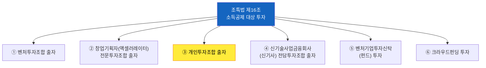
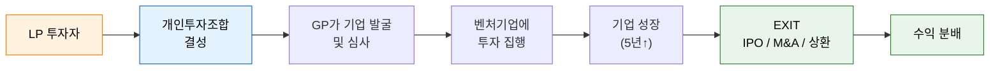
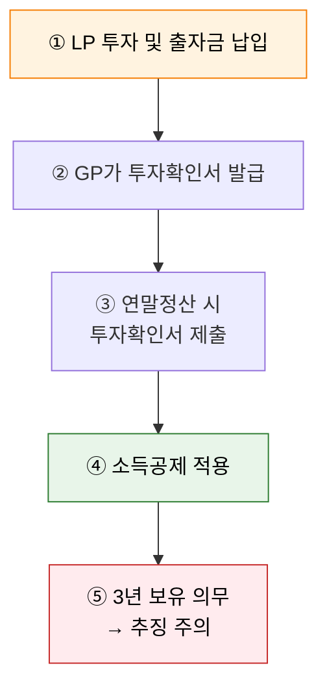
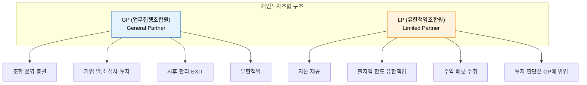
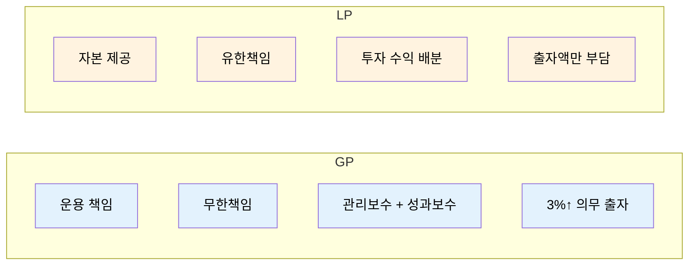
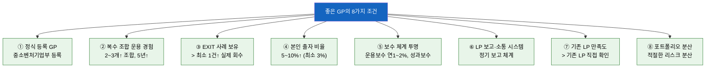
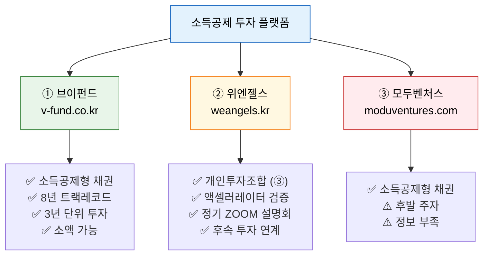
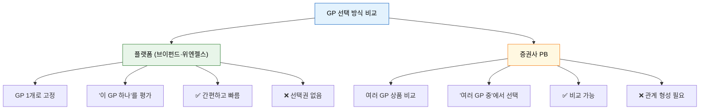
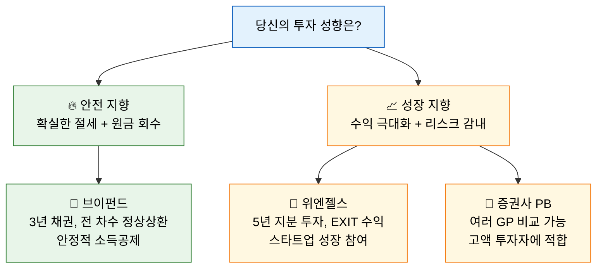
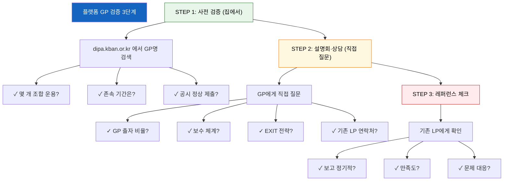

# 벤처투자 완벽 가이드 — 소득공제부터 플랫폼 선택까지

> 작성일: 2026-06-22
> 참고 법령: 조세특례제한법 제16조 (벤처투자조합 출자 등에 대한 소득공제)

---

## 1. 벤처 투자란?

### 1.1 정의

벤처 투자란 성장 가능성이 높은 창업기업·벤처기업에 자본을 투자하고, 해당 기업이 성장하여 IPO(기업공개) 또는 M&A 등으로 EXIT(회수)할 때 수익을 실현하는 투자 방식입니다.

### 1.2 벤처 투자의 6가지 유형 (조특법 제16조)

조세특례제한법 제16조는 벤처투자에 대한 소득공제 혜택을 규정하며, 대상이 되는 출자·투자 유형은 6가지입니다.

### 1.3 개인투자조합 (③번, 핵심)

이 가이드의 핵심은 **③ 개인투자조합**입니다.

| 개념 | 설명 |
|---|---|
| **개인투자조합** | 2인 이상이 자금을 모아 벤처기업에 투자할 목적으로 결성하는 조합 |
| **근거 법률** | 벤처투자촉진법 |
| **최소 출자금** | 조합 총액 1억원 이상 |
| **최소 1좌 금액** | 100만원 이상 |
| **최대 조합원 수** | 49인 이하 (GP + LP 합계) |
| **최소 존속 기간** | 5년 이상 |
| **GP 의무 출자** | 조합 총액의 3% 이상 |

### 1.4 투자 프로세스 개요

---

## 2. 소득공제에 대한 내용

### 2.1 조특법 제16조 소득공제 개요

벤처투자에 대한 소득공제는 **조세특례제한법 제16조**에 근거합니다. (2025년 12월 31일까지 한시 적용)

### 2.2 구간별 공제율

| 투자 금액 | 공제율 | 비고 |
|---|---|---|
| **3,000만원 이하** | **100%** | 전액 소득공제 |
| 3,000만원 초과 ~ 5,000만원 이하 | **70%** | |
| 5,000만원 초과분 | **30%** | |

### 2.3 공제 한도

> **연간 공제 한도 = 해당 과세연도 종합소득금액 × 50%**

즉, 종합소득이 1억원이라면 최대 5,000만원까지 공제 가능합니다.

### 2.4 과세표준별 절세 효과 (1,000만원 투자 시)

| 과세표준 | 세율 | 투자금 | 소득공제 효과 | 연평균 수익률 (3년) |
|---|---|---|---|---|
| 10억원 ~ | 49.5% | 1,000만원 | 495만원 | 연 14.3% |
| 5억원 ~ | 46.2% | 1,000만원 | 462만원 | 연 13.5% |
| 3억원 ~ | 44.0% | 1,000만원 | 440만원 | 연 12.9% |
| 1.5억원 ~ | 41.8% | 1,000만원 | 418만원 | 연 12.3% |
| 8,800만원 ~ | 38.5% | 1,000만원 | 385만원 | 연 11.5% |

> **핵심**: 고소득자일수록 소득공제 혜택이 극대화됩니다. 최고세율 구간(49.5%) 투자자는 1,000만원 투자 시 실질적으로 495만원을 환급받는 효과가 있습니다.

### 2.5 소득공제 요건

| 요건 | 내용 |
|---|---|
| **보유 의무** | **3년 이상 보유** (조기 처분 시 추징) |
| **공제 시기 선택** | 출자일 속하는 과세연도부터 2년이 되는 날까지 1회 선택 가능 |
| **투자 대상** | 벤처기업 또는 창업기업 |
| **적용 구조** | 타인의 출자지분을 양수하는 방식은 제외 |

### 2.6 소득공제 신청 절차

---

## 3. GP와 LP에 대한 설명

### 3.1 기본 구조

### 3.2 GP (업무집행조합원)

GP는 조합을 운영하고 투자 결정을 내리는 핵심 주체입니다.

| 항목 | 내용 |
|---|---|
| **역할** | 기업 발굴, 실사, 투자 심사, 투자 집행, 사후 관리, EXIT |
| **책임** | **무한책임** — 조합의 채무에 대해 무제한 책임 |
| **의무 출자** | 조합 총액의 **3% 이상** 의무 출자 |
| **자격 요건** | ① 전문개인투자자 / ② GP 경력 5년↑ / ③ 투자심사 2년↑ 또는 관련업무 3년↑ / ④ GP 양성 교육 이수 |
| **법인 GP** | 창업기획자(액셀러레이터), 창조경제혁신센터, 신기술창업전문회사, 기술지주회사 등 |
| **수익 구조** | 관리보수(연 1~2%) + 성과보수(초과 수익의 20% 내외) |

### 3.3 LP (유한책임조합원)

LP는 자본을 제공하고 수익을 배분받는 투자자입니다.

| 항목 | 내용 |
|---|---|
| **역할** | 자본 출자, 투자 결정은 GP에 위임 |
| **책임** | **유한책임** — 출자한 금액 한도 내로 책임 제한 |
| **자격** | 개인은 별도 자격 제한 없음 |
| **최소 투자** | 1좌당 100만원 이상 (조합별 상이) |
| **권리** | 조합원 총회 참석, 결산 보고 수령, 정보 접근 |
| **수익** | 투자 수익을 출자 비율에 따라 배분 |

### 3.4 GP vs LP 비교 요약

---

## 4. 좋은 GP의 조건

### 4.1 8가지 핵심 평가 기준

좋은 GP를 선별하기 위한 8가지 조건입니다.

### 4.2 상세 설명

#### ① 중소벤처기업부에 등록된 정식 GP
- 공시시스템([dipa.kban.or.kr](https://dipa.kban.or.kr))에서 GP명 검증 가능
- 등록되지 않은 GP는 소득공제 대상이 아님

#### ② 2~3개 이상의 조합 운용 경험 (5년 이상 선호)
- 동일 GP가 여러 조합을 운용했다 = 트랙레코드가 쌓여 있음
- 오래 운영된 GP일수록 경험과 노하우 풍부

#### ③ 최소 1건 이상의 실제 회수(EXIT) 사례 보유
- IPO, M&A, 구주 매각 등 실제로 투자금을 회수한 사례
- EXIT 사례가 없다면 아직 검증되지 않은 GP

#### ④ GP 본인이 조합 총액의 5~10% 이상 출자 (3%는 최소)
- GP가 많은 금액을 출자할수록 **이해관계 일치**
- "남의 돈"이 아니라 "내 돈"도 걸려 있어야 신중한 운용 기대

#### ⑤ 운용보수 연 1~2%, 성과보수 체계 투명
- 운용보수: 조합 총액의 연 1~2%가 일반적
- 성과보수: 초과 수익의 20% 내외 (조합 규약에 명시)
- 계약서에 명확히 기재되어 있어야 함

#### ⑥ 정기적인 LP 보고 및 소통 시스템 구축
- 반기 또는 연간 단위 정기 보고
- 투자 현황, 포트폴리오 가치, 재무 상황 공유
- 온라인 대시보드 또는 정기 미팅

#### ⑦ 기존 LP들이 만족하고 있다는 증거 (직접 확인)
- GP가 기존 LP와의 연락을 거절하면 **위험 신호**
- 가능하면 기존 LP 1~2명과 직접 통화

#### ⑧ 투자 포트폴리오가 적절히 분산되어 있음
- 특정 업종·기업에 쏠리지 않고 분산 투자
- 1개 기업에 올인하는 GP는 리스크가 큼

---

## 5. 추천 플랫폼에 대한 설명과 비교

### 5.1 현재 시장에서 이용 가능한 플랫폼

벤처투자 소득공제를 받을 수 있는 주요 플랫폼은 3곳입니다.

### 5.2 브이펀드 (V-Fund)

| 항목 | 내용 |
|---|---|
| **URL** | [v-fund.co.kr](https://v-fund.co.kr) |
| **운영사** | 한국벤처창업(주) |
| **투자 방식** | **소득공제형 채권** |
| **GP 역할** | 한국벤처창업이 GP 역할 수행 |
| **투자 기간** | **3년** (개인투자조합 5년보다 짧음) |
| **소득공제** | 조특법 제16조 동일 적용 |
| **최소 금액** | 소액 가능 (온라인 가입) |
| **트랙레코드** | **2018년 런칭, 29차까지 전 차수 정상 상환 완료, 3년 연속** |
| **연락처** | 02-6092-9007 / admin@v-fund.co.kr |
| **가입** | 온라인 회원가입 → 상담 신청 |

**장점**
- 8년간 29차례 모든 채권 정상 상환 → 가장 검증된 트랙레코드
- 3년 단위로 회전 투자 가능 (5년 기다릴 필요 없음)
- 소액부터 시작 가능
- 플랫폼이 기업 심사·사후 관리까지 모두 담당

**단점**
- 채권 투자라 수익률이 제한적
- 투자 대상 기업 선택권 없음
- GP가 1개로 고정 (선택권 없음)

### 5.3 위엔젤스 (WeAngels)

| 항목 | 내용 |
|---|---|
| **URL** | [weangels.kr](https://www.weangels.kr) |
| **운영사** | (주)알토란벤처스 (액셀러레이터 겸 VC) |
| **투자 방식** | **개인투자조합 (③번) 결성 → LP 모집** ← 핵심 |
| **GP 역할** | 알토란벤처스가 직접 GP 수행 |
| **투자 기간** | **5년 이상** (조합 만기) |
| **소득공제** | 조특법 제16조 동일 적용 |
| **기업 검증** | '로드 투 유니콘' 3개월 배치 프로그램 → KPI·실행력 검증 |
| **누적 실적** | 누적 투자유치 120억, 기업당 평균 5억 |
| **LP 혜택** | 분석 리포트, 데모데이 초청, 사후 성장 데이터 공유 |
| **투자 시스템** | '윔스(WIMS)' — 투자 관리 전용 시스템 |
| **연락** | 카카오톡 채널 @위엔젤스 |
| **유튜브** | '장유빌 투자이야기' (정기 설명회 진행) |

**장점**
- **진짜 개인투자조합 (③번)** — 조특법상 ③번 투자 방식
- 액셀러레이터 코칭 기반 검증 → 투자 이후에도 성장 지원
- 후속 투자(크라우드펀딩·VC) 연결로 EXIT 가능성 UP
- 정기 온라인 ZOOM 설명회 → 부담 없이 참여

**단점**
- 트랙레코드가 브이펀드보다 짧음 (2022년 시작)
- 투자 기간 김 (최소 5년)
- 지분 투자 리스크 (원금 손실 가능성)
- 최소 금액이 상대적으로 높을 수 있음

### 5.4 모두벤처스 (Modu Ventures)

| 항목 | 내용 |
|---|---|
| **URL** | [moduventures.com](https://www.moduventures.com) |
| **투자 방식** | 소득공제형 채권 |
| **위상** | 브이펀드의 후발 주자 |

브이펀드와 유사한 채권형 플랫폼이나, 규모와 트랙레코드에서 브이펀드에 비해 정보가 부족합니다.

### 5.5 플랫폼 상세 비교표

| 비교 항목 | **브이펀드** | **위엔젤스** | **모두벤처스** |
|---|---|---|---|
| **투자 유형** | 소득공제형 채권 | **개인투자조합 (③)** | 소득공제형 채권 |
| **GP/운영사** | 한국벤처창업 | 알토란벤처스 | 모두벤처스 |
| **투자 기간** | **3년** (짧음) | **5년 이상** (조합) | 3년 |
| **소득공제** | 조특법 §16 동일 | 조특법 §16 동일 | 조특법 §16 동일 |
| **최소 금액** | 소액 (100만원↑) | 조합별 상이 (1,000만↑) | 소액 |
| **기업 검증 방식** | 한국벤처창업 심사 | **로드 투 유니콘** 3개월 검증 | 자체 심사 |
| **온라인 가입** | ✅ 가능 | ✅ 가능 (회원가입) | ✅ 가능 |
| **트랙레코드** | ⭐⭐⭐⭐⭐ | ⭐⭐⭐ | ⭐⭐ |
| **후속 투자** | 없음 (채권 만기) | 있음 (크라우드펀딩·VC 연계) | 없음 |
| **설명회** | 전화 상담 | **정기 ZOOM 설명회** | 온라인 |

### 5.6 GP 검증: 플랫폼 vs 증권사 PB

---

## 6. GP를 추천한다면?

### 6.1 투자 성향별 추천

### 6.2 상황별 최적 선택

| 상황 | 1순위 추천 | 이유 |
|---|---|---|
| **처음이라 소액으로 시작** | **브이펀드** | 온라인 5분 가입, 100만원부터 가능, 3년 채권 안정적 |
| **소득공제 극대화가 목표** | **브이펀드** | 3년 단위 회전, 소득공제 효과는 동일, 원금 리스크 낮음 |
| **스타트업 지분 투자 경험** | **위엔젤스** | 개인투자조합 LP 진짜 경험, EXIT 기회 |
| **고액 투자 (5,000만원↑)** | **위엔젤스 + 증권사 PB** | 분산 투자로 리스크 관리 |
| **여러 GP 비교 후 선택** | **증권사 PB** | 여러 GP 상품 비교 가능 |
| **안정성 최우선** | **브이펀드** | 8년 트랙레코드, 29차 전 차수 정상상환 |

### 6.3 GP별 8가지 조건 충족 현황

#### 브이펀드 (한국벤처창업)

| # | 조건 | 판정 | 근거 |
|---|---|---|---|
| ① | 중기부 등록 GP | ✅ 충족 | 한국벤처창업(주) 등록 법인 |
| ② | 2~3개↑ 조합 운용 | ✅ 충족 | **29차까지 운용**, 2018년~ |
| ③ | EXIT 사례 보유 | ✅ 충족 | **전 차수 정상 상환 완료** (3년 연속) |
| ④ | GP 5~10% 출자 | ❓ 비공개 | 계약 시 확인 필요 |
| ⑤ | 보수 체계 투명 | ⚠️ 부분 충족 | 사전 안내 |
| ⑥ | LP 보고 시스템 | ✅ 충족 | 정기적 투자 현황 제공 |
| ⑦ | 기존 LP 만족도 | ❓ 직접 확인 필요 | 블로그·카페 검색 |
| ⑧ | 포트폴리오 분산 | ✅ 충족 | 다수 기업에 분산 투자 |

#### 위엔젤스 (알토란벤처스)

| # | 조건 | 판정 | 근거 |
|---|---|---|---|
| ① | 중기부 등록 GP | ✅ 충족 | 액셀러레이터 등록 |
| ② | 2~3개↑ 조합 운용 | ❓ 확인 필요 | 공시시스템 검증 필요 |
| ③ | EXIT 사례 보유 | ⚠️ 초기 단계 | 2022년 시작, IPO 전 |
| ④ | GP 5~10% 출자 | ❓ 확인 필요 | 설명회·계약서 확인 |
| ⑤ | 보수 체계 투명 | ❓ 확인 필요 | 설명회에서 질문 |
| ⑥ | LP 보고 시스템 | ✅ 충족 | **윔스(WIMS)** 시스템 |
| ⑦ | 기존 LP 만족도 | ❓ 직접 확인 필요 | 설명회 참석 → 네트워킹 |
| ⑧ | 포트폴리오 분산 | ❓ 확인 필요 | 포트폴리오 리스트 요청 |

### 6.4 플랫폼 GP 검증 3단계

### 6.5 설명회에서 꼭 물어볼 질문 리스트

#### 브이펀드 상담 시
> 1. 소득공제형 채권의 기업 선별 기준은 무엇인가요?
> 2. GP 출자 비율이 어떻게 되나요?
> 3. 기존 투자자들의 후기를 볼 수 있을까요?
> 4. 채권의 만기 전 중도 처분이 가능한가요?

#### 위엔젤스 ZOOM 설명회에서
> 1. 알토란벤처스가 현재 운용 중인 개인투자조합은 몇 개인가요?
> 2. 조합의 운용보수와 성과보수 체계를 알려주세요.
> 3. 기존에 LP로 참여한 분과 통화 가능할까요?
> 4. GP 본인의 출자 비율은 어떻게 되나요?
> 5. EXIT 사례나 구체적인 회수 계획이 있나요?
> 6. 포트폴리오는 몇 개 기업에 분산 투자하나요?
> 7. GP가 기존 LP와의 연락을 거절한다면 → 위험 신호

### 6.6 최종 추천 요약

| 우선순위 | 대상 | 이유 |
|---|---|---|
| **🥇 1순위** | **브이펀드** | 안정성 + 소득공제 효과 동일 + 소액 가능 + 검증된 트랙레코드 |
| **🥇 2순위** | **위엔젤스** | 개인투자조합 진짜 경험 + ZOOM 설명회 + 후속 투자 연계 |
| **🥇 고액 투자자** | **증권사 PB** | 여러 GP 비교 + 맞춤형 포트폴리오 |

> 💡 **현실적인 조언**: 처음이라면 **브이펀드**에서 소액으로 먼저 경험해보고, 이후 위엔젤스 설명회나 증권사 PB를 통해 더 다양한 GP를 비교하는 방식이 실수할 확률이 가장 낮습니다.

---

### 참고 자료

| 사이트 | URL | 용도 |
|---|---|---|
| 개인투자조합 공시시스템 | [dipa.kban.or.kr](https://dipa.kban.or.kr) | GP 등록·공시 확인 |
| 엔젤투자지원센터 | [kban.or.kr](https://www.kban.or.kr) | GP 문의 |
| 벤처투자종합포털 | [vcs.go.kr](https://www.vcs.go.kr) | 투자자 검색·통계 |
| 브이펀드 | [v-fund.co.kr](https://v-fund.co.kr) | 소득공제형 채권 투자 |
| 위엔젤스 | [weangels.kr](https://www.weangels.kr) | 개인투자조합 LP 참여 |
| 모두벤처스 | [moduventures.com](https://www.moduventures.com) | 소득공제형 채권 투자 |
| 법령 정보 | [law.go.kr](https://www.law.go.kr) | 조특법 제16조 원문 |
