# 분양정보 유망도 추천 시스템 — 설계 문서

> **프로젝트**: 공공데이터 OpenAPI 기반 전국 아파트 분양 및 토지(공매) 유망도 분석 리포트 자동화  
> **Language**: Python 3.12+  
> **Updated**: 2026-07-02

---

## 1. System Overview

### 1.1 목적

이 시스템은 전국적으로 분양되는 아파트와 공매 토지 정보를 여러 공공데이터 API에서 수집하여, **분양 유망도**를 정량적으로 평가하고 HTML 이메일 리포트로 전달하는 자동화 파이프라인입니다.

**이 시스템이 해결하는 문제**: 분양 정보는 청약홈, LH, 온비드, 국토부 등 여러 사이트에 분산되어 있고, 각 사이트마다 데이터 구조와 업데이트 주기가 다릅니다. 일반인이 매일 수백 건의 분양 공고를 일일이 찾아다니며 "어디가 싸고 좋은지" 판단하는 것은 현실적으로 불가능합니다. 이 시스템은 이를 전담하여 **수집 → 분석 → 리포트 발송**까지 전 과정을 자동화합니다.

**데이터 출처**:

| 출처 | 데이터 | 용도 |
|------|--------|------|
| 청약홈 (ApplyhomeInfoDetailSvc) | 전국 아파트 분양 공고 | 분양가, 세대수, 주택형별 정보, 경쟁률 |
| 국토부 실거래가 (RTMSDataSvcAptTrade) | 아파트 실제 거래 가격 | 시세 기반 할인율 계산 |
| LH 분양임대공고문 (lhLeaseNoticeInfo1) | 한국토지주택공사 토지/용지 공고 | LH 토지 평가 |
| 온비드 부동산 물건목록 (RlstCltrList2) | 공매 대지 | KAMCO 공매 대지 평가 |
| vworld.kr 개별공시지가 (getIndvdLandPriceAttr) | 대지의 공시지가 | 토지 평가 (공시지가 대비 비율) |

아래 다이어그램은 전체 시스템을 입력(소스) → 파이프라인(처리) → 출력의 세 영역으로 나누어 보여줍니다.

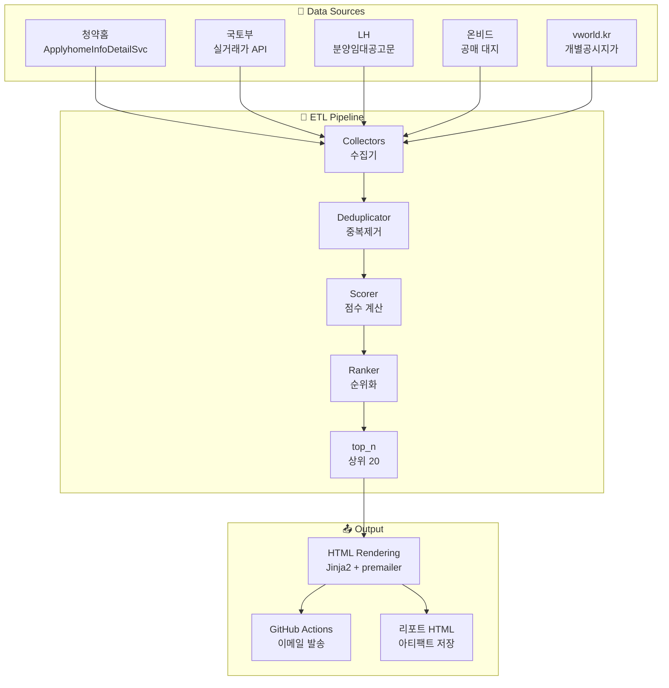

**입력(Data Sources)**: 5개의 공공 API가 각각 다른 데이터를 제공합니다. 청약홈과 국토부 실거래가는 주택 분석에 사용되고, LH/온비드/vworld는 토지 분석에 사용됩니다.

**파이프라인(Pipeline)**: 수집기(Collector)가 각 API로부터 데이터를 가져오면, 정규화된 SaleListing 모델로 변환됩니다. 이후 중복 제거, 점수 계산, 순위화, 상위 N개 추출을 거쳐 최종 20건의 추천 목록이 만들어집니다.

**출력(Output)**: 최종 결과물은 Jinja2 템플릿으로 HTML을 렌더링하고, premailer로 CSS를 인라인화한 후 GitHub Actions SMTP 발송 action을 통해 이메일로 전송됩니다.

### 1.2 핵심 요구사항

| 요구사항 | 설명 | 상세 |
|----------|------|------|
| **데이터 수집** | 5개 공공 API 주기적 호출 | Pagination 자동 처리, FileCache로 중복 호출 방지, rate-limit 준수 |
| **상태 분류** | 공고일 기준 자동 판별 | PLANNED(예정)/OPEN(청약중)/CLOSED(마감)/UNSOLD(잔여)로 분류 |
| **유망도 점수** | 5개 항목 가중합 계산 | 할인율 35% + 교통 30% + 브랜드 15% + 경쟁 15% + 규모 5% |
| **리포트** | HTML 이메일 자동 생성 | premailer CSS 인라인화로 Gmail/Naver 대응 |
| **자동화** | GitHub Actions scheduled workflow | 매일/매주 정해진 시간에 실행, 외부 cron fallback 지원 |

### 1.3 상태 머신 — 분양 공고의 생애주기

분양 공고는 시간이 지남에 따라 상태가 변화합니다. 이 상태는 유망도 분석에서 중요한 필터 조건입니다.

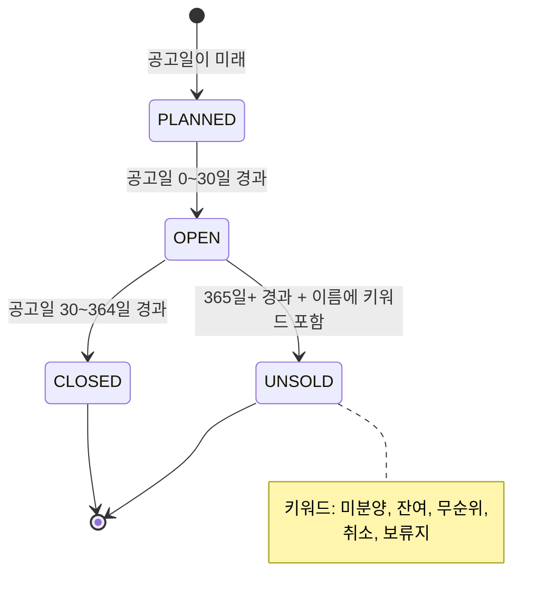

**상태 전이 조건을 자세히 살펴보면**:

- **PLANNED**: 공고일이 현재보다 미래인 경우, 아직 청약이 시작되지 않은 분양입니다. 입지와 분양가만으로 선점 평가가 가능합니다.
- **OPEN**: 공고일이 30일 이내인 경우, 현재 청약이 진행 중이거나 막 마감된 단지입니다. 이 상태가 가장 분석 가치가 높습니다.
- **CLOSED**: 공고일이 30~364일 경과한 경우, 일반적인 청약은 종료되었습니다. 리포트에서 제외됩니다.
- **UNSOLD**: 공고일이 365일 이상 지났지만 단지명에 "미분양", "잔여", "무순위", "취소", "보류지" 등의 키워드가 포함된 경우입니다. 이는 조합원 취소분이나 잔여 세대가 매물로 나온 경우로, **가격 할인이 큰 알짜 매물이 될 가능성이 높아** 리포트에 포함합니다.

상태 판별 로직은 `cheongyak.py`의 `_estimate_status()` 메서드에서 수행합니다. 주의할 점은 청약홈 API가 공고일을 기준으로 90일(현재는 365일로 확장)만 데이터를 제공하므로, UNSOLD 상태의 매물은 API 응답에 포함되지 않을 수 있어 API 조회 기간을 365일로 늘렸습니다.

---

## 2. Architecture & Components

### 2.1 계층형 아키텍처 (Layered Architecture)

이 시스템은 전형적인 3계층 아키텍처를 따릅니다. 각 계층은 자신의 책임에 집중하고, 하위 계층에만 의존합니다.

**Presentation Layer (표현 계층)** — CLI와 HTML 렌더러를 포함합니다. 사용자(또는 GitHub Actions)와의 접점입니다. `cli.py`는 argparse로 명령행 인자를 파싱하고 전체 파이프라인을 오케스트레이션합니다. `email_renderer.py`는 점수 데이터를 받아 HTML 이메일로 변환합니다.

**Domain Layer (도메인 계층)** — 핵심 비즈니스 로직이 위치합니다. 유망도 점수 계산(Scorer), 순위화(Ranker), 할인율 계산(PriceComparator), 브랜드/지역 점수 매핑이 포함됩니다. 이 계층은 외부 API나 파일 I/O에 직접 접근하지 않고, Data Layer가 제공한 데이터로만 작업합니다.

**Data Layer (데이터 계층)** — 외부 API 호출과 캐싱을 담당합니다. 각 API별 Collector가 데이터를 가져와 정규화된 SaleListing 모델로 변환합니다. OdcloudClient는 공통 API 클라이언트로, pagination과 rate-limit을 모든 Collector가 재사용합니다.

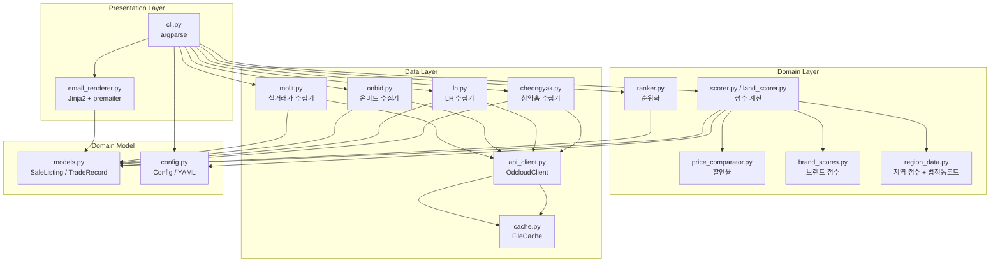

**의존성 방향**: CLI(Presentation)는 모든 계층에 접근합니다. Scorer(Domain)는 브랜드/지역/할인율 정보가 필요하고, Collector(Data)는 API 클라이언트와 캐시만 사용합니다. 모델과 설정은 모든 계층에서 공유됩니다.

### 2.2 패키지 구조

파일/디렉토리 구조는 위 계층 분리를 물리적으로 반영합니다.

```
housing/
├── config.yaml                     # 가중치, API 키, 캐시 설정
├── requirements.txt                # 의존성
├── main.py                         # 진입점 (src.housing.cli 호출)
├── pytest.ini
├── src/housing/
│   ├── cli.py                      # argparse CLI, E2E 파이프라인 오케스트레이션
│   ├── config.py                   # YAML → dict, 환경변수 치환, 타입세이프 접근자
│   ├── models.py                   # SaleListing, TradeRecord, SupplyType, SaleStatus
│   ├── collectors/
│   │   ├── base.py                 # BaseCollector ABC — Config, OdcloudClient, Cache
│   │   ├── cheongyak.py            # 청약홈 아파트 분양 — API 15098547
│   │   ├── lh.py                   # LH 토지/용지 — API 15058530 (upp_ais_tp_cd=01)
│   │   ├── onbid.py                # 온비드 공매 대지 — API B010003
│   │   ├── molit.py                # 국토부 실거래가 — API 15126469
│   │   └── sh.py                   # SH 서울주택 (미사용, COLLECTOR_MAP 미등록)
│   ├── analyzer/
│   │   ├── scorer.py               # 주택 종합 점수 calculator
│   │   ├── land_scorer.py          # 토지(대지) 평가 + vworld.kr 공시지가 fallback
│   │   ├── ranker.py               # 점수 내림차순 정렬, top_n, 카테고리 분류
│   │   ├── price_comparator.py     # 할인율 계산 + 점수 변환
│   │   ├── region_data.py          # 시/군/구 → 법정동코드(5자리), 지역 점수
│   │   └── brand_scores.py         # 건설사 브랜드 점수 맵 (30+개사)
│   ├── reporter/
│   │   ├── email_renderer.py       # Jinja2 + premailer HTML 렌더러
│   │   └── templates/
│   │       └── report.html         # 이메일 템플릿
│   └── utils/
│       ├── api_client.py           # OdcloudClient (pagination, rate-limit, retry)
│       └── cache.py                # FileCache / NullCache (SHA256 key, TTL)
├── tests/                          # pytest 테스트
└── output/
    └── report.html                 # 생성 리포트
```

**collectors/** 디렉토리는 각 API별 수집기가 1:1로 대응됩니다. 모든 수집기는 `BaseCollector` 추상 클래스를 상속받아 `collect()` 인터페이스를 구현합니다. `sh.py`는 서울주택공사(SH) 수집기로 작성되었으나 실제 API 연동이 미구현되어 `COLLECTOR_MAP`에 등록되지 않았습니다.

**analyzer/** 디렉토리는 점수 계산에 필요한 모든 도메인 로직을 포함합니다. `price_comparator.py`는 할인율 계산과 점수 변환을 모두 담당하고, `brand_scores.py`와 `region_data.py`는 순수 데이터 맵입니다.

**reporter/** 디렉토리는 단일 HTML 템플릿(`report.html`)과 이를 렌더링하는 `email_renderer.py`로 구성됩니다. `config.yaml`로부터 동적으로 필터를 등록하는 등 Jinja2 환경을 설정합니다.

**utils/** 디렉토리는 API 클라이언트와 캐시라는 두 가지 핵심 인프라를 제공합니다. 이 모듈들은 전혀 수정하지 않고 재사용할 수 있는 것이 목표입니다.

---

## 3. Data Flow (E2E Pipeline)

### 3.1 `cmd_all()` 상세 흐름 — 한 번의 실행이 거치는 모든 과정

`python -m src.housing.cli all` 명령이 실행되면 `cli.py`의 `cmd_all()` 함수가 다음 순서로 전체 파이프라인을 조율합니다.

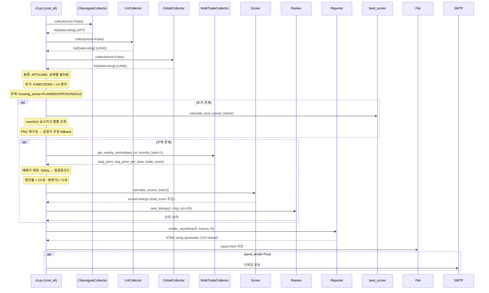

**흐름을 단계별로 설명하면**:

1. **수집 단계**: `collect()`가 순차적으로 세 개의 수집기를 호출합니다. 청약홈 수집기는 아파트(APT) 분양 리스트를, LH와 온비드 수집기는 토지(LAND) 리스트를 반환합니다. 각 수집기는 내부에서 API pagination을 자동 처리하고, FileCache를 통해 중복 호출을 방지합니다.

2. **분류 및 필터링 단계**: 수집된 `SaleListing` 리스트는 두 가지 기준으로 분류됩니다.
   - **supply_type**: `LAND`(토지)와 그 외(주택, APT/PUBLIC)로 분리합니다.
   - **status**: 주택은 `housing_active` 조건(PLANNED/OPEN/UNSOLD)으로 필터링하여 CLOSED 상태를 제외합니다.
   - **분리된 LAND는 다시 온비드(KAMCO)와 LH로 분리**됩니다. KAMCO는 감정가/유찰횟수 등이 풍부하고, LH 토지는 데이터가 부족하여 평가 방식을 달리하기 때문입니다.

3. **토지 점수 계산** (선택): 토지 데이터가 있으면 `land_scorer.py`의 `calculate_land_scores_batch()`가 각 토지의 5개 항목 점수를 계산합니다. 이 과정에서 vworld.kr API로 공시지가를 조회합니다. 공시지가 조회가 실패하면 PNU 재구성 → 감정가 추정 fallback 체인이 작동합니다(4.2.2절 참조).

4. **시세 매칭 및 주택 점수 계산** (선택): 주택 데이터가 있으면 먼저 MolitTradeCollector로 인근 실거래가를 조회합니다. `months_back=1`(1개월)로 최신 거래 데이터를 가져와 법정동코드 기준으로 각 listing에 매칭합니다. 그 후 `scorer.py`의 `calculate_scores_batch()`가 5개 항목의 종합 점수를 계산합니다.

5. **순위화**: `ranker.py`가 점수 내림차순으로 정렬하고 `top_n(20)`으로 상위 20개만 추출합니다.

6. **리포트 생성**: `email_renderer.py`가 최종 데이터(주택 Top 20, KAMCO, LH)를 받아 Jinja2 템플릿을 렌더링합니다. premailer가 CSS를 인라인화한 후 최종 HTML 파일을 저장하고, `--send-email` 옵션시 SMTP로 발송합니다.

### 3.2 데이터 흐름 다이어그램 — 상태 기반 의사결정 구조

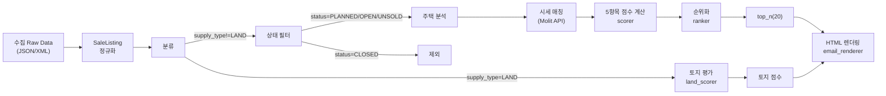

이 다이어그램은 데이터가 파이프라인을 통과하면서 어떤 분기(branch)를 타는지 보여줍니다. 핵심 분기점은 두 가지입니다:

- **supply_type 분기**: `LAND`는 토지 평가 루트로, 그 외는 주택 분석 루트로 갑니다. 두 루트는 완전히 다른 평가 방식을 사용하므로 이후 합쳐지지 않고 독립적으로 점수가 계산됩니다.
- **status 분기**: 주택 중에서 `CLOSED` 상태(마감된 청약)는 리포트에서 제외됩니다. 이는 리소스 낭비를 막고 리포트의 정보 밀도를 높이기 위함입니다.

---

## 4. Scoring System

### 4.1 주택 (아파트 분양) — 점수 체계와 가중치의 설계 의도

주택 유망도 점수는 **5개 독립 항목의 가중합**으로 계산됩니다. 각 항목은 0~100점 범위를 가지며, 가중치는 투자 수익성에 미치는 영향력을 기준으로 배분했습니다.

가장 높은 가중치(0.35)를 받은 **할인율**은 분양가가 시세보다 얼마나 저렴한지를 나타내며, 이는 단기 차익 실현 가능성에 직접 연결됩니다. 두 번째로 높은 **교통/입지**(0.30)는 장기 가치와 환금성을 결정짓는 요소입니다. **브랜드**(0.15)와 **경쟁률**(0.15)은 각각 품질 신뢰도와 시장의 수요 강도를 나타내며, **규모**(0.05)는 단지의 커뮤니티 인프라 수준을 반영합니다.

```mermaid
graph TB
    subgraph Inputs["입력 데이터"]
        DR[할인율<br/>discount_rate]
        TL[교통/입지 점수<br/>region + GTX]
        BR[브랜드 점수<br/>builder name]
        CR[경쟁률 점수<br/>competition_rate]
        SC[규모 점수<br/>units]
    end

    subgraph Weights["가중치 (config.yaml)"]
        W1["discount_rate: 0.35"]
        W2["transit_location: 0.30"]
        W3["brand: 0.15"]
        W4["competition: 0.15"]
        W5["scale: 0.05"]
    end

    subgraph Total["종합 점수"]
        TOTAL[total_score =<br/>Σ(각 항목 점수 × 가중치)]
    end

    DR --> TOTAL
    TL --> TOTAL
    BR --> TOTAL
    CR --> TOTAL
    SC --> TOTAL
```

가중치는 `config.yaml`에 정의되어 있어, 운영 중에도 변경할 수 있습니다. 만약 "입지보다 브랜드가 더 중요하다"는 피드백이 있다면 config만 수정하면 됩니다.

#### 4.1.1 할인율 점수 (가중치 0.35) — 가장 중요한 수익성 지표

할인율은 "이 아파트를 분양받아서 당장 팔면 얼마를 벌 수 있는가"를 측정합니다. 계산 방식은 다음과 같습니다.

```
할인율 = (인근 실거래가 - 분양가) / 인근 실거래가 × 100
```

여기서 **인근 실거래가**는 MolitTradeCollector가 동일 법정동코드(5자리)의 최근 1개월간 거래 데이터를 수집하여 ㎡당 평균가로 산출합니다. **분양가**는 청약홈 API가 제공하는 주택형별 공급면적(㎡)당 분양가입니다. 총액이 아닌 단가(㎡당)로 비교하는 이유는 단지마다 주택형 구성이 달라 총액 비교가 왜곡될 수 있기 때문입니다.

| 할인율 | 점수 | 의미 |
|--------|:----:|------|
| ≥20% | 100 | 분양가가 시세보다 20% 이상 저렴 — 매우 유망 |
| 10% | 75 | 적정 수준의 할인 |
| 0% | 50 | 분양가 = 시세, 프리미엄 없음 |
| -10% | 25 | 분양가가 시세보다 10% 비쌈 |
| ≤-20% | 0 | 매우 불리 |
| 데이터 없음 | 50 | 중립 (추정 불가) |

할인율 데이터를 구할 수 없는 경우(해당 지역 최근 거래가 없을 때)에는 50점으로 중립 처리합니다. 이는 "잘 모르겠다"는 의미로, 나머지 항목으로 평가가 이루어지도록 합니다.

#### 4.1.2 교통/입지 점수 (가중치 0.30) — 환금성과 장기 가치 결정

입지 점수는 지역별 기본 점수에 교통 인프라(지하철, GTX) 보너스를 더해 결정됩니다.

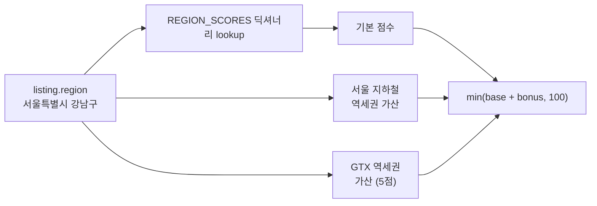

**지역 점수**는 `region_data.py`의 `REGION_SCORES` 딕셔너리에 정의되어 있습니다. 기본 점수는 해당 지역의 장기적 주택 수요와 가격 안정성을 반영합니다. 점수는 다양한 요소를 고려해 수동으로 설정됩니다:

| 지역 | 점수 | 설정 이유 |
|------|:----:|-----------|
| 서울 | 95 | 대한민국 최상위 입지, 수요와 환금성 모두 최고 |
| 부산 | 80 | 광역시 중 가장 높은 수요 |
| 인천 | 82 | GTX 개통으로 서울 접근성 대폭 개선 |
| 경기 성남 | 88 | 판교/분당 중심, IT 업무지구 |
| 경기 과천 | 90 | 서울 접근성 + 교육환경 우수 |
| 경기 평택 | 72 | GTX 개통 예정, 상대적 저평가 지역 |
| 광주 | 72 | 광역시이나 지역경제 규모 고려 |
| 경남 함안 | 40 | 인구 감소 지역, 낮은 수요 |

**GTX 역세권 가산**(5점)은 GTX 노선이 개통되었거나 개통 예정인 역 주변 단지에 추가 점수를 부여합니다. GTX는 서울 도심 접근 시간을 혁신적으로 단축시키므로 입지 가치에 직접적인 영향을 미칩니다.

#### 4.1.3 브랜드 점수 (가중치 0.15) — 건설사 평판이 미래 가치에 미치는 영향

브랜드 점수는 동일한 입지라도 건설사에 따라 미래 가치(중고 시장 가격)가 달라지는 현실을 반영합니다. 브랜드 점수는 `brand_scores.py`의 `BRAND_SCORES` 딕셔너리에서 정의되며, `config.yaml`의 `brand_score_overrides`로 덮어쓰기할 수 있습니다.

매칭 로직은 다음과 같습니다:

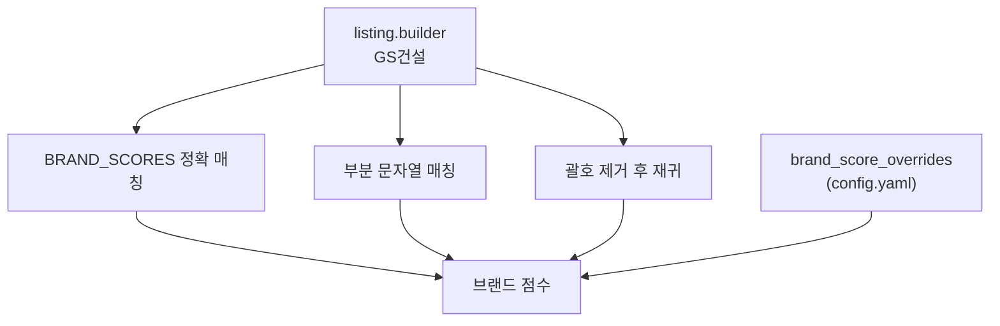

**매칭 우선순위**:
1. 정확 매칭: `"GS건설"` → `brand_scores["GS건설"]`
2. 부분 문자열 매칭: `"GS건설(합병)"` → `"GS건설"` 포함 여부 확인
3. 괄호 제거: `"GS건설(합병)"` → `"GS건설"` 추출 → 재귀 매칭
4. 오버라이드: config.yaml 우선 적용
5. 모두 실패 시: 50점(중립)

주요 브랜드 점수:

| 건설사 | 점수 | 비고 |
|--------|:----:|------|
| 삼성물산 | 96 | 래미안 — 최상위 브랜드 |
| GS건설 | 95 | 자이(Xi) — 프리미엄 브랜드 |
| 현대건설 | 94 | 힐스테이트 — 프리미엄 브랜드 |
| 포스코건설/이앤씨 | 90 | 더샵 — 상위 브랜드 |
| 대우건설 | 88 | 푸르지오 |
| DL이앤씨 | 87 | e편한세상 |
| 롯데건설 | 85 | 롯데캐슬 |
| 호반건설 | 80 | 중상위 |
| 한화건설 | 78 | 중상위 |
| 중흥건설 | 76 | 중위 |
| LH | 65 | 공공 — 브랜드 프리미엄 낮음 |
| 매칭 실패 | 50 | 미등록 건설사 |

#### 4.1.4 경쟁률 점수 (가중치 0.15) — 시장의 수요 신호

경쟁률은 **다른 수요자들이 이 단지를 얼마나 선호하는지**를 보여주는 시장의 직접적인 신호입니다. 높은 경쟁률은 대기 수요가 풍부하다는 의미로, 미래에도 환금성이 좋을 것으로 예상할 수 있습니다.

| 경쟁률 | 점수 | 시장 해석 |
|--------|:----:|-----------|
| ≥50:1 | 100 | 극도의 수요 집중, 당첨만 되면 확실한 수익 |
| ≥30:1 | 90 | 매우 높은 경쟁 |
| ≥15:1 | 75 | 높은 경쟁 |
| ≥5:1 | 55 | 적정 경쟁 |
| ≥1:1 | 30 | 경쟁 거의 없음 |
| <1:1 또는 데이터 없음 | 10 또는 50 | 미달 또는 데이터 부족 |

경쟁률 데이터는 청약홈 API로부터 가져오며, 모든 주택형의 평균 경쟁률을 사용합니다. API가 경쟁률을 제공하지 않는 경우 50점(중립)으로 설정됩니다.

#### 4.1.5 규모 점수 (가중치 0.05) — 커뮤니티 인프라 반영

규모(세대수)는 단지 내 커뮤니티 시설, 상가, 녹지 등 인프라의 규모와 직결됩니다. 대규모 단지일수록 자체 편의시설이 잘 갖춰지는 경향이 있습니다. 단, 가중치가 5%로 가장 낮아 전체 점수에 미치는 영향은 제한적입니다.

| 세대수 | 점수 산식 |
|--------|-----------|
| 1000세대 이상 | 100점 |
| 100-999세대 | `세대수 / 1000 × 100` |
| 100세대 미만 | `세대수 / 100 × 10` |

### 4.2 토지 (온비드 공매 대지) — 주택과 다른 평가 체계

토지 평가는 주택과 완전히 다른 접근법을 사용합니다. 주택이 "시세 대비 할인율"에 초점을 맞춘다면, 토지 평가는 **"공시지가 대비 입찰가의 적정성"** 과 **"감정가 대비 할인율"**을 중심으로 합니다.

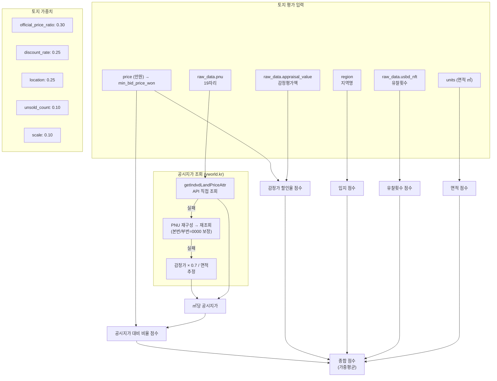

**토지 5개 평가 항목**:

| 항목 | 가중치 | 설명 |
|------|:------:|------|
| 공시지가 대비 비율 | 30% | 입찰가가 공시지가보다 얼마나 싼지 — 핵심 수익성 지표 |
| 감정가 할인율 | 25% | 감정평가액 대비 할인 수준 |
| 입지 | 25% | 지역별 수요 및 발전 가능성 |
| 유찰횟수 | 10% | 유찰될수록 낙찰가 인하 가능성 |
| 면적 규모 | 10% | 대지 면적 |

#### 4.2.1 공시지가 대비 비율 점수 (가중치 0.30) — 토지의 핵심 수익성 지표

```
ratio = 최저입찰가총액 / (공시지가 × 면적)
```

이 비율이 낮을수록 공시지가(정부 평가액)보다 싸게 살 수 있는 기회를 의미합니다.

| ratio | 점수 | 의미 |
|------|:----:|------|
| ≤0.3 (30%) | 100 | 공시지가보다 70% 싸게 — 매우 유망 |
| ≤0.5 (50%) | 85 | |
| ≤0.8 (80%) | 65 | |
| ≤1.0 (100%) | 50 | 공시지가 수준 |
| ≤1.5 (150%) | 25 | |
| ≤2.0 (200%) | 10 | |
| >2.0 | 5 | |

#### 4.2.2 공시지가 조회 Fallback 체인 — 다양한 실패 상황에 대비

공시지가 조회는 토지 평가에서 가장 중요한 입력값이지만, API가 항상 성공하는 것은 아닙니다. 다음과 같은 fallback 체인으로 모든 실패 상황에 대비합니다:

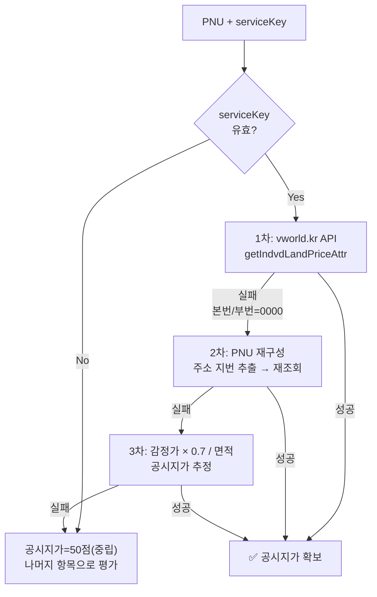

**Fallback 설명**:
1. **1차**: vworld.kr API에 PNU(19자리 필지고유번호)로 직접 조회
2. **2차**: 1차가 실패하고 PNU의 본번/부번이 0000(대표 지번)인 경우, PNU에서 주소를 추출하여 지번(본번/부번)을 보정한 후 재조회
3. **3차**: API 조회가 계속 실패하면 감정평가액 × 0.7(일반적인 공시지가/감정가 비율) / 면적으로 공시지가를 추정
4. **최종**: 모든 방법이 실패하면 공시지가 항목은 50점(중립)으로 처리하고 나머지 4개 항목으로 평가

---

## 5. API Integration

### 5.1 공공데이터 API 연동 구조

5개의 외부 API는 모두 공통 클라이언트(`OdcloudClient`)를 통해 호출됩니다. 즉, API 연동의 **공통 관심사**(인증, pagination, 재시도, rate-limit)는 모두 `OdcloudClient`에 집중되어 있고, 각 Collector는 **비즈니스 로직**(데이터 변환, 정규화)에만 집중합니다.

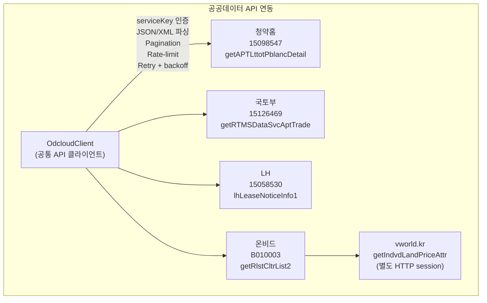

vworld.kr만 예외적으로 별도 HTTP 세션을 사용합니다. 이는 vworld.kr이 data.go.kr 도메인(공공데이터포털)이 아닌 별도 인증 체계를 사용하기 때문입니다.

| API | ID | 수집기 | 출력 데이터 |
|-----|-----|--------|-------------|
| 청약홈 분양공고 상세 | 15098547 | cheongyak | SaleListing (APT) |
| 국토부 아파트 실거래가 | 15126469 | molit | TradeRecord |
| LH 분양임대공고문 | 15058530 | lh | SaleListing (LAND) |
| 온비드 부동산 물건목록 | B010003 | onbid | SaleListing (LAND) |
| vworld.kr 개별공시지가 | — | land_scorer | ㎡당 공시지가 |

### 5.2 API Client 상세 — OdcloudClient의 내부 동작

`OdcloudClient`는 공공데이터포털의 다양한 API 응답 구조를 처리할 수 있도록 설계되었습니다.

**주요 특징**:

1. **통합 인증**: 생성자에서 `serviceKey`를 받아 모든 요청의 query parameter에 자동 포함
2. **응답 구조 자동 파싱**: 공공데이터포털 API는 응답 구조가 제각각입니다. `_extract_data()` 메서드가 다양한 JSON 구조를 자동 탐지하여 데이터 배열만 추출합니다
3. **Pagination 자동화**: `fetch_all()`이 page/perPage 파라미터를 순차적으로 증가시키며 모든 페이지를 수집합니다. `totalCount` 응답이 있으면 조기에 종료하여 불필요한 호출을 방지합니다
4. **재시도 + backoff**: 일시적 오류(5xx) 발생시 지수 backoff(지연 시간을 점진적으로 증가)로 최대 `max_retries`회 재시도
5. **Rate-limit 준수**: `_wait_rate_limit()`가 각 요청 사이에 `config.request_delay`(기본 0.1초) 이상 간격을 보장

```
OdcloudClient
├── _service_key: str          # data.go.kr API key
├── _session: requests.Session # 재사용 세션
├── _wait_rate_limit()         # config.request_delay 준수
├── _request()                 # GET/POST + 재시도 (exponential backoff)
├── fetch()                    # 단일 페이지 JSON
├── fetch_text()               # XML/Text 응답
├── fetch_all()                # Pagination 자동 처리
│   ├── page/perPage 파라미터
│   ├── 최대 max_pages 페이지
│   └── totalCount 조기 종료
├── _extract_data()            # 다양한 응답 구조 처리
│   ├── {"data": [...]}
│   ├── {"response": {"body": {"items": {"item": [...]}}}}
│   └── {"body": {"items": [...]}}
└── _get_total_count()         # totalCount 추출
```

### 5.3 캐시 — FileCache로 불필요한 API 호출 방지

공공데이터 API는 호출 횟수 제한이 있고 latency도 높기 때문에, 동일한 요청을 반복하지 않도록 캐시가 필수적입니다.

**FileCache의 동작 방식**:

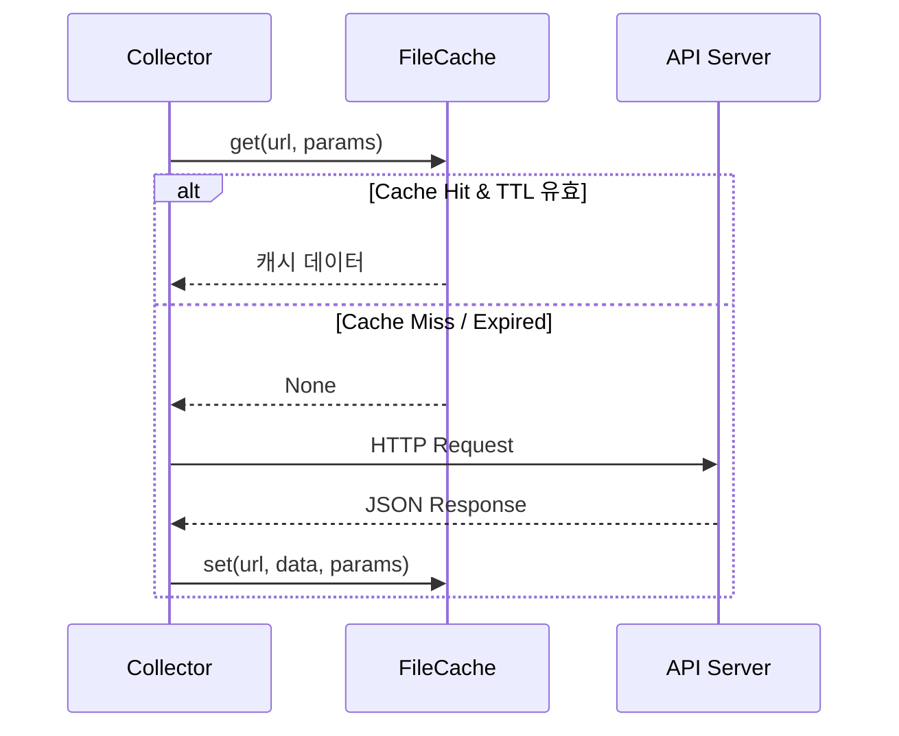

**캐시 키 생성**: URL과 요청 파라미터(serviceKey 제외)를 JSON 직렬화하여 SHA256 해시로 변환합니다. serviceKey를 키에서 제외하는 이유는 같은 API 요청이라도 키만 다를 경우 캐시 미스가 발생하는 것을 방지하기 위함입니다.

**Cache TTL**: 기본 6시간입니다. API 업데이트 주기가 일반적으로 1일 단위이므로, 6시간이면 데이터 신선도와 API 호출 횟수 사이의 합리적인 균형점입니다. 테스트 시에는 `NullCache`를 사용하여 캐시를 완전히 비활성화할 수 있습니다.

---

## 6. Data Model

### 6.1 SaleListing — 시스템 전체의 중앙 데이터 모델

`SaleListing`은 이 시스템에서 가장 중요한 데이터 클래스입니다. 모든 Collector는 API 응답을 `SaleListing`으로 정규화하고, 모든 Analyzer는 `SaleListing`을 입력받아 점수를 계산합니다. 즉, **모든 모듈 간의 데이터 교환은 SaleListing을 통해 이루어집니다**.

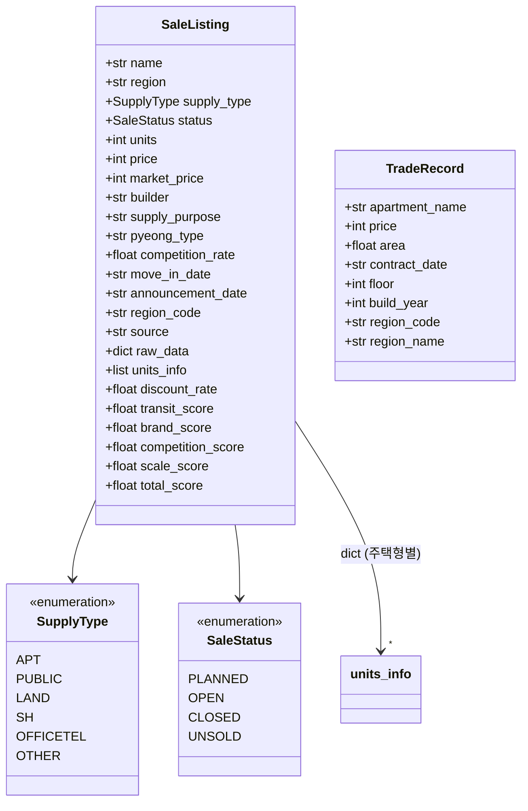

**필드 설명**:

| 필드 | 설정 시점 | 용도 |
|------|-----------|------|
| `name`, `region`, `builder` | Collector | 기본 식별 정보 |
| `supply_type`, `status` | Collector | 분류 및 필터링 |
| `units`, `price`, `competition_rate` | Collector | 점수 계산 입력 |
| `announcement_date`, `region_code` | Collector | 상태 판별, 시세 매칭 |
| `raw_data` | Collector | 원본 JSON 보존 (디버깅용) |
| `units_info` | Collector | 주택형별 세부 정보 (㎡당 분양가 계산) |
| `discount_rate`, `transit_score`, `brand_score`, `competition_score`, `scale_score` | Scorer | 각 항목별 점수 (0-100) |
| `total_score` | Scorer | 최종 종합 점수 |

`raw_data`는 Collector가 API로부터 받은 원본 JSON을 그대로 보관합니다. 이는 디버깅과 fallback 데이터 추출을 위한 것으로, 프로덕션에서는 사용되지 않습니다.

### 6.2 units_info 구조 — 주택형별 상세 정보

`units_info`는 하나의 분양 단지 내에 여러 주택형(전용면적별)이 있는 경우를 표현합니다. 리스트로 관리되는 이유는 동일 단지라도 주택형마다 분양가와 세대수가 다르기 때문입니다.

```python
units_info = [
    {
        "model_no": "1",           # 주택형 번호
        "house_type": "전용 84",    # 주택형명
        "supply_area": "84.0",     # 공급면적 (㎡)
        "price": 95000,            # 분양가 (만원)
        "households": 384,         # 세대수
        "price_per_m2": 1130.95,   # ㎡당 분양가 (계산됨)
        "price_per_pyung": 3738,   # 평당 분양가 (계산됨, 만원)
    }
]
```

각 주택형은 `model_no`로 식별됩니다. `price_per_m2`와 `price_per_pyung`은 할인율 계산을 위해 Collectr가 미리 계산해둔 파생 필드입니다.

### 6.3 TradeRecord — 실거래가 데이터

MolitTradeCollector가 국토부 실거래가 API에서 수집한 개별 거래 건을 나타냅니다. `region_code`(법정동코드 앞 5자리)로 SaleListing과 매칭됩니다.

---

## 7. Report Generation

### 7.1 이메일 리포트의 생산 과정

리포트 생성은 세 단계로 이루어집니다: **데이터 가공 → 템플릿 렌더링 → CSS 인라인화**.

**데이터 가공 단계**에서 `email_renderer.py`는 점수 데이터를 템플릿이 소비하기 쉬운 형태로 변환합니다. 예를 들어 할인율을 퍼센트 문자열로 변환하고, 상태(SupplyType)를 한글 레이블("아파트", "공공분양")로 매핑합니다. 또한 `units_info`를 HTML `<table>` 문자열로 미리 렌더링합니다(접이식 상세 테이블용).

**Jinja2 렌더링** 단계에서는 `report.html` 템플릿에 데이터를 주입하여 완전한 HTML을 생성합니다. Jinja2 필터(`format_number`, `color_for_score` 등)를 통해 숫자 형식과 색상을 템플릿 내에서 처리합니다.

**premailer 변환**이 마지막 단계입니다. `<style>` 블록의 CSS를 각 HTML 요소의 `style` 속성으로 인라인화합니다. 이는 Gmail, Naver 등 대부분의 웹메일이 `<style>` 태그를 제거하기 때문에 필수적입니다.

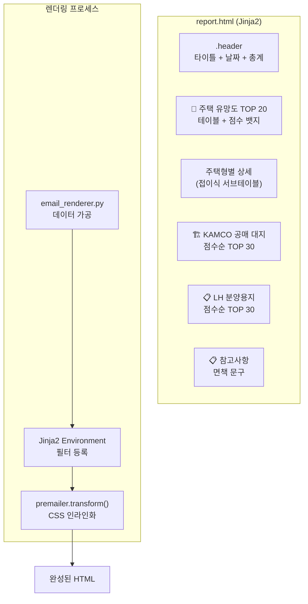

### 7.2 주택 테이블 컬럼 설명

| 컬럼 | 데이터 | 비고 |
|------|--------|------|
| 순위 | rank | 점수 순위 (1-20) |
| 유형 | `supply_type_kr` | 아파트 / 공공분양 |
| 단지명 | `name` + `builder` | ex. "북서울자이 폴라리스 / GS건설" |
| 지역 | `region` | "서울특별시 강북구 미아동" |
| 세대수 | `units` | 숫자 (천단위 콤마) |
| 분양가 | `avg_price_per_pyung` | 평당만원 (ex. "3,738") |
| 참고가 | `market_price_str` | 시세 추정가 (Molit 기반) |
| 할인율 | `discount_rate` | 퍼센트 (ex. "-5.2%") |
| 점수 | `total_score` | 배경색으로 시각화 |
| 상세 | units_table | ▶ 접으면 주택형별 상세 테이블 표시 |

### 7.3 점수별 색상 — 한눈에 보는 유망도

| 점수대 | 색상 | 의미 |
|:------:|------|------|
| 80+ | `#1a7a3a` (진한 초록) | 매우 유망 — 상위권 |
| 70+ | `#2d8f4e` (초록) | 유망 |
| 60+ | `#e6a817` (노랑) | 보통 |
| <60 | `#b91c1c` (빨강) | 비추천 — 불리한 조건 |

---

## 8. Deployment & CI/CD

### 8.1 GitHub Actions Workflow — 자동화된 일정 실행

이 시스템은 GitHub Actions의 scheduled workflow로 매일 실행됩니다. 워크플로우 파일은 `.github/workflows/email-report.yml`에 위치합니다.

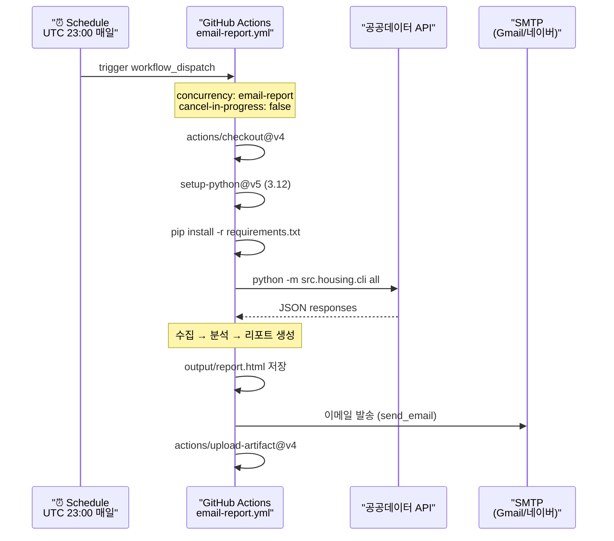

**스케줄**: 매일 UTC 23:00(KST 08:00)에 실행됩니다. `concurrency: cancel-in-progress: false`로 설정되어 이전 실행이 아직 끝나지 않았더라도 새 실행이 시작되지 않고 대기합니다.

**주요 단계**:
1. 코드 체크아웃 → Python 3.12 설정 → 의존성 설치
2. `python -m src.housing.cli all` 실행 (전체 파이프라인)
3. 생성된 `output/report.html`을 SMTP로 발송
4. HTML 리포트를 GitHub Actions 아티팩트로 업로드 (7일간 보관)

### 8.2 환경변수 — API 키와 SMTP 인증 정보

모든 민감 정보는 GitHub Actions Secrets에 저장되며, 워크플로우에서 환경변수로 주입됩니다.

| 변수 | 필수 | 용도 |
|------|:----:|------|
| `DATA_GO_KR_API_KEY` | ✅ | 공공데이터포털 통합 서비스키 (4개 API 공용) |
| `VWORLD_API_KEY` | 토지 | vworld.kr 공시지가 API |
| `SMTP_HOST` | 이메일 | SMTP 서버 주소 |
| `SMTP_PORT` | 이메일 | SMTP 포트 (기본 587) |
| `SMTP_USER` | 이메일 | SMTP 계정 (Gmail 사용시 전체 주소) |
| `SMTP_PASS` | 이메일 | SMTP 비밀번호 (Gmail: 앱 비밀번호 사용) |
| `MAIL_TO` | 이메일 | 수신자 이메일 주소 |
| `MAIL_FROM` | - | 발신자 (생략시 SMTP_USER 사용) |

### 8.3 설정 파일 (config.yaml) — 런타임 설정의 중앙 관리

시스템의 모든 튜닝 가능한 파라미터는 `config.yaml` 한 곳에서 관리됩니다. Python 코드는 환경변수 치환(`${VAR_NAME}`)을 지원하는 `config.py`를 통해 이 파일을 읽습니다.

```yaml
api_keys:
  data_go_kr: "${DATA_GO_KR_API_KEY}"    # 환경변수 치환
  vworld: "${VWORLD_API_KEY}"

weights:
  discount_rate: 0.35    # 할인율 (합계 1.0)
  transit_location: 0.30  # 교통/입지
  brand: 0.15             # 브랜드
  competition: 0.15       # 경쟁률
  scale: 0.05             # 규모

land_weights:
  official_price_ratio: 0.30  # 공시지가 대비
  discount_rate: 0.25          # 감정가 할인율
  location: 0.25               # 입지
  unsold_count: 0.10           # 유찰
  scale: 0.10                  # 면적

api:
  request_delay: 0.1    # 초
  max_retries: 3
  timeout: 30
  per_page: 100

cache:
  enabled: true
  ttl_hours: 6
  dir: ".cache"
```

**설계 의도**: 가중치를 config로 분리한 이유는 "이 단지의 점수가 이상하다"는 피드백이 왔을 때 코드 변경 없이 config만 수정하면 되도록 하기 위함입니다. 예를 들어 할인율의 중요도를 더 높이고 싶다면 `weights.discount_rate`를 0.40으로 올리면 됩니다.

---

## 9. Location Code Mapping

### 9.1 주소 → 법정동코드 매핑 — 데이터 간 연결의 핵심

이 시스템에서 가장 까다로운 문제 중 하나는 **분양 공고(청약홈)의 지역 정보와 실거래가(국토부)의 지역 정보를 일치시키는 것**입니다. 청약홈은 자체 region_code(3자리 숫자)를 사용하는 반면, 국토부 실거래가 API는 법정동코드(5자리)를 요구합니다.

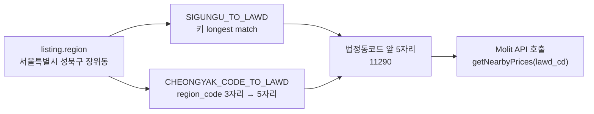

**매핑은 두 단계로 이루어집니다**:

1. **1차 매핑** (`SIGUNGU_TO_LAWD`): `listing.region` 문자열(예: "서울특별시 성북구 장위동")에서 시/군/구명을 longest match로 추출하여 240개 시/군/구 매핑 테이블에서 법정동코드 5자리(시/군/구 코드)를 찾습니다. 예: "성북구" → `11290`.

2. **2차 매핑 (fallback)** (`CHEONGYAK_CODE_TO_LAWD`): 청약홈 API가 자체적으로 제공하는 3자리 region_code(예: `100`=서울)를 5자리 법정동코드로 변환합니다. 이는 1차 매핑이 실패했을 때 사용됩니다. 17개 시/도 수준의 매핑만 존재하므로 정밀도는 낮지만, 마지막 보루 역할을 합니다.

정확한 법정동코드 매칭은 **할인율 계산의 정확도**에 직접적인 영향을 미칩니다. 엉뚱한 지역의 실거래가와 비교하면 할인율이 왜곡되기 때문입니다.

---

## 10. Known Limitations & Design Decisions

### 10.1 설계 결정과 그 배경

| 항목 | 결정 | 상세 사유 |
|------|------|-----------|
| **`months_back=1`** | Molit 실거래가 조회 기간 1개월 | 12개월로 설정하면 60회 API 호출이 필요하지만(60개 법정동), 1개월로 줄이면 20회 내외로 최적화됨. 단, 거래량이 적은 지역은 최근 1개월간 거래가 없어 할인율 데이터를 구할 수 없는 단점이 있음 |
| **API 수집 기간 365일** | 청약홈 API 조회 기간 365일 | 원래 90일이었으나 UNSOLD(잔여/미분양) 매물이 API 응답에서 누락되는 문제 발견 후 확장. 365일로 늘려도 API 응답 속도에 큰 차이는 없었음 |
| **`top_n=20`** | 주택 섹션 상위 20개만 표시 | 이메일 가독성과 모바일에서의 스크롤 부담을 고려. 20개 이상이면 정보 과잉으로 핵심 매물 식별이 어려움 |
| **CLOSED 필터** | 공고일 30일 이상 경과시 리포트에서 제외 | 마감된 청약(CLOSED)은 더 이상 청약할 수 없으므로 정보 가치가 낮음. 단, UNSOLD는 예외적으로 포함 |
| **CSS 인라인화** | premailer.transform() 사용 | Gmail, Naver Mail, Outlook Web Access는 `<style>` 블록을 제거함. 인라인 스타일만 보존되므로 모든 이메일 클라이언트에서 동일한 레이아웃 보장 |
| **NaverCollector** | 완전 제거됨 | Naver 부동산에서 mock 데이터만 반환하고 실제 분석 가치가 없었음. 크롤링 기반 수집은 유지보수 비용 대비 효용이 낮다고 판단 |
| **SHCollector** | COLLECTOR_MAP 미등록 | 서울주택공사(SH) 수집기는 코드만 존재하고 실제 API 인증키와 연동이 구현되지 않음. 현재는 사용하지 않음 |

### 10.2 알려진 한계

1. **실거래가 지연**: 국토부 실거래가 API는 계약일 기준으로 최대 1-2개월 지연되어 데이터가 제공됩니다. 따라서 리포트의 할인율은 "과거 1개월간의 평균"을 기준으로 하며, 급등/급락장에서는 실제 시세와 차이가 있을 수 있습니다.

2. **LH 토지 데이터 누락**: LH API(`upp_ais_tp_cd=01`)는 면적과 가격 정보를 별도 엔드포인트에서 제공하지 않는 경우가 있습니다. 이 경우 "평당참고가" 컬럼이 공란으로 표시되며, 할인율 점수 없이 나머지 항목으로만 평가됩니다.

3. **경쟁률 데이터의 한계**: 청약홈 API가 모든 단지에 경쟁률을 제공하지는 않습니다. 경쟁률이 없는 단지는 50점(중립)으로 처리되므로, 실제 경쟁이 치열한 신규 단지와 차별화되지 않을 수 있습니다.

4. **GitHub Actions 스케줄 지연**: GitHub Actions의 scheduled workflow는 실제 트리거 시점이 설정 시각보다 최대 10시간 이상 지연되는 경우가 보고됩니다. 이에 대한 대책으로 cron-job.org 같은 외부 cron 서비스를 통한 `workflow_dispatch` 호출을 고려할 수 있습니다.

---

## 11. Error Handling — graceful degradation 원칙

이 시스템의 오류 처리 철학은 **"부분 실패가 전체를 멈추지 않게 한다"** 는 graceful degradation(우아한 성능 저하)입니다. 특정 API가 실패하더라도 리포트는 생성되어야 하며, 단지 해당 섹션만 제외되거나 중립 점수로 처리됩니다.

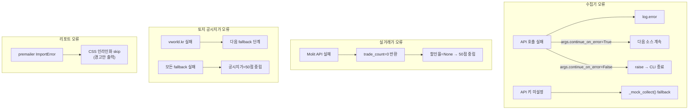

**각 오류 시나리오별 처리**:

| 시나리오 | 처리 방식 | 영향 |
|----------|-----------|------|
| 특정 Collector API 호출 실패 | `args.continue_on_error=True`시 log만 남기고 다음 소스로 진행 | 해당 섹션(주택/KAMCO/LH)만 누락 |
| API 키 미설정 | `_mock_collect()` 호출로 mock 데이터 사용 | 점수 계산 로직은 테스트 가능하나 실제 데이터는 미반영 |
| Molit 실거래가 API 실패 | `trade_count=0` 반환, 할인율=None | 할인율 점수 50점(중립) 처리 |
| vworld.kr 공시지가 조회 실패 | 3단계 fallback 체인 | 전부 실패시 공시지가=50점(중립) |
| premailer 미설치 | CSS 인라인화 skip, 경고만 출력 | 이메일 클라이언트에서 레이아웃 깨짐 가능 |
| 전체 API 실패 + `--mock` 옵션 | mock 데이터로 리포트 생성 | 실제 데이터 리포트는 아님 |
