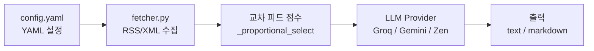
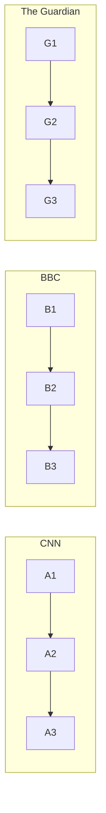
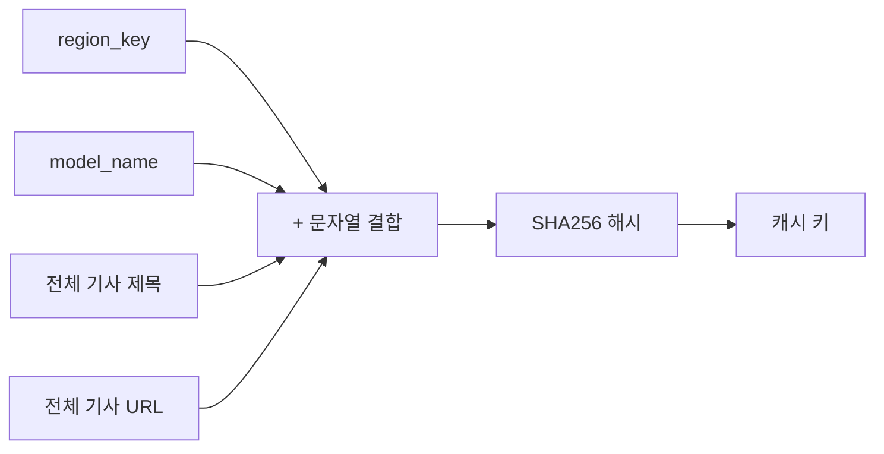
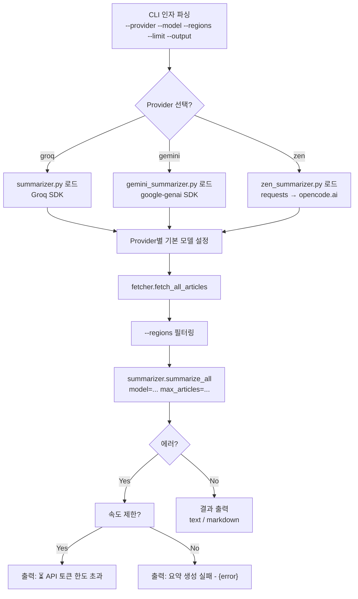
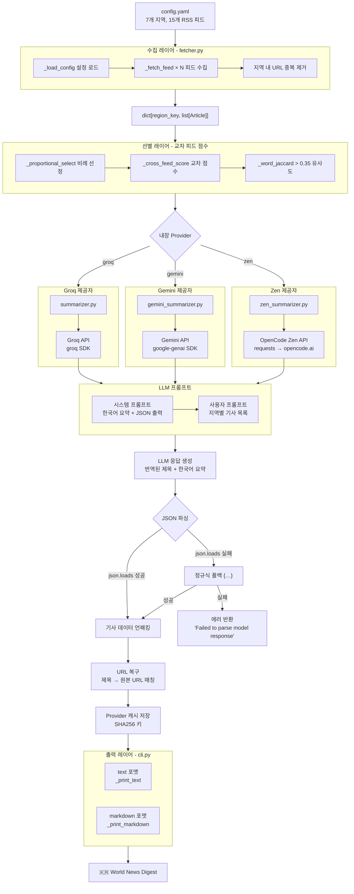

# DESIGN-NEWS.md — 지역별 뉴스 수집 및 요약 시스템

## 개요

전 세계 7개 지역의 RSS 피드를 수집 → 중요한 기사 선별 → LLM으로 한국어 요약.

- **저장소**: [github.com/icarus-inte01/sandbox](https://github.com/icarus-inte01/sandbox) — `news/` 디렉터리



---

## 1. 데이터 모델 — `src/news/models.py`

모든 레이어에서 공유하는 핵심 데이터클래스:

```python
@dataclass
class FeedConfig:
    url: str        # RSS 피드 URL
    source: str     # 표시 이름 (예: "CNN", "BBC")

@dataclass
class RegionConfig:
    name: str               # 사람이 읽을 수 있는 지역명
    feeds: list[FeedConfig] # 지역당 1–3개 피드

@dataclass
class Article:
    title: str          # RSS 원본 제목
    url: str            # 최선의 기사 URL
    description: str    # RSS 요약/설명 (프롬프트에서 500자로 제한)
    source_name: str    # 예: "BBC Asia", "SCMP"
    published: str      # ISO-8601 날짜 문자열
    region: str         # 지역 키 (fetcher가 채움)
```

**설계 노트:**
- `Article`은 Fetcher → Selector → LLM 프롬프트로 흐르며, 역직렬화되지는 않음
- `FeedConfig` / `RegionConfig`는 설정 레이어에만 존재하며 Fetcher에서 소비됨

---

## 2. 설정 — `config.yaml`

```yaml
regions:
  north_america:
    name: "North America"
    feeds:
      - url: "http://rss.cnn.com/rss/cnn_topstories.rss"
        source: "CNN"
      - url: "https://feeds.bbci.co.uk/news/world/us_and_canada/rss.xml"
        source: "BBC"
  asia:
    name: "Asia"
    feeds:
      - url: "https://www3.nhk.or.jp/rss/news/cat0.xml"
        source: "NHK"
      - url: "https://www.scmp.com/rss/4/feed"
        source: "SCMP"
      ...
  europe, middle_east, latin_america, africa, oceania: ...
```

`fetcher._load_config()` 에 의해 로드 → `dict[str, RegionConfig]`.

---

## 3. 수집 레이어 — `src/news/fetcher.py`

### 역할
- YAML 설정 파싱
- `feedparser`로 각 RSS 피드 수집
- 제목, URL, 설명, 발행일 추출
- **지역 내** URL 중복 제거
- RSS 피드 순서 유지 (편집자가 중요한 기사를 먼저 배치)

### 주요 함수

```python
def fetch_all_articles(config_path="config.yaml") -> dict[str, list[Article]]
```

모든 지역을 순회하며 각 피드에 대해:
1. `_fetch_feed(feed_cfg)` → `feedparser.parse(url)` → `Article` 리스트
   - URL 추출 우선순위: `links[alternate/html]` > `id`/`guid` > `link` 폴백
   - 날짜 추출: `published_parsed` > `updated_parsed` → ISO-8601
2. 지역 내 URL 기준 중복 제거 (첫 번째 항목 우선)
3. 결과: `{"asia": [Article, ...], "europe": [...], ...}`

### 의존성
- `feedparser` — RSS/Atom XML 파서
- `pyyaml` — 설정 로더

---

## 4. 선별 레이어 — 교차 피드 점수 (Cross-Feed Scoring)

세 summarizer 모듈에 동일하게 내장되어 있음. 별도 파일 없음.

### 알고리즘: `_proportional_select(articles, n)`

```
목표: 여러 피드에서 비례적으로 n개 기사를 선별하되,
      여러 소스에서 보도된 기사에 가중치 부여.
```

**1단계: `source_name`으로 그룹화**



**2단계: `_cross_feed_score()`로 그룹 내 점수 계산**
- 각 기사에 대해 **다른 피드**에서 유사한 제목의 기사를 얼마나 많이 가져왔는지 카운트
- 유사도 기준: `_word_jaccard()` > 0.35
- 3개 피드에서 보도된 기사 → 점수 2, 1개 피드만 보도 → 점수 0

**3단계: 각 그룹 내에서 점수 내림차순 정렬**

**4단계: 슬롯 분배**

```mermaid
flowchart LR
    N[n = 전체 슬롯 수] --> Divide[per_feed = n // len&#40;그룹 수&#41;<br/>remainder = n % len&#40;그룹 수&#41;]
    Divide --> CNN_take["CNN: per_feed + 1"]
    Divide --> BBC_take["BBC: per_feed + 1"]
    Divide --> G_take["Guardian: per_feed"]
    CNN_take --> Selected["선정된 기사"]
    BBC_take --> Selected
    G_take --> Selected
```



### 중요성
- 여러 소스에서 보도된 속보가 우선 선정됨
- 지역/틈새 기사도 피드별 할당 슬롯으로 대표성 확보
- 단일 피드가 50개 기사를 가져와도 다른 피드를 압도하지 않음

---

## 5. LLM 요약 레이어 — 3개 제공자

### 공통 인터페이스

모든 summarizer 모듈은 세 가지 함수를 노출:

```python
summarize_all(articles_by_region, region_names, model, max_articles) → list[dict]
summarize_region(region_key, region_name, articles, model, max_articles) → dict
emoji_for(region_key) → str
```

반환 구조:
```python
{
    "region": "asia",
    "region_name": "Asia",
    "articles": [
        {"title": "한국어 제목", "url": "...", "one_liner": "...", "significance": "..."},
        ...
    ],
    "error": None | str
}
```

### 5a. Groq 제공자 — `src/news/summarizer.py`

| 항목 | 상세 |
|---|---|
| API | `groq` Python SDK → `client.chat.completions.create()` |
| 환경변수 | `GROQ_API_KEY` |
| 기본 모델 | `llama-3.3-70b-versatile` |
| 무료 모델 | `llama-3.3-70b-instruct`, `llama-4-maverick-17b-128e-instruct-fp8`, `llama-4-scout-17b-16e-instruct-fp8` |
| 속도 제한 | 재시도 없음 — 429 발생 시 에러 반환 |
| 캐시 | `.cache/summaries.json` |
| 특징 | `response_format={"type": "json_object"}` (네이티브 구조화 출력) |

### 5b. Gemini 제공자 — `src/news/gemini_summarizer.py`

| 항목 | 상세 |
|---|---|
| API | `google-genai` Python SDK → `client.models.generate_content()` |
| 환경변수 | `GEMINI_API_KEY` 또는 `GOOGLE_API_KEY` |
| 기본 모델 | `gemini-2.5-flash-lite` |
| 속도 제한 | 15s/30s/45s 백오프로 3회 재시도 |
| 캐시 | `.cache/summaries_gemini.json` |
| 특징 | `response_mime_type="application/json"` (네이티브 구조화 출력) |

### 5c. Zen 제공자 — `src/news/zen_summarizer.py`

| 항목 | 상세 |
|---|---|
| API | Raw `requests` → `https://opencode.ai/zen/v1/chat/completions` |
| 환경변수 | `OPENCODE_API_KEY` |
| 기본 모델 | `big-pickle` |
| 무료 모델 | `deepseek-v4-flash-free`, `kimi-k2.5-free`, `qwen3.6-plus-free`, `glm-4.7-free`, `mimo-v2-flash-free` 외 15+ |
| 속도 제한 | 10s/20s/30s 백오프로 3회 재시도 (429/5xx 발생 시) |
| 캐시 | `.cache/summaries_zen.json` |
| 특징 | OpenAI 호환 엔드포인트, 가장 다양한 무료 모델 선택지 |

### LLM 프롬프트 구조

**시스템 프롬프트** (3개 제공자 모두 동일):

```
역할: 한국어 뉴스 요약 비서
작업: 5개 중요 기사 선정 → 각각:
  1. 한국어 제목 (번역 필수 — 원어 유지 금지)
  2. 한국어 요약 (4-5문장, 누가/무엇을/언제/어디서/왜 포함)
  3. 입력받은 URL
  4. 한국어 중요도 설명 (2-3문장)

엄격 규칙: 모든 출력은 한국어. 일본어, 중국어, 포르투갈어 등 금지.
응답 형식: JSON — {"articles": [{"title", "url", "one_liner", "significance"}]}
```

**사용자 프롬프트** (지역별 구성):

```
Region: {name}
Total articles available: {n}

[1] Title: ...
    Source: ...
    Description: ...

[2] ...
...
```

각 설명은 500자로 제한. 모델은 지역당 약 30개 기사를 수신.

### 번역 및 요약

번역과 요약은 **단일 LLM 호출**로 처리 — 별도의 번역 단계 없음. 프롬프트가 모델에 지시:
1. 영어/일본어/중국어 등으로 된 기사 읽기
2. 제목을 **한국어로 번역**
3. 내용을 **한국어로 요약**
4. 한국어 JSON으로 출력

이는 **번역-후-요약** 방식을 한 번에 처리하는 방식으로, 2단계 파이프라인과 대조됨.

### 후처리

1. **JSON 파싱**: `json.loads()` 시도 → 실패 시 정규식 `{...}` 추출 → 실패 시 에러 반환
2. **URL 복구**: 출력된 제목을 정규화된 제목 조회를 통해 원본 URL과 매칭

---

## 6. 캐싱 레이어

### 동작 방식



| 제공자 | 캐시 파일 |
|---|---|
| Groq | `.cache/summaries.json` |
| Gemini | `.cache/summaries_gemini.json` |
| Zen | `.cache/summaries_zen.json` |

- 최초 실행 → API 호출 → 캐시 저장
- 재실행 (동일 기사 + 모델) → 캐시 히트 → API 호출 없음
- 캐시는 실행 간 유지됨 (디스크의 JSON 파일)

---

## 7. CLI 및 출력 레이어 — `src/news/cli.py`

### 진입점

```bash
python main.py [--provider groq|gemini|zen]
               [--model <model-name>]
               [--regions asia,europe]
               [--limit 30]
               [--output text|markdown]
               [--config config.yaml]
```

### 흐름



### 제공자 → 모듈 매핑

| `--provider` | 모듈 | 기본 모델 |
|---|---|---|
| `groq` | `summarizer` (groq SDK) | `llama-3.3-70b-versatile` |
| `gemini` | `gemini_summarizer` | `gemini-2.5-flash-lite` |
| `zen` | `zen_summarizer` (requests) | `big-pickle` |

---

## 8. 전체 데이터 흐름 다이어그램



---

## 9. 주요 설계 결정

| 결정 | 근거 |
|---|---|
| **Pluggable providers** | 파이프라인 코드 변경 없이 AI 백엔드 전환 가능. 동일한 `summarize_region()` 인터페이스. |
| **교차 피드 점수** | 단일 피드 독점 방지. 여러 소스 보도 속보가 상위 선정됨. |
| **단일 호출 번역 + 요약** | 2단계 파이프라인보다 단순. 단일 컨텍스트 윈도우, 단일 API 호출, 지연 시간 감소. |
| **Provider별 캐시** | 동일 기사 + 다른 모델 → 다른 캐시 키. 교차 오염 없음. |
| **JSON 구조화 출력** | 일관된 파싱 가능 출력 강제. 정규식 폴백으로 복원력 확보. |
| **RSS 순서 유지 (날짜 정렬 안 함)** | RSS 피드는 중요한 기사를 먼저 배치. 편집자 순서가 알고리즘 정렬보다 우선. |
| **설명 500자 제한** | 더 많은 기사를 컨텍스트 윈도우에 포함 (30개 기사 × ~500자 ≈ 15K 토큰). |
| **지역별 LLM 호출** | 각 지역이 독립적인 컨텍스트를 가짐. 지역 간 혼동 방지. |

---

## 10. 개선 가능 사항

- **2단계 파이프라인**: 번역 단계를 요약과 분리. 단계별로 다른 모델 사용 가능.
- **비동기 API 호출**: 순차 처리 대신 지역별 병렬 처리 (현재 지역 간 3초 쿨다운).
- **지역별 프롬프트 설정**: 지역마다 다른 길이 요구사항 설정 가능.
- **폴백 체인**: 기본 Provider 실패 시 자동으로 보조 Provider 재시도.
- **스트리밍 출력**: 각 지역 완료 시점에 바로 출력 (UX 개선).
- **프롬프트 압축**: LLM 전송 전 기사를 사전 요약하여 더 긴 컨텍스트 처리.
