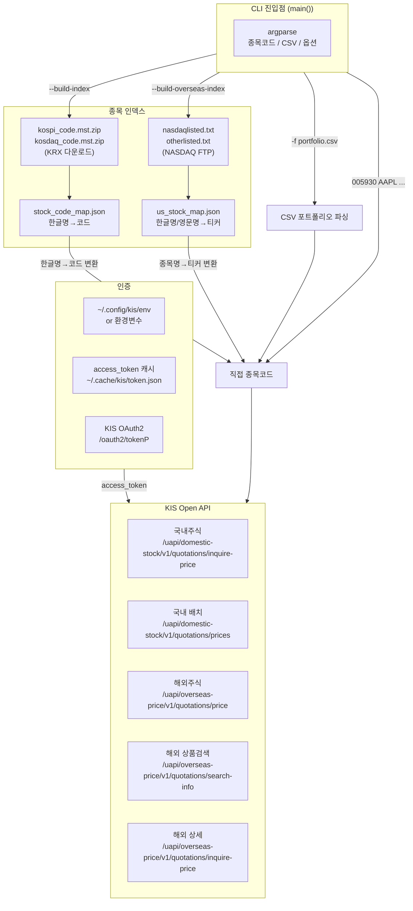
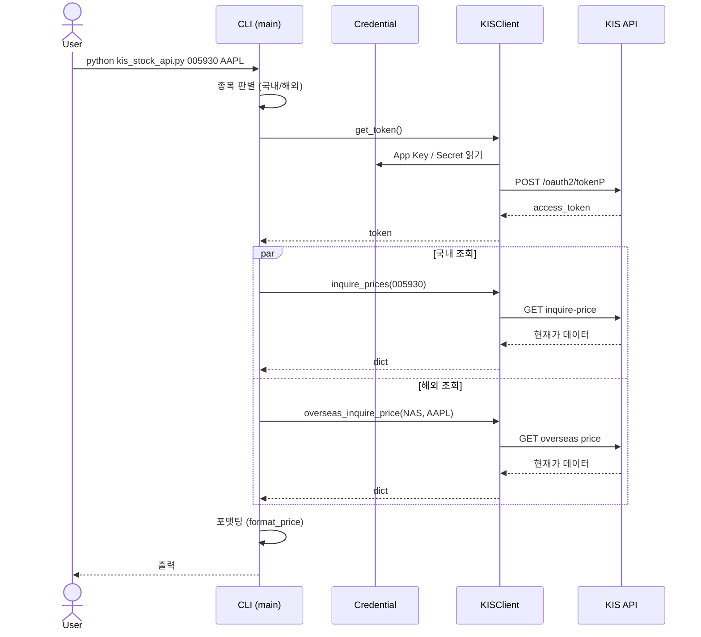
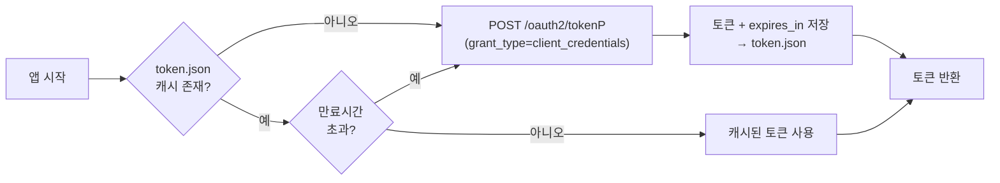
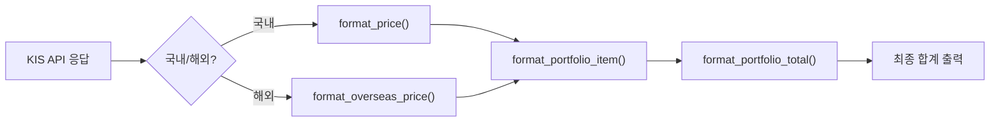

# KIS Stock API — Design Document

## 개요

KIS (한국투자증권) Open API를 통해 국내/해외 주식 현재가를 조회하는 CLI 도구입니다.

- **저장소**: [github.com/icarus-inte01/sandbox](https://github.com/icarus-inte01/sandbox) — `stock/` 디렉터리
- **실행 환경**: Python 3 스크립트 (단일 파일)
- **외부 의존성**: `requests` 패키지만 필요

---

## Architecture



### 실행 흐름



---

## 제공 기능

### 1. 국내주식 현재가 조회

| 항목 | 설명 |
|------|------|
| **API** | `GET /uapi/domestic-stock/v1/quotations/inquire-price` |
| **입력** | 6자리 종목코드 (e.g. `005930`) |
| **출력** | 현재가, 전일대비, 등락률, 시가/고가/저가, 거래량 |
| **Batch** | 최대 30종목을 1회 API 호출로 처리 (`inquire_prices_batch`) |

**KISClient.inquire_price() 동작:**

```python
def inquire_price(self, stock_code: str) -> dict:
    # GET /uapi/domestic-stock/v1/quotations/inquire-price
    # Headers: tr_id=HHKBP0002 (현재가)
    # Params: fid_cond_mrkt_div_code=J (KOSPI/KOSDAQ 자동)
    #         fid_input_iscd={stock_code}
    return response.json()["output"]
```

### 2. 해외주식 현재가 조회

| 항목 | 설명 |
|------|------|
| **API** | `GET /uapi/overseas-price/v1/quotations/price` |
| **입력** | 거래소코드 (`NAS`/`NYS`/`AMS`) + 티커 |
| **출력** | 현재가, 전일대비, 등락률, 매수/매도호가 |
| **종목명 검색** | `overseas_search_info()`로 티커→종목명 변환 가능 |

해외주식은 거래소코드와 상품유형코드가 필요합니다:

```python
OVS_EXCHANGE_MAP = {
    "NASDAQ": ("NAS", "512"),
    "NYSE":   ("NYS", "513"),
    "AMEX":   ("AMS", "529"),
}
```

### 3. 종목명 → 코드 변환 (인덱스)

**국내주식 인덱스:**

KRX에서 제공하는 마스터 파일(`kospi_code.mst.zip`, `kosdaq_code.mst.zip`)을 다운로드받아 파싱합니다.

| 파일 | URL | 내용 |
|------|-----|------|
| `kospi_code.mst.zip` | `new.real.download.dws.co.kr` | KOSPI 전종목 단축코드+한글명 |
| `kosdaq_code.mst.zip` | `new.real.download.dws.co.kr` | KOSDAQ 전종목 단축코드+한글명 |

MST 파일 형식 (고정 너비 바이너리):
```
단축코드(9bytes) + 한글종목명(40bytes) + ... + 제조업(1byte) + ...
```

**해외주식 인덱스:**

NASDAQ Trader FTP에서 제공하는 심볼 디렉터리를 다운로드받습니다.

| 파일 | URL | 내용 |
|------|-----|------|
| `nasdaqlisted.txt` | `ftp://ftp.nasdaqtrader.com/...` | NASDAQ 상장종목 |
| `otherlisted.txt` | `ftp://ftp.nasdaqtrader.com/...` | NYSE/AMEX 등 상장종목 |

### 4. 포트폴리오 CSV 조회

CSV 파일로 포트폴리오를 관리하고 일괄 조회합니다.

**CSV 형식:**

```csv
code,qty          # code: 종목코드, qty: 보유수량
005930,100
KMI,50
```

```csv
name,qty          # name: 종목명 (인덱스 필요)
삼성전자,100
Kinder Morgan,50
```

**`--mixed` 모드:** 국내/해외 자동 판별:
- 6자리 숫자 `code` → 국내주식
- 한글 포함 `name` → `KOREAN_OVS_MAP` 확인 후 판별
- 영문 `name` → 해외주식 우선, 국내 인덱스에 있으면 국내

### 5. 환율 조회

해외 평가금액의 원화 환산을 위한 USD/KRW 환율 조회:

```python
def fetch_usd_krw_rate() -> float | None:
    # 1. open.er-api.com (무료, 무가입)
    # 2. 사용자 지정 (--rate 옵션)
```

---

## 인증 (Credential)

KIS Open API는 2-legged OAuth2 인증을 사용합니다.

### 인증 정보 저장

`~/.config/kis/env` 파일에 `KEY=VALUE` 형식으로 저장:

```
KIS_APP_KEY=your_app_key
KIS_APP_SECRET=your_app_secret
```

### 토큰 발급 흐름



- access_token은 `~/.cache/kis/token.json`에 캐시
- 만료 1시간 전부터 재발급
- `_get_credential()`: 환경변수 → env 파일 순서로 조회

---

## Rate Limit 처리

KIS API는 초당 약 10회 호출 제한이 있습니다.

| 전략 | 적용 |
|------|------|
| **국내 배치** | `inquire_prices_batch()`로 최대 30종목을 1회 호출에 처리 |
| **해외 병렬 제한** | 2개 스레드로 제한 (`ThreadPoolExecutor(max_workers=2)`) |
| **자동 재시도** | `EGW00201` (rate limit 초과) 오류 시 2초 대기 후 1회 재시도 |
| **search_info 제한** | 포트폴리오에서는 호출하지 않음 (각 종목별 추가 API 호출 방지) |

---

## 포맷팅 (출력)



| 함수 | 역할 |
|------|------|
| `format_price()` | 국내주식: 현재가, 전일대비, 등락률, 거래량 |
| `format_overseas_price()` | 해외주식: 현재가, 전일대비, 등락률, 호가 |
| `format_overseas_search_info()` | 해외주식 상품기본정보 (종목명, 상장국가 등) |
| `format_portfolio_item()` | 포트폴리오 항목별: 현재가 × 수량 = 평가금액 |
| `format_portfolio_total()` | 국내/해외 합계 + 환율 반영 최종 합계 |

---

## 파일 구조

```
~/work/sandbox/stock/
├── kis_stock_api.py        # 메인 스크립트 (1168 lines)
└── README.md               # 사용 가이드

런타임 파일:
~/.config/kis/env                    — API 인증 정보 (KEY=VALUE)
~/.cache/kis/token.json              — access_token 캐시
~/.cache/kis/stock_code_map.json     — 국내 종목 인덱스
~/.cache/kis/us_stock_map.json       — 해외 종목 인덱스
```

---

## 환경

| 항목 | 값 |
|------|-----|
| **Python** | 3.11+ |
| **의존성** | `requests` (외부 API 호출) |
| **API** | KIS Open API (`openapi.koreainvestment.com:9443`) |
| ** Transport** | HTTPS (REST) |
| **인증** | 2-legged OAuth2 (client_credentials) |

---

## 보안

1. **API 키 저장**: `~/.config/kis/env` 파일에 저장 (chmod 600 권장)
2. **토큰 캐시**: `~/.cache/kis/token.json`에 저장, 만료 1시간 전부터 자동 갱신
3. **인증 정보 유출 방지**: `.gitignore`에 `.kis_token_cache.json` 포함
4. **입력 검증**: 종목코드는 숫자/영문만 허용 (포맷팅 시에만 처리)
