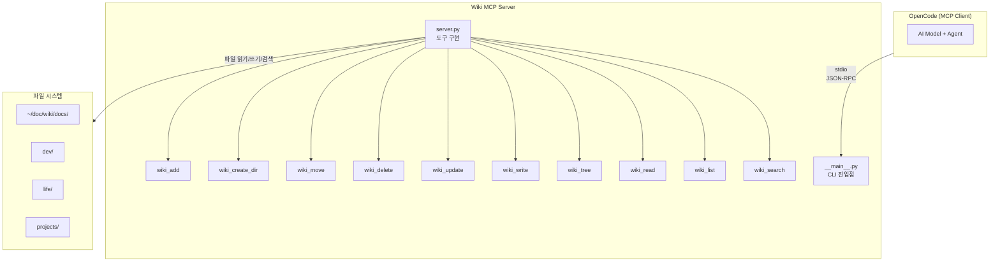
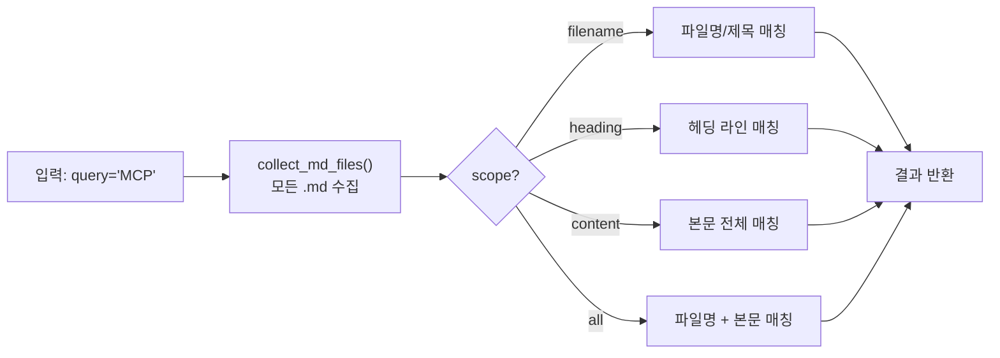
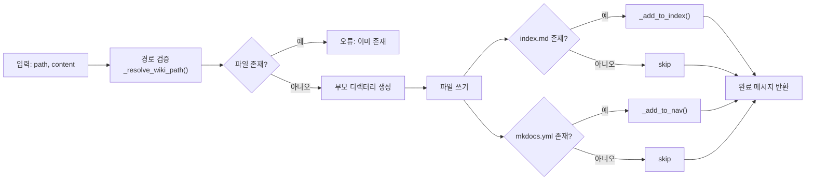
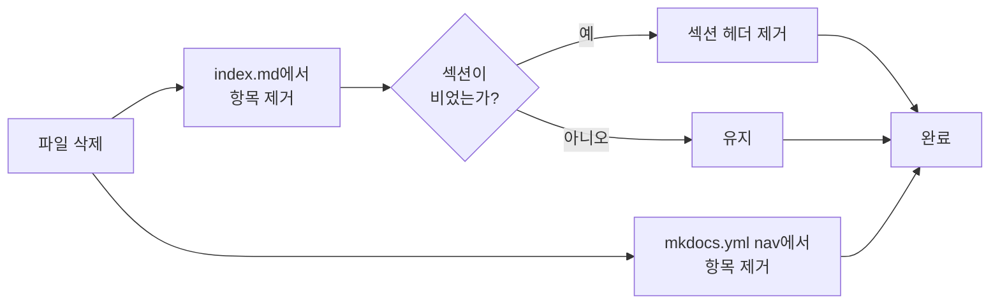
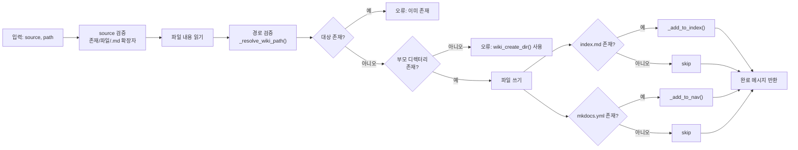
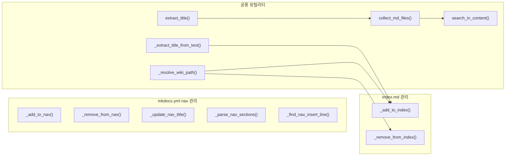
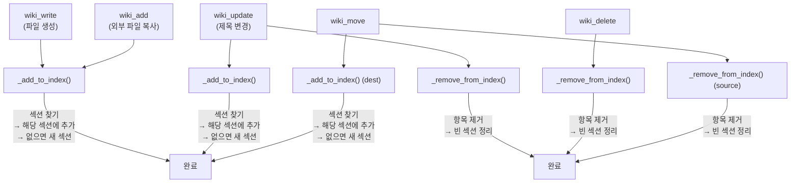
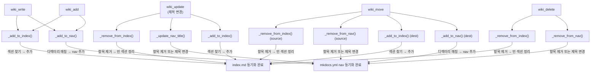
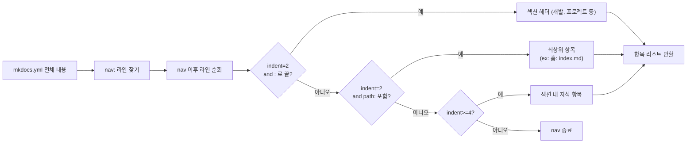

# Wiki MCP Server — Design Document

## 개요

Wiki MCP는 개인 위키(`~/doc/wiki/docs`)를 AI가 직접 검색/조회/편집할 수 있게 해주는 MCP 서버입니다. OpenCode의 MCP 클라이언트를 통해 10개의 도구를 제공하며, 파일 변경 시 `index.md`와 `mkdocs.yml` `nav`를 자동으로 동기화합니다.

---

## Architecture



### 프로젝트 구조

```
~/work/wiki_mcp/
├── .venv/                    # Python 가상 환경 (mcp SDK)
├── .gitignore
├── pyproject.toml            # pip 패키지 설정
├── README.md                 # 한글 README (기본)
├── README.en.md              # 영문 README
├── wiki_mcp/                 # Python 패키지
│   ├── __init__.py           # 패키지 초기화
│   ├── __main__.py           # CLI 진입점 (python -m wiki_mcp)
│   └── server.py             # MCP 서버 구현체
```

### 실행 방식

```bash
# OpenCode가 내부적으로 실행
/home/icarus/work/wiki_mcp/.venv/bin/python -m wiki_mcp /home/icarus/doc/wiki/docs
```

- **Transport**: stdio (표준입출력 파이프)
- **Protocol**: JSON-RPC 2.0
- **등록**: `opencode.jsonc` → `mcp.wiki` 섹션

---

## 제공 도구

### 1. wiki_search

위키 문서를 키워드로 검색합니다.

| 항목 | 설명 |
|------|------|
| **목적** | 문서를 찾을 때 "그거 어디 있었지?" 순간에 사용 |
| **검색 범위** | 파일명, 헤딩(`#`), 본문 내용 |
| **입력** | `query` (필수), `scope` (선택: all/filename/heading/content), `max_results` (선택, 기본 10) |
| **출력** | 매칭된 문서 목록 (제목, 경로, 매칭 개수) |

**동작 방식:**



### 2. wiki_list

특정 디렉터리의 문서 목록을 보여줍니다.

| 항목 | 설명 |
|------|------|
| **목적** | 디렉터리 구조 탐색 |
| **입력** | `path` (선택, 기본: 루트) |
| **출력** | `.md` 파일과 하위 디렉터리 목록 |
| **보안** | Path traversal 방어 (wiki_root 내부로 제한) |

### 3. wiki_read

위키 문서의 전체 내용을 읽습니다.

| 항목 | 설명 |
|------|------|
| **목적** | 문서 내용 조회 |
| **입력** | `path` (필수, e.g. `dev/mcp.md`) |
| **출력** | 전체 마크다운 내용 |
| **편의** | `.md` 확장자 생략 가능 |

### 4. wiki_tree

전체 위키 문서 트리를 계층 구조로 보여줍니다.

| 항목 | 설명 |
|------|------|
| **목적** | 위키 전체 구조 파악 |
| **입력** | 없음 |
| **출력** | 디렉터리별 문서 트리 |

### 5. wiki_write

새 마크다운 문서를 생성하고, 같은 디렉터리의 `index.md`와 `mkdocs.yml` `nav`에 자동 등록합니다.

| 항목 | 설명 |
|------|------|
| **목적** | 새 문서 생성 |
| **입력** | `path` (필수), `content` (필수), `section` (선택, index.md 섹션명) |
| **출력** | 생성 확인 메시지 + index.md 등록 + mkdocs.yml nav 등록 결과 |
| **특징** | 첫 번째 `# ` 헤딩을 문서 제목으로 자동 추출 |

**동작 방식:**



### 6. wiki_update

기존 문서의 내용을 업데이트합니다. 제목(`# ` 헤딩)이 변경되면 `index.md`의 항목과 `mkdocs.yml` `nav`의 제목도 함께 갱신합니다.

| 항목 | 설명 |
|------|------|
| **목적** | 문서 내용 편집 |
| **입력** | `path` (필수), `content` (필수) |
| **출력** | 업데이트 확인 메시지 + index.md/mkdocs.yml nav 변경 사항 |

### 7. wiki_delete

문서를 삭제하고 `index.md`와 `mkdocs.yml` `nav`에서 해당 항목을 제거합니다. 항목 제거 후 섹션이 비어 있으면 섹션도 함께 제거합니다.

| 항목 | 설명 |
|------|------|
| **목적** | 문서 삭제 |
| **입력** | `path` (필수) |
| **출력** | 삭제 확인 메시지 + index.md + mkdocs.yml nav 정리 결과 |

**정리 흐름:**



### 8. wiki_move

문서를 이동하거나 이름을 변경합니다. 원본 디렉터리의 `index.md`와 `mkdocs.yml` `nav`에서 항목을 제거하고, 대상 디렉터리의 `index.md`와 `mkdocs.yml` `nav`에 항목을 추가합니다.

| 항목 | 설명 |
|------|------|
| **목적** | 문서 이동/이름 변경 |
| **입력** | `source` (필수), `dest` (필수), `section` (선택, 대상 index.md 섹션명) |
| **출력** | 이동 확인 + 원본/대상 index.md + mkdocs.yml nav 갱신 결과 |

### 9. wiki_create_dir

새 디렉터리와 기본 `index.md`를 생성합니다.

| 항목 | 설명 |
|------|------|
| **목적** | 새 카테고리 디렉터리 생성 |
| **입력** | `path` (필수), `title` (필수, index.md의 `# ` 제목) |
| **출력** | 디렉터리 + index.md 생성 확인 |

### 10. wiki_add

외부 마크다운 파일을 위키로 복사합니다.

| 항목 | 설명 |
|------|------|
| **목적** | 로컬에 있는 `.md` 파일을 위키로 가져오기 |
| **입력** | `source` (필수, 외부 파일 절대 경로), `path` (필수, 위키 내 대상 경로), `section` (선택) |
| **출력** | 복사 확인 + index.md 등록 + mkdocs.yml nav 등록 결과 |
| **특징** | `wiki_write`와 동일하게 index.md/nav 자동 동기화, 부모 디렉터리 없으면 `wiki_create_dir()` 사용 유도 |

**동작 방식:**



---

## 핵심 함수 (server.py)



| 함수 | 역할 |
|------|------|
| `extract_title()` | `.md` 파일의 첫 번째 `# ` 헤딩을 읽어 문서 제목으로 사용 |
| `_extract_title_from_text()` | 문자열에서 첫 번째 `# ` 헤딩 추출 (파일 없이도 동작) |
| `collect_md_files()` | `root.rglob("*.md")`로 모든 마크다운 파일 재귀 수집 |
| `search_in_content()` | 파일 내용을 읽고 `query.lower() in line.lower()`로 대소문자 구분 없이 검색 |
| `_resolve_wiki_path()` | 상대 경로를 절대 경로로 변환 + `wiki_root` 이탈 검증 |
| `_add_to_index()` | `index.md`의 특정 섹션 아래에 항목 추가 (섹션이 없으면 생성) |
| `_remove_from_index()` | `index.md`에서 항목 제거 + 빈 섹션 정리 |
| `_add_to_nav()` | `mkdocs.yml` `nav`의 적절한 섹션 아래에 새 항목 추가 |
| `_remove_from_nav()` | `mkdocs.yml` `nav`에서 파일 경로로 항목 찾아 제거 |
| `_update_nav_title()` | `mkdocs.yml` `nav`에서 파일 경로에 해당하는 제목 문자열 교체 |
| `_parse_nav_sections()` | `mkdocs.yml` 문자열을 파싱하여 nav 항목 리스트 반환 |
| `_find_nav_insert_line()` | nav 항목 리스트에서 새 파일을 삽입할 라인 번호 계산 |
| `serve()` | MCP 서버 메인 루프 — tool 목록 등록 + 요청 처리 |

---

## index.md 관리 규칙

AGENTS.md 규칙을 `_add_to_index()` / `_remove_from_index()`로 자동화:



**규칙 요약:**
- 새 파일 생성/외부 파일 추가 → 같은 디렉터리의 `index.md`에 항목 추가 + `mkdocs.yml` `nav`에 등록
- 제목 변경 → `index.md` + `mkdocs.yml` `nav` 제목 갱신
- 파일 삭제 → `index.md`에서 항목 제거 + `mkdocs.yml` `nav`에서 제거; 빈 섹션도 함께 정리
- 파일 이동 → 원본 `index.md`/`nav`에서 제거, 대상 `index.md`/`nav`에 추가
- `index.md` 자체는 자기 자신의 목록에 포함되지 않음

### 전체 동기화 흐름



---

## mkdocs.yml Nav 관리

`mkdocs.yml`의 `nav` 섹션을 `_add_to_nav()` / `_remove_from_nav()` / `_update_nav_title()`로 자동 관리합니다.

### 구현 방식: 문자열 기반 조작

처음에는 `ruamel.yaml` 라이브러리로 round-trip YAML 편집을 시도했으나, 기존 `mkdocs.yml`에 포함된 `!!python/name:` 태그(PyYAML 확장)를 파싱하지 못해 `ParserError`가 발생했습니다.

해결책: **순수 문자열 기반 파싱 + 조작**으로 전환했습니다.

```python
# nav 섹션을 파싱하여 항목 리스트 반환
def _parse_nav_sections(mkdocs_content: str) -> list[dict]:
    # 각 항목: { line, indent, path, title, section, is_section }

# nav 항목의 실제 파일 경로 추출
# ("- 제목: path.md" → "path.md",  "- path.md" → "path.md")
def _entry_path(e: dict) -> str | None:

# 새 파일을 nav의 적절한 위치에 삽입할 라인 번호 찾기
# (같은 디렉터리의 마지막 항목 다음 라인)
def _find_nav_insert_line(entries: list[dict], rel_path: str) -> int | None:
```

### nav 섹션 파싱 알고리즘



### nav 추가/제거/변경 동작

| 함수 | 동작 |
|------|------|
| `_add_to_nav()` | `mkdocs.yml` 읽기 → nav 파싱 → `_find_nav_insert_line()`로 적절한 위치 계산 → 4-space indent로 새 줄 삽입 |
| `_remove_from_nav()` | nav 섹션 내에서 `path/to/file.md` 패턴 매칭 → 해당 줄 제거 → 연속 빈 줄 정리 |
| `_update_nav_title()` | `path/to/file.md` 패턴으로 줄 찾기 → `:` 앞의 제목 부분을 새 제목으로 교체 |

위치 결정: 파일의 디렉터리 경로를 기준으로 기존 nav에서 같은 디렉터리의 마지막 항목 다음에 삽입합니다. (예: `projects/foo.md` → `프로젝트` 섹션의 마지막 항목 다음)

---

## GitHub 저장소

- **URL**: [github.com/icarus-inte01/wiki-mcp](https://github.com/icarus-inte01/wiki-mcp)
- **공개 여부**: Public
- **README**: 한국어 (기본) + 영어 (바이링귤)

**설치 방법 (다른 환경):**

```bash
# 방법 A: 클론 + editable install
git clone https://github.com/icarus-inte01/wiki-mcp.git
cd wiki-mcp
python -m venv .venv
source .venv/bin/activate
pip install -e .

# 방법 B: pip 직접 설치
pip install git+https://github.com/icarus-inte01/wiki-mcp.git
```

---

## 보안

1. **Path traversal 방어**: 모든 도구에서 입력 경로가 `wiki_root` 내부인지 확인
   ```python
   target = (wiki_root / rel_path).resolve()
   if not str(target).startswith(str(wiki_root.resolve())):
       return error
   ```

2. **숨김 파일 제외**: `.`으로 시작하는 파일/디렉터리는 목록에서 제외

3. **파일 중복 생성 방지**: `wiki_write`/`wiki_add`에서 기존 파일이 있으면 오류 반환

4. **존재 확인**: 모든 쓰기/삭제/이동 도구에서 파일 존재 여부 사전 검증

5. **외부 파일 검증**: `wiki_add`에서 source 파일 존재 여부, 파일 타입, `.md` 확장자 확인

---

## 환경

| 항목 | 값 |
|------|-----|
| **Python** | 3.14.4 |
| **MCP SDK** | 1.27.2 |
| **의존성** | `mcp>=1.0.0` (ruamel.yaml에서 문자열 기반 nav 조작으로 전환) |
| **위키 경로** | `~/doc/wiki/docs/` |
| **설치 방식** | `pip install -e .` (editable) |
| **Transport** | stdio |
| **등록 파일** | `~/.config/opencode/opencode.jsonc` |

### MCP config 등록

```jsonc
"wiki": {
  "type": "local",
  "command": ["/home/icarus/work/wiki_mcp/.venv/bin/python", "-m", "wiki_mcp", "/home/icarus/doc/wiki/docs"],
  "enabled": true
}
```

---

## 향후 확장 아이디어

- **Resource 노출**: `wiki://` scheme으로 리소스 제공
- **SSE Transport**: 원격 접근 지원
- **검색 성능 개선**: inverted index 도입으로 대량 문서 검색 최적화
- **백링크**: 다른 문서에서 현재 문서를 참조하는 링크 역추적
